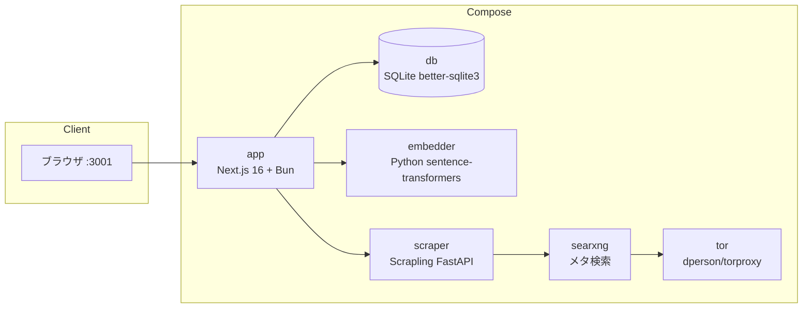

# UmansChat

**UmansAI** をバックエンドとする、セルフホスト可能なオープンソース AI ワークスペース。ChatGPT ライクな会話に、枝分かれスレッド、セマンティック記憶、Web 知識の取り込み、MCP ツール、外部コネクション、マルチモデルワークフロー、再利用可能なスキル、隔離コード実行、パーソナライズを統合。

[English](./README.md)

## プロジェクトの状態

**UmansChat はプレリリース版です。** バージョン間で破壊的変更が発生する可能性があります — データベーススキーマ、設定変数、API が予告なく変更されることがあります。更新前に `data/` ディレクトリと `.env` をバックアップしてください。

**Docker が推奨デプロイ方法です。** Docker Compose が全サービス（アプリ、embedder、scraper、SearXNG、Tor）を統合し、`docker compose pull && docker compose up -d` で簡単に更新できます。Docker を使わないスタンドアロン Windows exe も提供されています。

## 主な機能

### チャット・会話

- **ストリーミングチャット** — SSE によるトークンごとの出力
- **並列プリストリーム処理** — 検索・URL・記憶・スキルコンテキストの構築を並列実行。ツールプローブをモジュール読み込み時にウォームアップし、コード/翻訳/意見/アドバイスはヒューリスティックで検索判定 LLM をスキップして初回トークンまでのレイテンシを削減
- **ラピッドモード** — 入力欄の ⚡ で Web 検索・URL スクレイプ・記憶/スキル RAG（LLM 前の取得とストリーム後の生成の両方）をスキップ。MCP/コネクションとマルチモデルモードは有効のまま。再度 ⚡ を押すまでメッセージ・スレッドを跨いで維持
- **枝分かれする会話ツリー** — 再生成や編集で兄弟ノードを作成。`< 1/N >` で移動
- **添付ファイル** — 画像（ビジョン）、PDF（テキスト抽出）、テキスト/コード（1ファイル最大 10MB）
- **送信モード切替** — 既定は `Ctrl+Enter` / `Cmd+Enter` で送信。`⌃↵` をクリックすると `Enter` 送信（`Shift+Enter` で改行）
- **推論表示** — 思考トークンとインライン `<thinking>` タグを折りたたみブロックで表示
- **リッチ Markdown** — KaTeX（`$...$` / `$$...$$`）、コピー付きシンタックスハイライト、GFM テーブル/取り消し線/タスクリスト
- **モデル名・経過時間表示** — 各アシスタントメッセージに表示
- **自動タイトル生成** — 最初のユーザーメッセージから生成
- **日時・実行環境のプロンプト注入** — タイムゾーン考慮の現在日時と OS/アーキテクチャ

### マルチモデルワークフロー

- **モデルフォールバック（TTFT）** — プライマリが `LLM_FALLBACK_TIMEOUT_MS` 以内に最初のトークンを出さない場合、`LLM_FALLBACK_MODEL` へ一度だけ切替（空 = 無効）
- **デュアルモデル結論** — 相互レビュー方式または会話方式。統合最終回答 + 折りたたみの A/B 詳細
- **ハイパーシンキングモード** — 1〜5 ラウンドの自己レビュー（事実正確性・論理・完全性・明確さ・実用性）。最終回答をストリーム、中間は折りたたみトレース
- **協議（カウンシル）モード** — 2〜6 パネルが制限時間内で議論し最終モデルが統合。全トレースは折りたたみで確認
- **Thinking Effort 制御** — モデル毎の推論レベル（例: GLM-5.2: `none`/`high`/`max`、Flash: `none`/`low`/`medium`/`high`）

### 知識・記憶・検索

- **セマンティック検索** — 全スレッド横断（コサイン類似度 + sqlite-vec）
- **会話記憶** — 各ターン後に fact/working を抽出して RAG 注入。ライフサイクル（`validUntil`、working は 7 日期限、矛盾検出）、フィードバックループで重要度調整。サイドバー 🧠 メモリマネージャーで CRUD
- **Web ページスクレイピング → 知識化** — スクレイプ結果を RAG 化。チャットの URL は自動スクレイプ
- **Web 検索** — SearXNG パイプライン + 検索専用モデル。カテゴリ、ランキング、wiki フォールバック、適応リトライ。ラウンド数・件数は設定可能
- **時間範囲フィルタ** — 入力欄（None/day/week/month/year）で記憶・知識・スキル RAG・Web 検索を絞り込み
- **フォルダレベルのインストラクションとメモリスコープ** — フォルダ単位のシステムプロンプト。メモリスコープは `global` または `folder`

### ツール・連携

- **ワークスペースツール** — ストリーミング中にファイル読み書き、ディレクトリ一覧、シェル実行、アプリログ読み取り
- **サンドボックスコード実行（実験的、v0.4）** — Docker 隔離の `sandbox_run`（Python/JS）。Docker/イメージが無い場合は自動オフ。[サンドボックス](#サンドボックスコード実行任意) を参照
- **MCP サーバー統合** — Streamable HTTP / レガシー SSE / stdio。任意のリクエストヘッダー、接続テスト、SSRF ガード（`MCP_ALLOW_PRIVATE_URLS` でセルフホスト緩和）
- **コネクション（OAuth）** — Notion、GitHub、Gmail、Google Drive、Google Calendar、Outlook Mail、Outlook Calendar。スレッド単位で＋メニューから有効化
- **Todo リスト** — サイドバー ✓ UI + AI ツールでの作成/一覧/更新/削除（優先度・期限・埋め込み）

### パーソナライズ・スキル

- **パーソナライズ** — スタイルプリセット + warmth/energy/structure/emoji（0–2）。設定 → パーソナライズ。既定は無効
- **スキルシステム** — 6 種類 + セマンティック RAG。会話からドラフト自動抽出。スキルマネージャー（サイドバー 🛠️）
- **名前付きグローバルシステムインストラクション** — アカウント単位で複数保存。優先: スレッド systemPrompt > スレッド上書き > ユーザー既定 > body プロンプト
- **スレッド単位のシステムプロンプトとモデル選択**

### アカウント・UI・運用

- **アカウント認証** — Auth.js v5 Credentials + 任意の Google OAuth。初回は管理者作成。ユーザー毎にデータ分離
- **認証ハードニング** — 登録ロック、IP CIDR ホワイトリスト、ローカル/公開デュアルアクセス（リダイレクトはリクエスト Host に追従）
- **フォルダ整理**、**ダーク / ライト / システムテーマ**、**EN / JA 国際化**（既定は英語）
- **翻訳ページ** — `/translate`（サイドバー 🌐）。コンテキスト対応・複数候補モード
- **モーション UI** — 控えめなモーダル/ボタン/アコーディオン
- **設定 GUI** — `.env` へ書き込み（埋め込みモデル移行以外は再起動不要）
- **チャットエクスポート** — 任意でターン毎 Markdown 出力（`CHAT_EXPORT_PATH` / Docker は `CHAT_EXPORT_HOST_PATH`）
- **埋め込みモデル切替** — ローカル ONNX（transformers.js）または HTTP Python embedder
- **Tor プロキシ** — 匿名スクレイピング
- **exe リビルド / 自動更新時のデータ保持** — `.env` と `data/` は `%USERPROFILE%\.umans_chat_unofficial\`

## アーキテクチャ

UmansChat は Next.js 16 + React 19 のアプリで、バックエンドは SQLite（better-sqlite3）— ファイルベースで別サーバー不要です。Docker Compose はアプリとオプションサービスをまとめて起動します。



| サービス   | イメージ / ビルド        | 役割                                            | ポート              |
|------------|--------------------------|-------------------------------------------------|---------------------|
| `app`      | `Dockerfile` からビルド  | Next.js アプリ（チャット UI・API・設定）         | `3001 → 3000`       |
| `db`       | better-sqlite3           | SQLite（ファイルベース・組み込み）               | —                   |
| `embedder` | `./embedder` からビルド  | Python `sentence-transformers` HTTP embedder    | `8001`（公開）      |
| `scraper`  | `./scraper` からビルド   | Scrapling FastAPI + SearXNG クライアント         | 内部 `8000`         |
| `searxng`  | `searxng/searxng`        | SearXNG メタ検索                                 | `8081 → 8080`       |
| `tor`      | `dperson/torproxy`       | 匿名スクレイピング用 Tor SOCKS                   | `9050`（公開）      |
| `sandbox`  | profile `sandbox`        | `sandbox_run` 用イメージビルドのみ（常駐しない） | —                   |

## 要件

- **Bun** — 主なランタイム兼パッケージマネージャ（ローカル開発・ビルド）
- **Docker**（Compose 含む） — セルフホストの推奨。スタンドアロン Windows exe はターゲットに Docker 不要
- **UmansAI の API キー** — プロバイダは UmansAI 固定。`LLM_API_KEY` のみ必須
- **サンドボックス**を使う場合は Docker も必要（イメージはローカルビルド）

## クイックスタート（Docker）

自己完結スタックの推奨手順です。

```bash
# 1. 環境設定テンプレートをコピー
cp .env.example .env

# 2. LLM の API キーを設定（必須）
#    .env を編集し LLM_API_KEY を入力
#    任意: LLM_MODEL（省略時 umans-glm-5.2）

# 2b. AUTH_SECRET を生成
bunx auth secret
# 2c.（任意）Google ログイン:
#     GOOGLE_CLIENT_ID / GOOGLE_CLIENT_SECRET
#     リダイレクト URI: http://localhost:3001/api/auth/callback/google

# 3. 全サービスを起動
docker compose up -d

# 4. http://localhost:3001 を開く
#    初回は管理者アカウント作成
```

マイグレーションは自動適用。ユーザー毎にスレッド・フォルダ・記憶は分離。埋め込みモデル変更後は [データベースマイグレーション](#データベースマイグレーション) を参照。

**任意: サンドボックスイメージ（初回のみ）**

```bash
docker compose --profile sandbox build
```

## クイックスタート（スタンドアロン Windows exe）

ターゲットに Docker / Node / Bun は不要。ビルド環境は Windows + [Bun](https://bun.sh)。

```bash
bun install
cp .env.example .env   # LLM_API_KEY を設定; bunx auth secret
bun run pack:exe       # → dist/UmansChat/
# umanschat.exe をダブルクリック（または node dist/UmansChat/umanschat.cjs）
```

> **同一フォルダ再ビルド:** 既存 `dist/UmansChat/` への `pack:exe` は `.env` と `data/` を保持します。
>
> **データの場所:** `%USERPROFILE%\.umans_chat_unofficial\`（exe フォルダではない）。旧版からのアップグレード時は自動移行。

初回起動で DB 作成・マイグレーション・`:3001` 起動・ブラウザ表示。

> **初回はインターネット必須**（ローカル ONNX 埋め込み `Xenova/all-MiniLM-L6-v2` のダウンロード）。以降はオフライン可。Docker サイドカー無しでは Web 検索/スクレイプは空結果（チャット自体は動作）。
>
> **サンドボックス / scraper / SearXNG / Tor / Python embedder は同梱されません。** 必要なら `SCRAPER_URL` / `SEARXNG_URL` を Docker に向ける。サンドボックスは Docker Desktop + イメージビルド（[サンドボックス](#サンドボックスコード実行任意)）。

### 自動更新（exe 版のみ）

設定 → システム → GitHub に新リリースがあるとき **ダウンロードして更新**。`data/` と `.env` は触れません。Docker は `docker compose pull && docker compose up -d`。

> 認証なしの Releases API には **公開リポジトリ** が必要です。

## リリース（Docker + exe）

手動実行（`workflow_dispatch`）のみ。各リリースで **両方** を公開:

- **Docker（GHCR）** — `app` / `scraper` / `embedder` に `:<version>` と `:latest`
  - `ghcr.io/johmaru/umanschat-unofficial-app:<version>`
  - `ghcr.io/johmaru/umanschat-unofficial-scraper:<version>`
  - `ghcr.io/johmaru/umanschat-unofficial-embedder:<version>`
- **Windows exe** — `UmansChat-<version>-windows-x64.zip` を GitHub Release に添付

```
Actions → Release → Run workflow → バージョン入力（例: 1.2.3）
```

`version` は必須（`:latest` の誤上書き防止）。パイプライン: `prepare` → `docker` + `exe` → `release`（両成功時のみ）。

```bash
docker compose pull && docker compose up -d   # 公開イメージ
docker compose up -d --build                  # ソースからビルド
```

CI（`.github/workflows/ci.yml`）: `develop`/`main` への push/PR で 3 イメージビルド（push なし）+ windows-latest で `pack:exe`。

## クイックスタート（ローカル開発）

```bash
bun install
cp .env.example .env   # LLM_API_KEY 必須
bun run dev            # predev が sync-env + drizzle migrate
# http://localhost:3000
```

オプションのサイドカー:

```bash
docker compose up -d scraper embedder searxng tor
# SCRAPER_URL / SEARXNG_URL / EMBEDDER_URL をホスト公開ポートに向ける
```

## LLM プロバイダ

プロバイダは **UmansAI 固定**（`https://api.code.umans.ai/v1`）。必要なのは `LLM_API_KEY` のみ。

- モデル一覧と推論レベルは `/v1/models/info` から自動取得（プロセス内キャッシュ）
- セレクタには表示名（例: `Umans Qwen3.6 35B A3B`）
- API 失敗時は組み込み `MODEL_REASONING` テーブルにフォールバック
- 任意の **TTFT モデルフォールバック**: `LLM_FALLBACK_MODEL` + `LLM_FALLBACK_TIMEOUT_MS`（既定 10000）

## サンドボックスコード実行（任意）

> **実験的機能（v0.4）。** API・エラーコード・イメージタグは予告なく変わる可能性あり。Tier 2/3（ファイル検査・マルウェア分析）は未実装。

ネットワーク無し Docker コンテナ内で Python/JavaScript を実行する `sandbox_run`。Docker 到達可能かつイメージ存在時のみツールを公開（`SANDBOX_ENABLED=auto`）。

```bash
# Docker Compose
docker compose --profile sandbox build
docker compose up -d --build

# ネイティブ / exe / bun run dev
docker build -t umanschat-sandbox-python:v0.4 sandbox/python
```

チャットで「Python サンドボックスで `print(2+2)` を実行して」などと依頼。イメージが無い場合はツールが単に提示されない（エラーや半端な状態にはならない）。

詳細: [`.agents/skills/umanschat-install/SKILL.md`](./.agents/skills/umanschat-install/SKILL.md)

## Cloudflare Tunnel によるパブリックアクセス（任意）

ポート開放なしで HTTPS 公開。リモートからの Google OAuth に推奨。

### GUI（推奨）

1. 名前付きトンネルを作成（Cloudflare Zero Trust → Networks → Tunnels）。
2. パブリックホスト名 → `Service=http://app:3000`。
3. 設定 → 公開・セキュリティ → Cloudflare Tunnel: **Tunnel Token** を貼付、**AUTH_URL** を `https://…` に設定して起動。
4. アプリ再起動不要。GUI からいつでも起動/停止可能。

### .env

```bash
TUNNEL_TOKEN=your-token-here
AUTH_URL=https://your-tunnel.example.com
```

Google リダイレクト URI: `https://your-tunnel.example.com/api/auth/callback/google`

- **Docker / exe / Linux x64**: cloudflared を `data/cloudflared/` に固定バージョン + SHA256 検証でダウンロード
- **macOS**: 非対応

## 設定

すべて `.env`（典拠は `.env.example`）。大半は設定 GUI で再起動なしに編集可能。

### LLM

| 変数 | 説明 | デフォルト |
|------|------|------------|
| `LLM_API_KEY` | UmansAI API キー（必須） | — |
| `LLM_MODEL` | デフォルトモデル | `umans-glm-5.2` |
| `LLM_FALLBACK_MODEL` | TTFT フォールバック先モデル id（空 = 無効） | — |
| `LLM_FALLBACK_TIMEOUT_MS` | 最初のトークンを待つミリ秒 | `10000` |
| `THINKING_EFFORT` | 推論レベル（`none`/`low`/`medium`/`high`/`max`） | `medium` |
| `WEB_SEARCH_THINKING_EFFORT` | 検索結果要約時の推論レベル（`none`/`low`/`medium`/`high`/`max`） | `none` |
| `TRANSLATE_TIMEOUT` | 翻訳 LLM タイムアウト（秒） | `30` |

### 埋め込み

| 変数 | 説明 | デフォルト |
|------|------|------------|
| `EMBED_PROVIDER` | `local`（ONNX）または `http`（Python embedder） | `local` |
| `EMBED_MODEL` | モデル名（プロバイダに合わせる） | `Xenova/all-MiniLM-L6-v2` |
| `EMBED_DIM` | 次元数（モデルに合わせる） | `384` |
| `EMBEDDER_URL` | `http` 時の Python embedder URL | `http://localhost:8001` |
| `EMBEDDER_GPU_COUNT` | embedder コンテナの GPU 数（0 = CPU、Compose のみ） | `0` |

Docker の HTTP embedder を使う場合: `EMBED_PROVIDER=http`、`EMBED_MODEL=LiquidAI/LFM2.5-Embedding-350M`、`EMBED_DIM=1024`。

### Web 検索・スクレイピング

| 変数 | 説明 | デフォルト |
|------|------|------------|
| `WEB_SEARCH_MODEL` | クエリ生成 + 結果要約モデル | `umans-qwen3.6-35b-a3b` |
| `WEB_SEARCH_MAX_RESULTS` | 1 クエリあたりの取得・スクレイプ件数 | `3` |
| `WEB_SEARCH_MAX_ROUNDS` | 1 回答あたりの最大検索ラウンド（1–5） | `3` |
| `SCRAPER_URL` | Scraper（空 = 無効） | —（Compose がサービス URL を設定） |
| `SEARXNG_URL` | SearXNG（空 = 無効） | —（Compose がサービス URL を設定） |
| `TOR_PROXY` | アプリ側 Tor 参照（空 = なし） | — |
| `SCRAPE_PROXY` | Scraper が使うプロキシ | — |


### スキル

| 変数 | 説明 | デフォルト |
|------|------|------------|
| `SKILL_EVOLUTION_ENABLED` | 進化提案生成を有効化（`false`/`0` = オフ、フィードバック記録は常に動作） | `true` |
| `SKILL_EVOLUTION_AUTO_PROPOSE` | 否定フィードバック時に自動で提案生成をスケジュール（`true`/`1` = オン、オフ = 手動のみ） | `false` |
| `SKILL_EVOLUTION_MODEL` | 進化パッチ生成用 LLM モデル（空 = `LLM_MODEL`） | — |

### データベース・ログ・実行環境

| 変数 | 説明 | デフォルト |
|------|------|------------|
| `DATABASE_URL` | SQLite ファイルパス | `data/umanschat.db` |
| `HOST_OS` | プロンプト注入 OS 名（`Windows`/`macOS`/`Linux`、空 = 自動） | — |
| `TZ` | プロンプト日時のタイムゾーン（空 = `Asia/Tokyo`） | — |
| `LOG_LEVEL` | `debug`/`info`/`warn`/`error` | `info` |
| `LOG_FILE_ENABLED` | `data/logs/umanschat.log` へ出力（自動: exe→true、Docker→false） | auto |
| `LOG_FILE_MAX_SIZE` | ローテーション前サイズ（`.log.1` を 1 つ保持） | `5242880` |
| `CHAT_EXPORT_PATH` | Markdown エクスポート先（`<YYYY>/<MM>/<DD>/<title>.md`、空 = 無効） | — |
| `CHAT_EXPORT_HOST_PATH` | Docker 専用: ホスト側マウントパス（Windows は `C:/Users/...`） | — |

### 認証・セキュリティ

| 変数 | 説明 | デフォルト |
|------|------|------------|
| `AUTH_SECRET` | Auth.js シークレット（`bunx auth secret`） | — |
| `AUTH_TRUST_HOST` | リバースプロキシ背後でホストを信頼 | `true` |
| `AUTH_URL` | 設定 UI・トンネル・OAuth コンソール用の公開ベース URL。リダイレクトはリクエスト Host に追従 | `http://localhost:3001` |
| `REGISTRATION_LOCKED` | 新規アカウント作成をロック | `false` |
| `ALLOWED_REGISTRATION_IPS` | 登録許可 IP/CIDR（空 = 全許可。IP 不明時は拒否） | — |
| `GOOGLE_CLIENT_ID` / `GOOGLE_CLIENT_SECRET` | 任意の Google OAuth | — |
| `NOTION_CLIENT_ID` / `NOTION_CLIENT_SECRET` | Notion コネクション用 OAuth | — |
| `GITHUB_CONNECTIONS_CLIENT_ID` / `GITHUB_CONNECTIONS_CLIENT_SECRET` | GitHub コネクション用 OAuth | — |
| `GOOGLE_CONNECTIONS_CLIENT_ID` / `GOOGLE_CONNECTIONS_CLIENT_SECRET` | Gmail / Drive / Calendar コネクション用 OAuth（ログインとは別） | — |
| `MICROSOFT_CLIENT_ID` / `MICROSOFT_CLIENT_SECRET` / `MICROSOFT_TENANT_ID` | Outlook Mail / Calendar コネクション用 OAuth | — / `common` |
| `TUNNEL_TOKEN` | Cloudflare Tunnel トークン | — |
| `MCP_ALLOW_PRIVATE_URLS` | リモート MCP で http とプライベート IP を許可（セルフホスト/開発） | `false` |

### サンドボックス

| 変数 | 説明 | デフォルト |
|------|------|------------|
| `SANDBOX_ENABLED` | `auto` / `true` / `false` | `auto` |
| `SANDBOX_IMAGE` | ローカルイメージタグ（v0.4 では GHCR 非公開） | `umanschat-sandbox-python:v0.4` |
| `SANDBOX_MIN_FREE_MEM_PERCENT` | 空きメモリ % が下回ると拒否 | `15` |
| `SANDBOX_MAX_CONCURRENT` | 同時コンテナ上限 | `1` |
| `SANDBOX_DEFAULT_TIMEOUT_SEC` | 壁時計タイムアウト | `30` |
| `SANDBOX_STDOUT_MAX_BYTES` | サニタイズ後の stdout/stderr 上限 | `4096` |

## OAuth コネクション設定

コネクション機能を使うと、チャット中に AI が外部サービスにアクセスできます。7 つのプロバイダーに対応:
Notion、GitHub、Gmail、Google Drive、Google Calendar、Outlook Mail、Outlook Calendar。

### 共通手順

1. 各プロバイダーの開発者コンソールで OAuth クレデンシャルを作成。
2. リダイレクト URI を `{AUTH_URL}/api/connections/{provider}/callback` に設定。
3. 上記の環境変数を `.env` に設定し、設定画面で保存。
4. 設定 → コネクション → 各プロバイダーの「接続」をクリック。
5. スレッド単位: ＋ → コネクション → 有効にしたいものをオン。

### プロバイダー別メモ

| プロバイダー | コンソール | リダイレクト URI パス | 環境変数 |
|----------|---------|--------------------|----------|
| Notion | [notion.so/developers](https://www.notion.so/developers) | `/api/connections/notion/callback` | `NOTION_CLIENT_ID` / `NOTION_CLIENT_SECRET` |
| GitHub | [github.com/settings/developers](https://github.com/settings/developers) | `/api/connections/github/callback` | `GITHUB_CONNECTIONS_CLIENT_ID` / `GITHUB_CONNECTIONS_CLIENT_SECRET` |
| Gmail / Drive / Calendar | [Google Cloud Console](https://console.cloud.google.com/apis/credentials) | `/api/connections/{gmail,google_drive,google_calendar}/callback` | `GOOGLE_CONNECTIONS_CLIENT_ID` / `GOOGLE_CONNECTIONS_CLIENT_SECRET` |
| Outlook Mail / Calendar | [Microsoft Entra ID](https://entra.microsoft.com) | `/api/connections/{outlook,outlook_calendar}/callback` | `MICROSOFT_CLIENT_ID` / `MICROSOFT_CLIENT_SECRET` / `MICROSOFT_TENANT_ID` |

> **Google Connections ≠ ログイン**: `GOOGLE_CONNECTIONS_CLIENT_ID` は `GOOGLE_CLIENT_ID`（Auth.js ログイン）とは別物です。別の OAuth クライアントを作成してください。

デュアルアクセス時は localhost とトンネル両方のコールバック URL を登録。

## 使い方

- **スレッド作成** — 入力欄に入力し、初回送信で作成 + 自動タイトル。
- **送信** — 既定 `Ctrl+Enter` / `Cmd+Enter`。`⌃↵` で Enter 送信に切替。ストリーミング応答にモデル名と経過時間。
- **ラピッドモード** — ⚡ で検索/スクレイプ/記憶/スキル RAG をスキップ（オフまで維持）。
- **枝分かれ** — 再生成 / 編集 → `< 1/N >`。
- **デュアル / ハイパーシンキング / 協議** — スレッド設定の応答モード。
- **添付** — 画像、PDF、テキスト/コード（各 10MB）。
- **セマンティック検索** — 全スレッドをコサイン類似度で。
- **Web スクレイピング / Tor** — サービス設定時。Tor は設定で切替。
- **設定** — モデル、フォールバック、Thinking Effort、埋め込み、検索、Tor、ログ、翻訳モード。`.env` に書き込み。
- **グローバルインストラクション** — 設定 → AI & Models。
- **メモリマネージャー** — サイドバー 🧠。
- **Todo リスト** — サイドバー ✓（または AI に依頼）。
- **パーソナライズ** — 設定 → パーソナライズ。
- **スキルマネージャー** — サイドバー 🛠️（アクティブ / ドラフト / アーカイブ）。
- **時間範囲フィルタ** — 入力欄 ⚡ 隣のドロップダウン。
- **フォルダ設定** — フォルダインストラクション + メモリスコープ。
- **翻訳** — サイドバー 🌐 → `/translate`。
- **サンドボックス** — Docker + イメージ準備後、モデルにサンドボックス実行を依頼。

## データベースマイグレーション

Drizzle ORM + SQLite。Docker 起動時・exe 起動時・`bun run dev`（`predev` → `drizzle-kit migrate`）で自動適用。

`EMBED_MODEL` / `EMBED_DIM` 切替時は既存ベクトルと非互換。設定 GUI のマイグレーション（`applyMigration`）が `memories` と `page_embeddings` の埋め込みをクリア（JSON text 保存のため DDL 不要）。その後再埋め込み。

## テスト

```bash
bun run test        # Vitest ユニットテスト
bun run typecheck
bun run lint
```

## コントリビューター向けドキュメント

包括ドキュメントは [`docs/`](./docs/)（アーキテクチャ、スキーマ、ストリーミング、記憶/スキル、ツール、フロントエンド、デプロイ、テスト）。索引: [`docs/README.md`](./docs/README.md)。

AI エージェント向けルール: [`AGENTS.md`](./AGENTS.md)。
