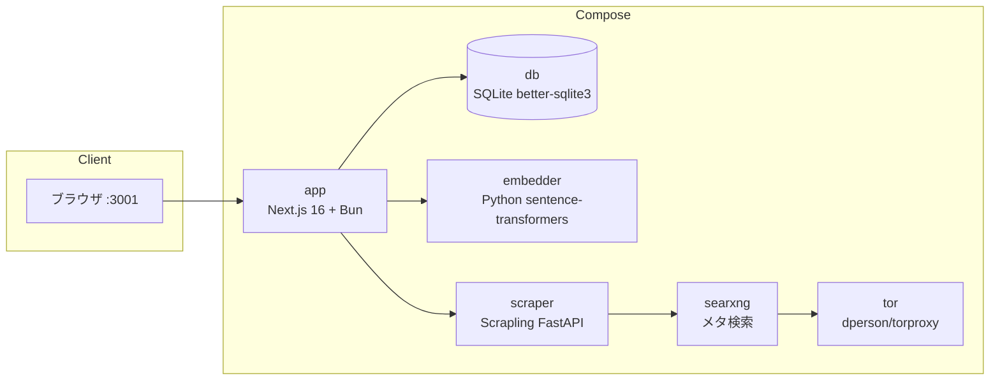

# UmansChat

高リソースの OpenAI 互換プロバイダ（UmansAI、OpenAI、vLLM、Ollama）向けの、セルフホスト可能なオープンソース AI ワークスペース。ChatGPT ライクな会話に、枝分かれスレッド、セマンティック記憶、Web 知識の取り込み、MCP ツール、外部コネクション、マルチモデルワークフロー、再利用可能なスキル、パーソナライズを統合。

[English](./README.md)

## プロジェクトの状態

**UmansChat はプレリリース版です。** バージョン間で破壊的変更が発生する可能性があります — データベーススキーマ、設定変数、API が予告なく変更されることがあります。更新前に `data/` ディレクトリと `.env` をバックアップしてください。

**Docker が推奨デプロイ方法です。** Docker Compose 構成が全サービス（アプリ、embedder、scraper、SearXNG、Tor）を統合し、`docker compose pull && docker compose up -d` で簡単に更新できます。Docker を使わないスタンドアロン Windows exe も提供されています。

## コントリビューター向けドキュメント

コントリビューター向けの包括的なドキュメントは [`docs/`](./docs/) フォルダにあります。アーキテクチャ、データベーススキーマ、チャットストリーミング、記憶/スキルシステム、ツール呼び出し、フロントエンドコンポーネント、デプロイメント、テストなどを網羅しています。全インデックスは [`docs/README.md`](./docs/README.md) を参照してください。

## 主な機能

- **ストリーミングチャット** — SSE によるトークンごとの出力
- **並列プリストリーム処理** — 検索・URL・記憶・スキルコンテキストの構築を順次ではなく並列で実行。ツールプローブをモジュール読み込み時にウォームアップし、コード/翻訳/意見/アドバイスリクエストはヒューリスティックで検索判定LLM呼び出しをスキップして初回トークンまでのレイテンシを削減
- **ラピッドモード** — 入力欄の ⚡ ボタンで、Web 検索・URL スクレイプ・記憶/スキル RAG（LLM 前の取得とストリーム後の生成の両方）をスキップし、初回トークンまでのレイテンシを下げます。MCP/コネクションツールとデュアルモデルフローは有効なまま。再度 ⚡ をクリックするまで、メッセージやスレッドを跨いでオン状態が維持されます。
- **枝分かれする会話ツリー** — 再生成やメッセージ編集で兄弟ノードを作成。`< 1/N >` で兄弟間を移動
- **添付ファイル** — 画像（ビジョン）、PDF（テキスト抽出）、テキスト/コードファイル（1ファイル最大 10MB）
- **セマンティック検索** — 全スレッド横断でコサイン類似度により検索
- **会話記憶** — 各ターン終了後に fact/working 記憶を抽出し、RAG コンテキストとして注入。記憶は完全なライフサイクルを備える: 置換された記憶は削除ではなく時限無効化（`validUntil`）され、working 記憶は7日後に自動期限切れ、fact 記憶は期限切れなし。矛盾検出 LLM 呼び出しにより対立する記憶の蓄積を防止。フィードバックループが注入回数と参照新しさを追跡し、ユーザーが繰り返し参照する記憶の重要度を自動調整して検索精度を向上。サイドバーの 🧠 メモリマネージャーから記憶の確認・検索・編集・削除・手動追加が可能
- **Web ページスクレイピング → 知識化** — スクレイプしたページを RAG ソースとして取り込み、以降の回答に活用。チャットに URL を貼ると自動でスクレイプしてコンテキストに注入
- **Web 検索** — アプリレベルの SearXNG パイプライン。検索クエリ生成と結果要約は検索専用モデルが担当。揮発性情報・明示的な検索要求・未知の語や固有名詞で自動起動。設定で切替可能
- **デュアルモデル結論** — 2つのモデルを相互レビュー方式または会話方式で走らせ、統合した最終回答をストリーミングし、A/Bの検討内容は折りたたみ詳細で確認可能
- **ハイパーシンキングモード** — 1つのモデルが1〜5ラウンドの自己レビューを繰り返し回答を洗練。各ラウンドで異なる視点（事実正確性、論理一貫性、完全性、明確さ、実用性）から検証・改善。最終的な洗練された回答がストリーミングされ、中間ドラフトと検証内容は折りたたみトレースで確認可能。
- **協議（カウンシル）モード** — 2〜6パネルの異なるAIペルソナが質問について議論し、初期回答を生成した後ラウンドごとに議論を行い、最終モデルが最良の回答を統合。パネル数と制限時間（30〜21600秒）は設定可能。議論の全トレースは折りたたみブロックで確認可能。
- **ワークスペースツール** — モデルがストリーミング中にファイルの読み書き、ディレクトリ一覧、シェルコマンド実行、アプリケーションログの読み取りを自律的に実行可能。コーディング支援、デバッグ、ワークスペース内のファイル操作に有用。
- **Tor プロキシ** — 匿名スクレイピングのための Tor 対応
- **Thinking Effort 制御** — モデル毎に対応レベルが異なる（GLM-5.2: `none`/`high`/`max`、Flash: `none`/`low`/`medium`/`high`）。制御非対応モデルでは無視される
- **埋め込みモデル切替** — transformers.js によるローカル ONNX、または HTTP Python embedder サービス
- **フォルダ分け** — スレッドをフォルダで整理
- **ダーク / ライト / システムテーマ**
- **EN / JA 国際化切替**（デフォルトは英語）
- **翻訳ページ** — サイドバーの 🌐 ボタンから開く `/translate` ページ。ソース/ターゲット言語選択、履歴、オプションのコンテキスト欄を備える。コンテキスト対応モード: 会話の抜粋を貼り付けて、トーンや用語に応じた翻訳を取得可能。コンテキストが空の場合は通常の翻訳に縮退する。複数候補モード: 異なる特性（直訳・自然・意訳）を持つ3つの翻訳を生成し、最適なものを選択可能。特性の主言語は設定で指定可能（または UI ロケールに自動追従）。
- **OpenAI 互換 LLM バックエンド** — UmansAI、OpenAI、vLLM、Ollama など
- **自動タイトル生成** — 最初のユーザーメッセージから生成
- **日時・実行環境のプロンプト注入** — 現在日時（タイムゾーン考慮）と検出した OS/アーキテクチャを全プロンプトの先頭に付与し、モデルが環境に適した回答を返すようにする
- **モデル名・経過時間表示** — 各アシスタントメッセージに使用モデルと応答時間を表示
- **モーション UI アニメーション** — モーダル遷移、ボタン押下フィードバック、アコーディオン展開、スムーズスクロール
- **スレッド単位のシステムプロンプトとモデル選択**
- **名前付きグローバルシステムインストラクション** — アカウント単位で複数のシステムプロンプトを保存し、1つをユーザー既定として選択、スレッド単位で上書き可能。優先順位: スレッド systemPrompt > スレッド指示の上書き > ユーザー既定 > body プロンプト
- **MCP サーバー統合** — 外部の Model Context Protocol サーバー（Streamable HTTP / stdio）を登録し、スレッド単位で有効化。LLM がストリーミング中にツールを発見・呼び出し、組み込みの検索/スクレイプツールと併用可能
- **コネクション（Notion）** — Notion アカウントを OAuth で連携。チャット中に LLM が `notion_search`、`notion_get_page`、`notion_get_blocks` ツールを呼び出し、Notion のコンテンツを検索・取得。スレッド単位で＋メニューから有効化
- **アカウント認証** — Auth.js v5 + Credentials（email/password）+ オプションで Google OAuth。初回起動時にアカウント作成が必要、以降はログイン。ユーザー毎にデータが分離
- **認証ハードニング** — 登録用 IP CIDR ホワイトリスト（`ALLOWED_REGISTRATION_IPS`）、登録ロック（`REGISTRATION_LOCKED`）、リダイレクト反転なしのローカル/公開デュアルアクセス（AUTH_URL は中和され、リダイレクトは受信リクエストのホストに追従）。DB マイグレーション後に無効なセッションクッキーを自動検出してクリアする。
- **パーソナライズ** — ユーザー単位のスタイルプリセット（standard/polite/casual/concise/detailed/academic/creative/technical）+ warmth/energy/structure/emoji の特性スライダー（0-2）。LLM のトーンをシステム全体で調整。デフォルトは無効。設定 → パーソナライズで構成。
- **スキルシステム** — セマンティック RAG マッチングによる再利用可能なスキル。6種類（workflow/bugfix/project_rule/tool_usage/coding_pattern/debugging）。会話からドラフト候補を自動抽出（1回につき最大3件、信頼度 + 理由付き）。スキルマネージャー（サイドバーの 🛠️ ボタン）で承認・編集後承認・却下が可能。手動 CRUD も対応。スキルは使用状況（成功/失敗回数、最終使用日時）を記録。
- **時間範囲フィルタ** — 入力欄のドロップダウン（None/day/week/month/year）で、記憶・Web知識・スキル RAG 取得および Web 検索結果を選択した期間に絞り込みます。
- **フォルダレベルのインストラクションとメモリスコープ** — フォルダにフォルダ単位のシステムプロンプト（フォルダ内全スレッドに適用）とメモリスコープ切替（`global` = 全スレッド、`folder` = 同フォルダ内のスレッドのみ）を設定可能。
- **推論表示** — モデルが思考トークンを出力する場合、回答の上に折りたたみ可能な「Thinking」ブロックとして表示。インラインの `<thinking>` タグも抽出してレンダリングします。
- **リッチ Markdown** — KaTeX 数式レンダリング（`$...$` インライン、`$$...$$` ブロック）、コピーボタン付きシンタックスハイライトコードブロック、GFM テーブル/取り消し線/タスクリスト。
- **設定 GUI** — `.env` に書き込み、埋め込みモデルのマイグレーション以外は再起動不要
- **exe リビルド時のデータ保存** — 既存の `dist/UmansChat/` に `bun run pack:exe` を再実行すると、`.env` と `data/` を退避・復元し、設定・API キー・データベースがリビルド後も保持される。

## アーキテクチャ

UmansChat は Next.js 16 + React 19 のアプリケーションで、SQLite（better-sqlite3）をバックエンドに持ちます — ファイルベースの組み込みデータベースで、別サーバーは不要です。下記の Docker Compose 構成は、アプリとオプションサービスをまとめて起動します。



| サービス   | イメージ / ビルド        | 役割                                            | ポート         |
|------------|--------------------------|-------------------------------------------------|----------------|
| `app`      | `Dockerfile` からビルド  | Next.js アプリ（チャット UI・API・設定）         | `3001 → 3000`  |
| `db`       | `better-sqlite3`（SQLite）  | SQLite データベース（ファイルベース・組み込み）            | —              |
| `embedder` | `./embedder` からビルド  | Python `sentence-transformers` HTTP embedder    | `8000`（公開） |
| `scraper`  | `./scraper` からビルド   | Scrapling FastAPI スクレイパー + SearXNG クライアント | `8000`（公開） |
| `searxng`  | `searxng/searxng:latest` | SearXNG メタ検索エンジン                         | `8081 → 8080`  |
| `tor`      | `dperson/torproxy:latest`| 匿名スクレイピング用 Tor SOCKS プロキシ          | `9050`（公開） |

- **Node.js / Bun** — Bun が主なランタイム兼パッケージマネージャ（ローカル開発・ビルド用）
- **Docker**（Docker Compose 含む） — セルフホストデプロイに推奨。スタンドアロン Windows exe とローカル開発の SQLite パスも利用可能で、追加インストールは不要です。
- **OpenAI 互換 LLM の API キー** — UmansAI、OpenAI、vLLM、Ollama など

## クイックスタート（Docker）

UmansChat を自己完結したサービスとして動かす場合の推奨手順です。

```bash
# 1. 環境設定テンプレートをコピー
cp .env.example .env

# 2. LLM の API キーを設定（必須）
#    .env を編集し LLM_API_KEY を入力
#    必要に応じて LLM_BASE_URL と LLM_MODEL をプロバイダに合わせて設定

# 2b. AUTH_SECRET を生成して .env に追加
bunx auth secret
# 2c.（任意）「Google でログイン」を有効にする場合、.env に設定:
#     GOOGLE_CLIENT_ID と GOOGLE_CLIENT_SECRET
#     https://console.cloud.google.com/apis/credentials で認証情報を作成
#     リダイレクト URI: http://localhost:3001/api/auth/callback/google

# 3. 全サービスを起動
docker compose up -d

# 4. アプリを開く
#    http://localhost:3001
#    初回起動時は管理者アカウントの作成を求められます
```

初回起動時、データベースのマイグレーションはアプリが自動的に適用されます。また、初回は管理者アカウントの作成（ニックネーム + メールアドレス + パスワード）を求められます。以降のアクセスにはログインが必要です。ユーザー毎にスレッド・フォルダ・記憶は分離されます。初期セットアップ後に埋め込みモデルを変更する場合は [データベースマイグレーション](#データベースマイグレーション) を参照してください。

## クイックスタート（スタンドアロン Windows exe）

Docker を使わずに配布・実行するもう一つの方法です。配布フォルダには `umanschat.exe` と同梱の `node.exe` が含まれ、Docker や Node.js、Bun をユーザー環境に用意する必要はありません。ビルド環境でのみ Bun が必要です。

```bash
# 1. 依存パッケージをインストール（ビルド環境）
bun install

# 2. 環境設定テンプレートをコピーして設定
cp .env.example .env
#    .env を編集し LLM_API_KEY を入力
#    AUTH_SECRET を生成: bunx auth secret

# 3. 配布フォルダをビルド（内部で next build を DATABASE_URL=":memory:" で実行）
bun run pack:exe
#    dist/UmansChat/ に umanschat.exe と必要ファイル一式が出力されます
```

> **同一フォルダ再ビルド時の状態保持**: 既存の `dist/UmansChat/` に対して `bun run pack:exe` を再実行すると、`.env` と `data/`（SQLite DB）を退避・復元し、セキュリティ設定・API キー・データベースが再ビルド後も保持されます（アプリ内自動更新と同じ挙動）。新規フォルダへの展開は正しく初期状態（ロック解除）で起動し、最初の管理者作成が可能です。

> **データの場所:** `.env` と `data/` は exe フォルダではなく `%USERPROFILE%\.umans_chat_unofficial\` に保存されます。exe フォルダを削除・入れ替えても設定・APIキー・データベースは保持されます。旧バージョンからのアップグレード時、ランチャーが exe フォルダから自動でデータを移行します。

`dist/UmansChat/` フォルダをユーザーの Windows マシンにそのまま配布できます。`umanschat.exe` をダブルクリックすると：

1. ユーザーデータフォルダ（`%USERPROFILE%\.umans_chat_unofficial\data\`）に SQLite データベース（`umanschat.db`）を初回起動時に作成し、マイグレーションを適用
2. サーバーを起動し、ブラウザで `http://localhost:3001` を自動で開く
3. 初回は管理者アカウントの作成を求められます

**埋め込みモデルの初回ダウンロード**: スタンドアロン exe はデフォルトでローカル ONNX 埋め込み（`EMBED_PROVIDER=local` 用に `.env.example` で `Xenova/all-MiniLM-L6-v2`）を使います。初回の埋め込み生成時に Hugging Face からモデルがダウンロードされるため、インターネット接続が必要です。モデルのダウンロードが完了すれば、以降のチャットはオフラインで動作します。HTTP Python embedder（`EMBED_PROVIDER=http`）の場合、既定モデルは `LiquidAI/LFM2.5-Embedding-350M`（1024次元）でサーバー側で実行され、クライアントでのダウンロードは不要です。


**オプションサービスの縮退**: スタンドアロン exe にはスクレイパー、SearXNG、Tor、Python embedder は同梱されません。これらの機能を使わずにチャットは正常に動作しますが、Web 検索・スクレイピングは空の結果を返します（エラーにはなりません）。スクレイピング/検索を利用したい場合は別途 Docker で該当サービスを起動し、`.env` の `SCRAPER_URL`・`SEARXNG_URL` を公開ポートに向けてください。

### 自動更新（exe 版のみ）

スタンドアロン exe は起動時および **設定 → システム** で更新を確認します。GitHub に新しいリリースがある場合、設定ボタンに amber（琥珀色）のドットが表示されます。

1. 設定 → システムタブを開く
2. **ダウンロードして更新** をクリック — リリース zip をダウンロード・展開し、マーカーファイルを書き込みます
3. ランチャーが 5 秒以内にマーカーを検出し、サーバーを停止、ファイルを差し替え（`data/` と `.env` を保持）、新しい exe を起動します
4. 新しいサーバーが起動するとブラウザが自動リロードされます

`data/` と `.env` は `%USERPROFILE%\.umans_chat_unofficial\` にあり、更新時には一切触れられません。古い `umanschat.exe` は `.old` にリネームされ、次回起動時に削除されます。

> **前提条件**: GitHub Releases API とアセットダウンロードを認証なしで利用するには、リポジトリを公開設定にする必要があります。
> **Docker** ユーザーは `docker compose pull && docker compose up -d` で更新します — 自動更新は exe 版のみの機能です。

## リリース（Docker + exe）

リリースは GitHub Actions の手動実行（`workflow_dispatch`）のみで行います。各リリースでは **両方** の配布形式を公開します:

- **Docker イメージ**（GHCR）:
  - `ghcr.io/johmaru/umanschat-unofficial-app:<バージョン>`
  - `ghcr.io/johmaru/umanschat-unofficial-scraper:<バージョン>`
  - `ghcr.io/johmaru/umanschat-unofficial-embedder:<バージョン>`
  各イメージには `:<バージョン>` と `:latest` の両方のタグが付きます。
- **Windows スタンドアロン exe**: `UmansChat-<バージョン>-windows-x64.zip`。GitHub Release に添付されます。

リリースを作成するには、ワークフローを手動実行します:

```
Actions タブ → Release → Run workflow → バージョンを入力（例: 1.2.3）
```

`version` 入力は **必須** です。省略時は実行できないようにすることで、誤実行による `:latest` の上書きを防ぎます。タグ push では自動リリースしません。意図的に公開したい時だけ実行してください。

パイプラインは 4 ジョブで構成されます: `prepare`（共通バージョン計算）、`docker`（ubuntu-latest、3 イメージを push）、`exe`（windows-latest、`umanschat.exe` をネイティブビルド — クロスコンパイルなし）、`release`（`needs: [prepare, docker, exe]` — 両アーティファクト成功後にのみ GitHub Release を作成）。

### 公開イメージの利用

```bash
# ソースからビルドせず、公開済みイメージを pull して起動
docker compose pull
docker compose up -d
```

ローカル開発でソースからビルドする場合は `docker compose up -d --build` を使います。

### CI 検証

`develop`/`main` への push/PR ごとに `.github/workflows/ci.yml` が実行されます: 3 つの Docker イメージをビルド（push なし）し、windows-latest で `bun run pack:exe` を実行します。両ジョブが成功しないとマージできません。


## Cloudflare Tunnel によるパブリックアクセス（任意）

ポート開放やパブリック IP なしで HTTPS 経由でアプリを公開するには、Cloudflare 名前付きトンネルを使います。リモートネットワークから Google OAuth を利用する場合に推奨します。

### GUI での設定（推奨）

1. [Cloudflare Zero Trust](https://one.dash.cloudflare.com/) → Networks → Tunnels → Create a tunnel で名前付きトンネルを作成（タイプ: Cloudflared）。
2. パブリックホスト名を追加し、`Service=http://app:3000` にルーティング。
3. Cloudflare ダッシュボードからトンネルトークンをコピー。
4. UmansChat → 設定 → 公開・セキュリティタブ → Cloudflare Tunnel セクションを開く。
5. **Tunnel Token** 欄にトークンを貼り付け。
6. **AUTH_URL** に公開ホスト名を設定（例: `https://umanschat.example.com`）。`https://` で始まる必要があります。
7. **起動** ボタンをクリック。トンネルが即座に起動します — アプリの再起動は不要です。

GUI からいつでもトンネルの起動/停止ができます。`AUTH_URL` は動的反映されるため（NextAuth がリクエスト毎に読み込み）、Google OAuth のコールバック URL も即座に切り替わります。

### .env での設定（Docker CLI）

```bash
# .env
TUNNEL_TOKEN=your-token-here
AUTH_URL=https://your-tunnel.example.com
```

```bash
docker compose --profile tunnel up -d
```

### Google OAuth のリダイレクト URI

Google Cloud Console で認可リダイレクト URI を以下に設定:
`https://your-tunnel.example.com/api/auth/callback/google`

### Docker とスタンドアロン exe の違い

- **Docker Compose**: cloudflared コンテナを Docker socket 経由で管理（トークン変更時は `--force-recreate` で再作成）。
- **スタンドアロン exe（Windows x64 のみ）**: 初回使用時に cloudflared バイナリを `data/cloudflared/` にダウンロード。固定バージョン（`2024.12.2`）+ SHA256 検証 + HTTPS のみ + 自動更新なし。バージョンアップは開発者が再ビルドが必要。
- **Linux x64 で Node/Bun 実行時**: ソースから Linux 上で実行する場合（スタンドアロン exe ではなく）、Linux 版 cloudflared バイナリを同じセキュリティ検証付きでダウンロード。
- macOS は非対応（`.tgz` 展開が必要なため、未実装）。

## クイックスタート（ローカル開発）

Next.js アプリ本体を開発する場合の手順です。

```bash
# 1. 依存パッケージをインストール
bun install

# 2. データベースを準備（SQLite は組み込み。初回起動時に data/umanschat.db が自動作成される）
#    スクレイピング/検索などのオプションサービスを使う場合は別途 Docker で起動（後述）

# 3. 環境設定テンプレートをコピーして設定
cp .env.example .env
#    LLM_API_KEY を設定。スクレイピング/検索を使う場合は各サービス URL も設定

# 4. 開発サーバーを起動（predev フックが自動でマイグレーションを実行）
bun run dev
#    http://localhost:3000
```

ローカル開発では Docker で DB コンテナを起動する必要はありません。SQLite ファイル（`data/umanschat.db`）が `bun run dev` の初回起動時に自動作成され、`predev` フックが `drizzle-kit migrate` でテーブルを作成します。

ローカル開発中にスクレイピング/検索が必要な場合は、scraper / embedder / searxng / tor を Docker で起動できます。

```bash
docker compose up -d scraper embedder searxng tor
```

Compose 経由ではなくアプリを直接動かす場合は、`.env` の `SCRAPER_URL`・`SEARXNG_URL`・`EMBEDDER_URL`（HTTP 埋め込みを使う場合）を、ホストに公開されたポートに向けてください。


## 設定

設定はすべて `.env` にまとまっています（`.env.example` が典拠）。アプリ内の設定 GUI で大部分を実行時に編集でき、再起動不要です。

| 変数                    | 説明                                                              | デフォルト                                           |
|-------------------------|-------------------------------------------------------------------|------------------------------------------------------|
| `LLM_BASE_URL`          | OpenAI 互換 API のベース URL（api.code.umans.ai で Umansモード自動取得） | `https://api.code.umans.ai/v1`                       |
| `LLM_API_KEY`           | API キー（必須）                                                  | —                                                    |
| `LLM_MODEL`             | デフォルトモデル                                                  | `umans-glm-5.2`                                      |
| `LLM_MODELS`            | モデルセレクタ用のカンマ区切りモデル一覧（OAI互換モード用。Umansモードでは無視） | —                                                    |
| `THINKING_EFFORT`       | 推論レベル（`none`/`low`/`medium`/`high`/`max`、モデル毎に異なる）  | `medium`                                             |
| `TRANSLATE_TIMEOUT`     | 翻訳LLMのタイムアウト（秒）。長文や複数候補モードで増やす        | `30`                                                 |
| `EMBED_MODEL`           | 埋め込みモデル名（`local` プロバイダでは `Xenova/*` ONNX モデル、`http` プロバイダでは `sentence-transformers` モデル） | `LiquidAI/LFM2.5-Embedding-350M`                           |
| `EMBED_DIM`             | 埋め込み次元数（`EMBED_MODEL` に合わせる）                          | `1024`                                               |
| `EMBED_PROVIDER`        | 埋め込みバックエンド: `local`（ONNX）または `http`（Python embedder） | `local`                                  |
| `EMBEDDER_URL`          | Python embedder の URL（`EMBED_PROVIDER=http` 時に必要。Docker は自動設定） | `http://localhost:8001`                   |
| `EMBEDDER_GPU_COUNT`    | Python embedder のGPU数（0 = CPUフォールバック、nvidiaのみ、Docker Composeのみ） | `0` |
| `WEB_SEARCH_MAX_RESULTS`| チャット送信時に取得・スクレイピングする件数                       | `3`                                                  |
| `WEB_SEARCH_MAX_ROUNDS` | 1回の回答で検索を繰り返す最大回数（1-5）。検索判定 LLM が決定したクエリのうち実行する数を制限 | `2`                                                  |
| `SCRAPER_URL`           | Scraper マイクロサービスの URL                                    | `http://localhost:8000`                              |
| `SEARXNG_URL`           | SearXNG の URL                                                    | `http://localhost:8080`                              |
| `TOR_PROXY`             | アプリ側の Tor プロキシ（参考用。空 = Tor なし）                  | —                                                    |
| `SCRAPE_PROXY`          | Scraper がスクレイピング時に使用するプロキシ                       | —                                                    |
| `WEB_SEARCH_MODEL`    | 検索クエリ生成と結果要約に使うモデル                              | `umans-qwen3.6-35b-a3b`                              |
| `DATABASE_URL`          | SQLite データベースファイルのパス                                   | `data/umanschat.db`                                  |
| `HOST_OS`              | プロンプトに注入する OS 名（`Windows`, `macOS`, `Linux`。空 = `/proc/version` から自動検出） | —                            |
| `AUTH_SECRET`           | Auth.js JWT 暗号化シークレット（必須。`bunx auth secret` で生成） | —                                                  |
| `AUTH_TRUST_HOST`       | リバースプロキシ背後でホストヘッダーを信頼（Docker 用）            | `true`                                               |
| `REGISTRATION_LOCKED`     | 新規アカウント作成をロック（`true`/`false`）                        | `false`                                              |
| `ALLOWED_REGISTRATION_IPS`| 新規登録を許可する IP/CIDR のカンマ区切りリスト（空 = 全IP許可。IP不明時は拒否） | — |
| `LOG_LEVEL`             | ログレベル閾値（`debug`/`info`/`warn`/`error`）                    | `info`                                               |
| `LOG_FILE_ENABLED`      | `data/logs/umanschat.log` へのファイル出力（`true`/`false`。自動: exe→`true`、Docker→`false`） | auto                                   |
| `LOG_FILE_MAX_SIZE`     | ローテーション前の最大ファイルサイズ（`.log.1` バックアップを1つ保持） | `5242880` (5MB)                                 |
| `CHAT_EXPORT_PATH`      | チャットをMarkdownファイルとして保存するディレクトリ（`<YYYY>/<MM>/<DD>/<title>.md`、空 = 無効） | —                            |
| `CHAT_EXPORT_HOST_PATH` | Docker専用: エクスポート先としてマウントするホスト側パス（Windowsではスラッシュ使用: `C:/Users/...`、空 = Docker無効） | —                            |
| `TZ`                   | プロンプト日時表示のタイムゾーン（空 = `Asia/Tokyo`）              | —                                                    |
| `NOTION_CLIENT_ID`      | Notion OAuth クライアント ID（コネクション機能。[Notion 連携設定](#notion-連携設定)を参照） | — |
| `NOTION_CLIENT_SECRET`  | Notion OAuth クライアントシークレット                              | —                                                    |
| `AUTH_URL`              | 設定 UI・トンネルステータス・OAuth コンソールの公開ベース URL。リダイレクトは受信リクエストの Host に従うため、この値を変更せずローカルと公開アクセスを併用可能。 | `http://localhost:3001` |

## Notion 連携設定

コネクション機能を使うと、チャット中に LLM が Notion ツール（ページ検索、ページ内容取得）を呼び出せます。有効化手順:

1. [https://www.notion.so/developers](https://www.notion.so/developers) で **public** インテグレーションを作成する。
2. リダイレクト URI を `http://localhost:3001/api/connections/notion/callback` に設定する（デプロイ環境に合わせてホスト/ポートを調整）。
3. `.env` に `NOTION_CLIENT_ID` と `NOTION_CLIENT_SECRET` を設定する。`AUTH_URL` はアプリの公開 URL に合わせる（リダイレクト URI と一致させる）。
4. アプリを再起動する（`docker compose up -d --build`）。
5. 設定 → コネクション →「Notion に接続」を開く。Notion で認可すると、コネクションが設定リストに表示される。
6. スレッド単位: ＋メニュー →「コネクション」→ Notion コネクションをオンにする。LLM が会話内容から判断して Notion ツールを自動呼び出しする。

## 使い方

- **スレッド作成** — 入力欄に入力すると、最初の送信でスレッドが作成され、最初のメッセージから自動でタイトルが生成されます。
- **メッセージ送信** — `Enter` で送信、`Shift+Enter` で改行。応答はトークンごとにストリーミングされます。完了した各アシスタントメッセージの下にモデル名と応答時間が表示されます。
- **ラピッドモード** — 入力欄の ⚡ をクリックすると、Web 検索・URL スクレイプ・記憶/スキル取得をスキップして高速に応答します。再度 ⚡ をクリックするまで、以降のメッセージ（スレッド切替後も）でオンのままです。MCP/コネクションツールとデュアルモデルモードは通常通り動作します。
- **枝分かれ** — 任意のメッセージで「再生成」または「編集」を行うと兄弟ブランチが作成されます。`< 1/N >` で兄弟間を移動できます。
- **デュアルモデルモード** — スレッド設定で「応答モード」を「デュアルモデル」に切り替え、モデルA/Bと「相互レビュー」または「会話方式」を選びます。チャットには統合された最終回答が先に表示され、A/B回答・レビュー・議論ログは「デュアルモデル詳細」の折りたたみで確認できます。1メッセージあたり複数回LLMを呼ぶため、通常モードよりコストと待ち時間が増えます。
- **ハイパーシンキングモード** — スレッド設定で「応答モード」を「ハイパーシンキング」に切り替え、反復回数（1〜5、既定3）を設定します。モデルが初期ドラフトを生成した後、異なる視点（事実正確性、論理一貫性、完全性、明確さ、実用性）から検証と改善を繰り返します。最終的な洗練された回答がストリーミングされ、全中間ドラフト・検証・修正版は「ハイパーシンキング詳細」の折りたたみで確認できます。各ラウンドで1回のLLM呼び出しが発生するため、合計コストはラウンド数に比例します。
- **協議（カウンシル）モード** — スレッド設定で「応答モード」を「協議（カウンシル）」に切り替え、パネル数（2〜6、既定3）と制限時間（30〜21600秒、既定60）を設定します。各パネルが異なるペルソナで初期回答を生成し、ラウンドごとに議論を行います。最終モデルが議論から最良の回答を統合します。議論の全トレース（パネル、初期回答、発言）は「協議の詳細」の折りたたみで確認できます。このモードは多数のLLM呼び出しを行うため、コストと応答時間が長くなります。
- **添付ファイル** — 画像（ビジョン対応モデルに送信）、PDF（テキスト抽出）、テキスト/コードファイル（各 10MB まで）を添付できます。
- **セマンティック検索** — 全スレッドを横断して検索し、コサイン類似度で順位付けします。
- **Web スクレイピング** — Web 検索が有効な場合、結果がスクレイプされ、現在の回答の RAG ソースとして取り込まれます。
- **Tor** — 設定で Tor を切り替え、匿名スクレイピングを有効にできます。
- **設定** — 設定パネルを開き、LLM プロバイダ/モデル、Thinking Effort、埋め込みモデル、Web 検索件数、Tor オプション、ログレベル、翻訳のデフォルトモード（単一 vs 複数候補）、翻訳特性の主言語を変更できます。変更は `.env` に書き込まれ、埋め込みモデルの変更（マイグレーションが必要）以外は即座に反映されます。
- **グローバルシステムインストラクション** — 設定 → AI & Models で名前付きシステムインストラクションを作成・編集・削除。1つを既定として選択すると全スレッドに適用されます（スレッドで上書き可能）。スレッド設定でスレッド単位のインストラクションを選択できます。
- **メモリマネージャー** — サイドバーの 🧠 ボタンから会話記憶（fact/working）の一覧表示・検索・フィルタ・編集（内容/種類/重要度）・削除（論理削除で RAG から除外）・手動追加ができます。各記憶には注入回数・最終注入日時・最終参照日時が表示され、どの記憶が会話に活用されているかを確認できます。
- **パーソナライズ** — 設定 → パーソナライズを開きます。スタイルプリセットを選択（または「None」で無効化）。4つの特性スライダー（warmth, energy, structure, emoji; 0-2）を調整します。変更は全ての新規メッセージに即座に反映されます — 再起動不要です。
- **スキルマネージャー** — サイドバーの 🛠️ をクリックします。**アクティブスキル**タブ: 名前/内容/種類/トリガー/タグの編集、アーカイブ。**ドラフト候補**タブ: LLM が提案したスキル（信頼度スコア + 理由付き）を確認し、そのまま承認・編集後承認・却下が可能。**アーカイブ**タブ: アーカイブ済みスキルを復元。スキルは会話とのコサイン類似度でマッチングされ、コンテキストとして注入されます。
- **時間範囲フィルタ** — 入力欄のドロップダウン（⚡ の隣）を使って、記憶/知識/スキル取得と Web 検索を直近の時間枠に絞り込みます。「None」は全履歴を検索します。
- **フォルダ設定** — フォルダを右クリック → 設定（または新規フォルダ作成）。フォルダレベルのインストラクション（フォルダ内全スレッドのシステムプロンプト）とメモリスコープ（global = 全スレッド、folder = このフォルダ内のスレッドのみ）を設定します。
- **翻訳** — サイドバーの 🌐 言語アイコンをクリックして `/translate` を開く。ソース（自動検出対応）とターゲット言語を選択し、テキストを入力して翻訳。「コンテキスト」アコーディオンを展開して会話の抜粋を貼り付けると、文脈を考慮した翻訳（トーン・用語・参照）が可能。複数候補モード（設定でオン切替）を有効にすると、異なる特性（直訳・自然・意訳）を持つ3つの翻訳を生成し、最適なものを選択可能。特性の主言語は設定で指定、または自動で UI ロケールに追従。翻訳履歴は下に表示される。

## データベースマイグレーション

UmansChat は Drizzle ORM を使用し、デフォルトで SQLite（better-sqlite3）をバックエンドにします。初回起動時に `drizzle-kit migrate` がテーブルを作成します — `bun run dev` の `predev` フック、Docker コンテナの起動エントリ、スタンドアロン exe のランチャーのいずれかが実行します。pgvector 拡張や HNSW インデックスは不要です。

Docker を使わないローカル開発では、`predev` フックが自動的に `drizzle-kit migrate` を実行するため手動適用は不要です（[クイックスタート（ローカル開発）](#クイックスタートローカル開発) を参照）。

埋め込みモデルを切り替えた場合（`EMBED_MODEL` / `EMBED_DIM` を変更）、既存の埋め込みデータは新しいベクトル空間と互換性がなくなります。設定 GUI のマイグレーション機能（`applyMigration`）は `memories` および `page_embeddings` テーブルの埋め込みデータをクリアします（DDL 不要 — SQLite では埋め込みは JSON text 列として保存されるため、次元数に依存しません）。クリア後、コンテンツを再埋め込みしてください。

## テスト

```bash
# ユニットテスト
bun run test

# 型チェック
bun run typecheck

# リント
bun run lint
```
