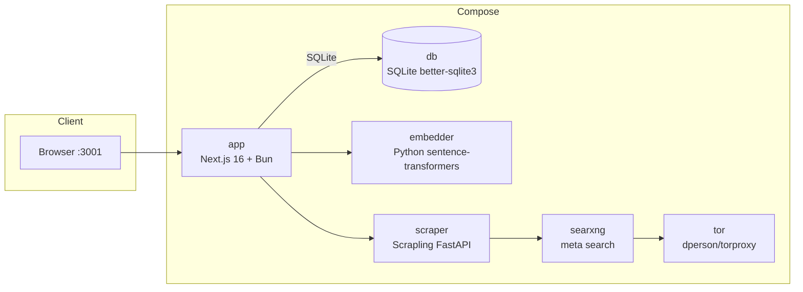

# UmansChat

A self-hosted, open-source AI workspace for high-resource OpenAI-compatible providers (UmansAI, OpenAI, vLLM, Ollama). Combines ChatGPT-like conversations with branching threads, semantic memory, web knowledge ingestion, MCP tools, external connections, multi-model workflows, reusable skills, and tone personalization.

[日本語 / Japanese](./README.ja.md)

## Contributor Documentation

Comprehensive documentation for contributors is available in the [`docs/`](./docs/) folder. It covers architecture, database schema, chat streaming, memory/skills systems, tool calling, frontend components, deployment, testing, and more. See [`docs/README.md`](./docs/README.md) for the full index.

## Features

- **Streaming chat** with SSE (token-by-token output)
- **Parallel pre-stream processing** — search, URL, memory, and skill context build run concurrently instead of sequentially; tool probe warms up at module load; code/translation/opinion/advice requests skip the search-decision LLM round-trip via heuristic, reducing first-token latency
- **Rapid mode** — a per-message ⚡ toggle in the composer that skips web search, URL scraping, and memory/skill RAG (both pre-LLM retrieval and post-stream generation) for lower first-token latency; MCP/connections tools and dual-model flow stay active. Stays on across messages and threads until you click ⚡ again.
- **Branching conversation tree** — regenerate or edit a message to create sibling nodes; navigate siblings with `< 1/N >`
- **File attachments** — images (vision), PDF (text extraction), text/code files (max 10MB per file)
- **Semantic search** across all threads (cosine similarity)
- **Conversation memory** — fact/working memories extracted after each turn and injected as RAG context; view, search, edit, delete, and manually add memories from the sidebar 🧠 Memory Manager
- **Web page scraping → knowledge ingestion** — scraped pages become a RAG source for future answers; URLs pasted in chat are scraped automatically and injected as context
- **Web search** — app-level SearXNG pipeline with a dedicated search model for query generation and result summarization; triggers on volatile info, explicit requests, and unfamiliar terms/proper nouns; configurable in settings
- **Dual-model conclusions** — run two models in cross-review or debate mode, then stream a synthesized final answer with the model work kept in collapsible details
- **Tor proxy** support for anonymous scraping
- **Thinking effort control** — per-model reasoning levels (e.g. GLM-5.2: `none`/`high`/`max`, Flash: `none`/`low`/`medium`/`high`); ignored for models without reasoning control
- **Embedding model switching** — local ONNX via transformers.js, or an HTTP Python embedder service
- **Folder organization** for threads
- **Dark / light / system theme**
- **EN / JA i18n toggle** (English is the default)
- **OpenAI-compatible LLM backend** — UmansAI, OpenAI, vLLM, Ollama, etc.
- **Auto title generation** from the first user message
- **Date/time + execution environment** — current date/time (timezone-aware) and detected OS/arch are prepended to every prompt so the model gives environment-appropriate answers
- **Model + elapsed time display** — each assistant message shows which model produced it and how long the response took
- **Motion-based UI animations** — modal transitions, button press feedback, animated accordions, and smooth scroll
- **Per-thread system prompt and model selection**
- **Named global system instructions** — save multiple system prompts per account, pick one as the user default, and override per-thread; priority: thread systemPrompt > thread instruction override > user default > body prompt
- **MCP server integration** — register external Model Context Protocol servers (Streamable HTTP or stdio) and enable them per-thread; the LLM discovers and calls their tools during streaming alongside built-in search/scrape tools
- **Connections (Notion)** — connect your Notion account via OAuth; the LLM calls `notion_search`, `notion_get_page`, and `notion_get_blocks` tools during chat to find and read Notion content; enabled per-thread via the ＋ menu
- **Account authentication** — Auth.js v5 with Credentials (email/password) and optional Google OAuth; first Docker launch requires account creation, then login; each user's data is isolated
- **Personalization** — per-user style presets (standard/polite/casual/concise/detailed/academic/creative/technical) + warmth/energy/structure/emoji trait sliders (0-2). Adjusts LLM tone system-wide. Disabled by default; configure in Settings → Personalization.
- **Skills system** — reusable procedural skills with semantic RAG matching. 6 kinds (workflow/bugfix/project_rule/tool_usage/coding_pattern/debugging). Auto-extracted draft candidates from conversations (up to 3/turn with confidence + reason); approve, edit-and-approve, or reject in the Skill Manager (sidebar 🛠️ button). Manual CRUD also supported. Skills track usage (success/failure counts, last-used).
- **Time-range filter** — composer dropdown (None/day/week/month/year) that narrows memory, web-knowledge, skill RAG retrieval, and web search results to the selected period.
- **Folder-level instructions & memory scope** — folders support a per-folder system prompt (applies to all threads in the folder) and a memory scope toggle: `global` (all threads) or `folder` (only threads in the same folder).
- **Reasoning display** — when a model emits thinking tokens, they appear in a collapsible "Thinking" block above the answer; inline `<thinking>` tags are also extracted and rendered.
- **Rich Markdown** — KaTeX math rendering (`$...$` inline, `$$...$$` block), syntax-highlighted code blocks with copy-to-clipboard, GFM tables/strikethrough/task lists.
- **Settings GUI** that writes to `.env` (no restart needed for config changes, except embedding-model migration)

## Architecture

UmansChat is a Next.js 16 + React 19 app backed by SQLite (better-sqlite3) — a file-based, embedded database with no separate server. The Docker Compose setup below orchestrates the app alongside optional services:



| Service    | Image / Build        | Role                                            | Port           |
|------------|----------------------|-------------------------------------------------|----------------|
| `app`      | Built from `Dockerfile` | Next.js app (chat UI, API, settings)         | `3001 → 3000`  |
| `db`       | `better-sqlite3` (SQLite) | SQLite database (file-based, embedded)         | —              |
| `embedder` | Built from `./embedder` | Python `sentence-transformers` HTTP embedder | `8000` (exposed) |
| `scraper`  | Built from `./scraper`  | Scrapling FastAPI scraper + SearXNG client    | `8000` (exposed) |
| `searxng`  | `searxng/searxng:latest` | SearXNG meta-search engine                    | `8081 → 8080`  |
| `tor`      | `dperson/torproxy:latest` | Tor SOCKS proxy for anonymous scraping      | `9050` (exposed) |

## Requirements

- **Node.js / Bun** — Bun is the primary runtime and package manager
- **Docker** (with Docker Compose) — optional; only needed for the scraper, embedder, SearXNG search, and Tor services. The standalone exe and local-dev SQLite path need nothing extra.
- An **OpenAI-compatible LLM API key** (UmansAI, OpenAI, vLLM, Ollama, etc.)

## Quick Start (Docker)

This is the recommended path for running UmansChat as a self-contained service.

```bash
# 1. Copy the environment template
cp .env.example .env

# 2. Set your LLM API key (required)
#    Edit .env and fill in LLM_API_KEY
#    Optionally set LLM_BASE_URL and LLM_MODEL for your provider

# 2b. Generate an AUTH_SECRET and add it to .env
bunx auth secret
# 2c. (Optional) To enable "Sign in with Google", set in .env:
#     GOOGLE_CLIENT_ID and GOOGLE_CLIENT_SECRET
#     Create credentials at https://console.cloud.google.com/apis/credentials
#     Redirect URI: http://localhost:3001/api/auth/callback/google
# 3. Start all services
docker compose up -d

# 4. Open the app
#    http://localhost:3001
#    On first launch, you'll be prompted to create an admin account.
```

On first run, database migrations are applied automatically by the app, and you'll be prompted to create the first admin account (nickname + email + password). Subsequent visits require login. Each user's threads, folders, and memories are isolated. If you change the embedding model after initial setup, see [Database Migrations](#database-migrations).

## Quick Start (Standalone Windows exe)

A no-Docker, double-clickable Windows experience. The resulting `dist/UmansChat/umanschat.exe` bundles the standalone server, a SQLite database file, the ONNX runtime, a launcher, and a bundled `node.exe` — no Docker, Node, or Bun install required on the target machine.
> **Build machine requires** Windows + [Bun](https://bun.sh) installed. The target machine needs nothing.

```bash
# 1. Build, assemble the distributable folder, and compile umanschat.exe
#    (runs `next build` internally with DATABASE_URL=":memory:")
bun run pack:exe

# 2. Run the app
#    Double-click dist/UmansChat/umanschat.exe
#    (or run: node dist/UmansChat/umanschat.cjs)
```

On first launch the launcher creates `data/umanschat.db`, applies migrations, starts the server on `:3001`, and opens your browser. You'll be prompted to create the first admin account.

> **First run requires internet.** Local ONNX embeddings download the model (`Xenova/all-MiniLM-L6-v2`, shipped in `.env.example` for `EMBED_PROVIDER=local`) from Hugging Face on first use. After the initial download, chat works offline. Web search and page scraping degrade to empty results without the Docker services — chat itself is unaffected. For the HTTP Python embedder (`EMBED_PROVIDER=http`), the default model is `LiquidAI/LFM2.5-Embedding-350M` (1024-dim) and runs server-side — no client download.

### Auto-Update (exe only)

The standalone exe checks for updates on startup and in **Settings → System**. When a newer release exists on GitHub, an amber dot appears on the settings button.

1. Open Settings → System tab
2. Click **Download and install** — the release zip is downloaded, extracted, and a marker file is written
3. The launcher detects the marker within 5 seconds, stops the server, swaps files (preserving `data/` and `.env`), and restarts the new exe
4. The browser auto-reloads when the new server comes up

`data/` (SQLite DB) and `.env` (API keys, settings) are preserved across updates. The old `umanschat.exe` is renamed to `.old` and cleaned up on next launch.

> **Prerequisite**: The GitHub repository must be public for the Releases API and asset downloads to work without authentication.
> **Docker** users update via `docker compose pull && docker compose up -d` — auto-update is exe-only.

## Releases (Docker + exe)

Releases are produced manually via GitHub Actions. Each release publishes **both** distribution formats:

- **Docker images** (GHCR):
  - `ghcr.io/johmaru/umanschat-unofficial-app:<version>`
  - `ghcr.io/johmaru/umanschat-unofficial-scraper:<version>`
  - `ghcr.io/johmaru/umanschat-unofficial-embedder:<version>`
  Each image is tagged with both `:<version>` and `:latest`.
- **Windows standalone exe**: `UmansChat-<version>-windows-x64.zip`, attached to the GitHub Release.

To create a release, run the workflow manually:

```
Actions tab → Release → Run workflow → enter version (e.g. 1.2.3)
```

The `version` input is **required** — this prevents accidental runs from overwriting `:latest`. Releases are not triggered automatically by tag pushes; only run when you intentionally want to publish.

The pipeline runs four jobs: `prepare` (shared version), `docker` (ubuntu-latest, pushes 3 images), `exe` (windows-latest, builds `umanschat.exe` natively — no cross-compilation), and `release` (`needs: [prepare, docker, exe]` — creates the GitHub Release only after both artifacts succeed).

### Consuming published images

```bash
# Pull the released images instead of building from source
docker compose pull
docker compose up -d
```

For local development from source, use `docker compose up -d --build`.

### CI validation

Every push/PR to `develop`/`main` runs `.github/workflows/ci.yml`: builds all 3 Docker images (no push) and runs `bun run pack:exe` on windows-latest. Both jobs must pass before merge.

## Public Access via Cloudflare Tunnel (Optional)

To expose the app over public HTTPS without port forwarding or a public IP, use a Cloudflare named tunnel. This is the recommended way to use Google OAuth from a remote network.

### Setup via GUI (recommended)

1. Create a named tunnel at [Cloudflare Zero Trust](https://one.dash.cloudflare.com/) → Networks → Tunnels → Create a tunnel (type: Cloudflared).
2. Add a public hostname and route it to `Service=http://app:3000`.
3. Copy the tunnel token from the Cloudflare dashboard.
4. Open UmansChat → Settings → Connections tab → Cloudflare Tunnel section.
5. Paste the tunnel token into the **Tunnel Token** field.
6. Set **AUTH_URL** to your public hostname (e.g. `https://umanschat.example.com`). Must start with `https://`.
7. Click **起動** (Start). The tunnel starts immediately — no app restart required.

The tunnel can be started/stopped from the same GUI at any time. `AUTH_URL` is applied dynamically (NextAuth reads it per-request), so the Google OAuth callback URL switches immediately.

### Setup via .env (Docker CLI)

```bash
# .env
TUNNEL_TOKEN=your-token-here
AUTH_URL=https://your-tunnel.example.com
```

```bash
docker compose --profile tunnel up -d
```

### Google OAuth redirect URI

In Google Cloud Console, set the authorized redirect URI to:
`https://your-tunnel.example.com/api/auth/callback/google`

### Docker vs standalone exe

- **Docker Compose**: The cloudflared container is managed via Docker socket (`--force-recreate` on token change).
- **Standalone exe (Windows x64 only)**: cloudflared binary is downloaded to `data/cloudflared/` on first use. The binary is pinned to a fixed version (`2024.12.2`) with SHA256 verification, HTTPS-only download, and no automatic updates. Version upgrades require a rebuild by the developer.
- **Node/Bun on Linux x64**: When running from source on Linux (not the standalone exe), the Linux cloudflared binary is downloaded to `data/cloudflared/` with the same security checks.
- macOS is not supported (requires `.tgz` extraction, not implemented).

## Quick Start (Local Dev)

For development of the Next.js app itself.

```bash
# 1. Install dependencies
bun install

# 2. Database is file-based SQLite — no Docker db needed.
#    data/umanschat.db is created automatically on first run.

# 3. Copy the environment template and configure
cp .env.example .env
#    Set DATABASE_URL, LLM_API_KEY, and (for scraping/search) the service URLs

# 4. Apply database migrations (creates tables on first run)
bunx drizzle-kit migrate

# 5. Run the dev server
bun run dev
#    http://localhost:3000
```

The scraper, embedder, searxng, and tor services are optional Docker containers you can start when you need scraping/search during local development:

```bash
docker compose up -d scraper embedder searxng tor
```

Point `SCRAPER_URL`, `SEARXNG_URL`, and (for HTTP embeddings) `EMBEDDER_URL` in `.env` to the host-exposed ports when running the app outside Compose.

## Configuration

All configuration lives in `.env` (see `.env.example` as the source of truth). The in-app Settings GUI can edit most of these at runtime without a restart.

| Variable                | Description                                                        | Default                                              |
|-------------------------|--------------------------------------------------------------------|------------------------------------------------------|
| `LLM_BASE_URL`          | Base URL of the OpenAI-compatible API (Umans mode auto-fetches models when `api.code.umans.ai`) | `https://api.code.umans.ai/v1`                       |
| `LLM_API_KEY`           | API key (required)                                                 | —                                                    |
| `LLM_MODEL`             | Default model                                                      | `umans-glm-5.2`                                      |
| `LLM_MODELS`            | Comma-separated model list (OAI-compat mode only; ignored in Umans mode) | —                                                    |
| `THINKING_EFFORT`       | Reasoning level (`none`/`low`/`medium`/`high`/`max`, per model)  | `medium`                                             |
| `EMBED_MODEL`           | Embedding model name (`Xenova/*` ONNX model for `local` provider, or `sentence-transformers` model for `http` provider)  | `LiquidAI/LFM2.5-Embedding-350M`                     |
| `EMBED_DIM`             | Embedding dimension (must match `EMBED_MODEL`)                     | `1024`                                               |
| `EMBED_PROVIDER`        | Embedding backend: `local` (ONNX) or `http` (Python embedder)     | `local`                                              |
| `EMBEDDER_URL`          | Python embedder URL (required when `EMBED_PROVIDER=http`; Docker sets automatically) | `http://localhost:8001`     |
| `EMBEDDER_GPU_COUNT`    | GPU count for the Python embedder (0 = CPU fallback; nvidia only; Docker Compose only) | `0` |
| `WEB_SEARCH_MAX_RESULTS`| Number of results fetched (and scraped) per chat send              | `3`                                                  |
| `WEB_SEARCH_MAX_ROUNDS` | Maximum search rounds per response (1-5); caps how many of the search-decision LLM's queries are executed | `2`                                                  |
| `SCRAPER_URL`           | Scraper microservice URL                                           | `http://localhost:8000`                              |
| `SEARXNG_URL`           | SearXNG URL                                                        | `http://localhost:8080`                              |
| `TOR_PROXY`             | Tor proxy for the app (reference; empty = no Tor)                 | —                                                    |
| `SCRAPE_PROXY`           | Proxy used by the scraper when scraping                            | —                                                    |
| `WEB_SEARCH_MODEL`     | Model for search query generation and result summarization        | `umans-qwen3.6-35b-a3b`                              |
| `DATABASE_URL`          | SQLite database file path                                          | `data/umanschat.db`                          |
| `HOST_OS`              | OS name injected into prompts (`Windows`, `macOS`, `Linux`; empty = auto-detect from `/proc/version`) | —                            |
| `TZ`                   | Timezone for the date/time injected into prompts (empty = `Asia/Tokyo`) | —                            |
| `AUTH_SECRET`           | Auth.js JWT encryption secret (required; generate with `bunx auth secret`) | —                                                  |
| `AUTH_TRUST_HOST`        | Trust the host header behind a reverse proxy (Docker)              | `true`                                               |
| `NOTION_CLIENT_ID`       | Notion OAuth client ID (for Connections feature; see [Notion Connection Setup](#notion-connection-setup)) | — |
| `NOTION_CLIENT_SECRET`   | Notion OAuth client secret                                          | —                                                    |
| `AUTH_URL`               | Public URL of the app (must match the Notion OAuth redirect URI)   | `http://localhost:3001`                              |

## Notion Connection Setup

The Connections feature lets the LLM call Notion tools (search pages, read page content) during chat. To enable:

1. Go to [https://www.notion.so/developers](https://www.notion.so/developers) and create a **public** integration.
2. Set the redirect URI to `http://localhost:3001/api/connections/notion/callback` (adjust the host/port for your deployment).
3. Set `NOTION_CLIENT_ID` and `NOTION_CLIENT_SECRET` in `.env`. Also set `AUTH_URL` to the app's public URL (must match the redirect URI).
4. Restart the app (`docker compose up -d --build`).
5. Open Settings → Connections → "Connect Notion". Authorize via Notion. The connection appears in the settings list.
6. Per-thread: open the ＋ menu → "Connections" → toggle on the Notion connection. The LLM will auto-invoke Notion tools based on conversation context.

## LLM Provider Modes

UmansChat supports two modes, switched automatically by `LLM_BASE_URL`:

### Umans mode (default)

When `LLM_BASE_URL` points to `api.code.umans.ai` (e.g. `https://api.code.umans.ai/v1`):

- The model list and reasoning levels are **auto-fetched** from `/v1/models/info` at startup (cached in-process).
- Models appear in the selector with their **display names** (e.g. `Umans Qwen3.6 35B A3B`).
- `LLM_MODELS` is **ignored** — the API is the source of truth.
- On API failure, falls back to the built-in `MODEL_REASONING` table.

### OpenAI-compatible mode

When `LLM_BASE_URL` points elsewhere (OpenAI, vLLM, Ollama, etc.):

- The model list is taken from `LLM_MODELS` (comma-separated, e.g. `gpt-4o,gpt-4o-mini`).
- Display names are not available — model IDs are shown as-is.
- Reasoning levels fall back to `MODEL_REASONING` for known Umans models, or empty for others.

Change `LLM_BASE_URL` in the Settings GUI or `.env` to switch modes. No restart is needed when using the Settings GUI.

## Usage

- **Create a thread** — start typing in the composer; the thread is created on first send and an auto title is generated from your first message.
- **Send a message** — press `Enter` to send, `Shift+Enter` for a newline. Responses stream token-by-token. Each completed assistant message shows the model name and elapsed response time below the answer.
- **Rapid mode** — click ⚡ in the composer to skip web search, URL scraping, and memory/skill retrieval for faster responses. Stays on for subsequent messages (and across thread switches) until you click ⚡ again. MCP/connections tools and dual-model mode still work normally.
- **Branching** — use **Regenerate** or **Edit** on any message to create a sibling branch. Navigate between siblings with `< 1/N >`.
- **Dual-model mode** — open thread settings, switch **Response mode** to **Dual model**, choose Model A/B, and pick **Cross review** or **Debate**. The chat shows the final synthesized answer first; the A/B answers, reviews, or debate turns are available in the collapsible **Dual-model details** block. This mode makes several LLM calls per message, so responses cost more and take longer than normal mode.
- **Attachments** — attach images (sent to vision-capable models), PDFs (text extracted), or text/code files (up to 10MB each).
- **Semantic search** — search across all threads; results are ranked by cosine similarity.
- **Web scraping** — when web search is enabled, results are scraped and ingested as a RAG source for the current answer.
- **Tor** — toggle Tor in settings for anonymous scraping.
- **Settings** — open the Settings panel to change the LLM provider/model, thinking effort, embedding model, web search count, and Tor options. Changes are written to `.env` and take effect immediately, except embedding-model changes which require a migration (see below).
- **Global system instructions** — open Settings → AI & Models to create, edit, and delete named system instructions. Select one as your default; it applies to all threads unless a thread overrides it. In thread settings, pick a different instruction per-thread.
- **Memory Manager** — click the 🧠 button in the sidebar to view all conversation memories (fact/working), search and filter them, edit content/kind/importance, delete (logical — removed from RAG), or manually add new memories.
- **Personalization** — open Settings → Personalization. Pick a style preset (or "None" to disable). Adjust the 4 trait sliders (warmth, energy, structure, emoji; 0-2). Changes apply to all new messages immediately — no restart needed.
- **Skill Manager** — click 🛠️ in the sidebar. **Active Skills** tab: edit name/content/kind/trigger/tags, archive. **Draft Candidates** tab: review LLM-proposed skills (with confidence score + reason), approve as-is, edit-then-approve, or reject. **Archived** tab: restore archived skills. Skills are matched by cosine similarity to the conversation and injected as context.
- **Time-range filter** — use the dropdown in the composer (next to ⚡) to limit memory/knowledge/skill retrieval and web search to a recent time window. "None" searches all history.
- **Folder settings** — right-click a folder → Settings (or create a new folder). Set a folder-level instruction (system prompt for all threads in the folder) and memory scope (global = all threads, folder = only threads in this folder).

## Database Migrations

UmansChat uses Drizzle ORM with SQLite (better-sqlite3). In the Docker setup, migrations run automatically on first startup — the app container runs `drizzle-kit migrate` before starting the server, which creates all tables. In standalone mode, the launcher runs migrations on first launch.

For local development outside Docker, apply migrations manually with `bunx drizzle-kit migrate` (see [Quick Start (Local Dev)](#quick-start-local-dev)).

When you switch the embedding model (changing `EMBED_MODEL` / `EMBED_DIM`), the Settings GUI's migration action (`applyMigration`) clears the existing `memories` and `page_embeddings` data so they can be re-embedded with the new model. No DDL is needed — embeddings are stored as JSON text, so the column type does not depend on the dimension. Re-embed your content after the migration.

## Testing

```bash
# Unit tests
bun run test

# Type checking
bun run typecheck

# Linting
bun run lint
```
