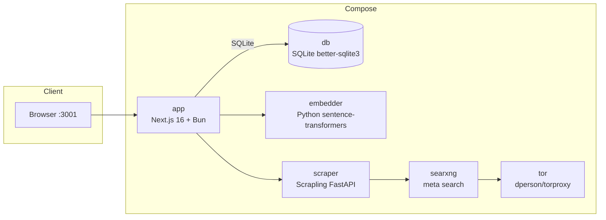

# UmansChat

A self-hosted, open-source AI workspace powered by **UmansAI**. Combines ChatGPT-like conversations with branching threads, semantic memory, web knowledge ingestion, MCP tools, external connections, multi-model workflows, reusable skills, isolated code execution, and tone personalization.

[日本語 / Japanese](./README.ja.md)

## Project Status

**UmansChat is pre-release software.** Breaking changes may occur between versions — database schemas, configuration variables, and APIs can change without notice. Back up your `data/` directory and `.env` before updating.

**Docker is the recommended deployment method.** Docker Compose orchestrates all services (app, embedder, scraper, SearXNG, Tor) and updates are straightforward with `docker compose pull && docker compose up -d`. A standalone Windows exe is also available for no-Docker deployments.

## Features

### Chat & conversations

- **Streaming chat** with SSE (token-by-token output)
- **Parallel pre-stream processing** — search, URL, memory, and skill context build run concurrently; tool probe warms up at module load; code/translation/opinion/advice requests skip the search-decision LLM via heuristic to cut first-token latency
- **Rapid mode** — composer ⚡ toggle skips web search, URL scraping, and memory/skill RAG (pre-LLM and post-stream) for lower latency; MCP/connections tools and multi-model modes stay active. Stays on across messages and threads until toggled off
- **Branching conversation tree** — regenerate or edit to create sibling nodes; navigate with `< 1/N >`
- **File attachments** — images (vision), PDF (text extraction), text/code files (max 10MB each)
- **Send-mode toggle** — default `Ctrl+Enter` / `Cmd+Enter` to send; click `⌃↵` for Enter-to-send (`Shift+Enter` newline)
- **Reasoning display** — thinking tokens and inline `<thinking>` tags in a collapsible block
- **Rich Markdown** — KaTeX (`$...$` / `$$...$$`), syntax-highlighted code with copy, GFM tables/strikethrough/task lists, and LLM-authored rich blocks (callouts, inline styling, rich lists) via remark-directive
- **Model + elapsed time** on each assistant message
- **Auto title generation** from the first user message
- **Date/time + execution environment** injected into prompts (timezone-aware OS/arch)

### Multi-model workflows

- **Model fallback (TTFT)** — if the primary model does not emit a first token within `LLM_FALLBACK_TIMEOUT_MS`, switch once to `LLM_FALLBACK_MODEL` (empty = disabled)
- **Dual-model conclusions** — cross-review or debate between two models; synthesized final answer with collapsible A/B details
- **Hyper-Thinking mode** — 1–5 self-review rounds from distinct perspectives; final answer streamed, drafts in collapsible trace
- **Council mode** — 2–6 persona panels debate under a time limit; final model synthesizes; full discussion in collapsible block
- **Thinking effort control** — per-model reasoning levels (e.g. GLM-5.2: `none`/`high`/`max`; Flash: `none`/`low`/`medium`/`high`)

### Knowledge, memory & search

- **Semantic search** across all threads (cosine similarity + sqlite-vec)
- **Conversation memory** — fact/working memories after each turn, RAG injection, lifecycle (`validUntil`, working 7-day expiry, contradiction detection), feedback loop for importance. Sidebar 🧠 Memory Manager for CRUD
- **Web page scraping → knowledge** — scraped pages become RAG sources; URLs in chat are scraped automatically
- **Web search** — SearXNG pipeline with a dedicated search model; categories, ranking, wiki fallback, adaptive retry; configurable rounds/results
- **Time-range filter** — composer dropdown (None/day/week/month/year) for memory, knowledge, skill RAG, and web search
- **Folder-level instructions & memory scope** — per-folder system prompt; memory scope `global` or `folder`

### Tools & integrations

- **Workspace tools** — model can read/write/edit files, search by glob/regex, list dirs, run shell commands, and read app logs during streaming. Tool results include structured status + next-action hints; an anti-loop guard prevents repeated failed exploration. The agent continue policy re-prompts when the model stops mid-task without a real answer.
- **Sandbox code execution (experimental, v0.4)** — isolated `sandbox_run` tool (Python/JS) via Docker; auto-off when Docker/image missing. See [Sandbox](#sandbox-code-execution-optional)
- **MCP server integration** — Streamable HTTP / legacy SSE / stdio; optional request headers; connection test; SSRF-guarded URLs (`MCP_ALLOW_PRIVATE_URLS` for self-host)
- **Connections (OAuth)** — Notion, GitHub, Gmail, Google Drive, Google Calendar, Outlook Mail, Outlook Calendar; per-thread enable via ＋ menu
- **Todo list** — sidebar ✓ UI + AI tools for create/list/update/delete (priority, due dates, embeddings)

### Personalization & skills

- **Personalization** — style presets + warmth/energy/structure/emoji sliders (0–2); Settings → Personalization; off by default
- **Skills system** — 6 kinds with semantic RAG; auto-extracted draft candidates; Skill Manager (sidebar 🛠️)
- **Named global system instructions** — multiple prompts per account; priority: thread systemPrompt > thread override > user default > body prompt
- **Per-thread system prompt and model selection**

### Account, UI & ops

- **Account authentication** — Auth.js v5 Credentials + optional Google OAuth; first launch creates admin; per-user data isolation
- **Auth hardening** — registration lock, IP CIDR whitelist, dual local/public access (redirects follow request Host)
- **Folder organization**, **dark / light / system theme**, **EN / JA i18n** (English default)
- **Translation page** — `/translate` (sidebar 🌐): context-aware and multi-candidate modes
- **Motion UI** — restrained modal/button/accordion motion
- **Settings GUI** writes `.env` (no restart except embedding-model migration)
- **Chat export** — optional Markdown export per turn (`CHAT_EXPORT_PATH` / Docker `CHAT_EXPORT_HOST_PATH`)
- **Embedding model switching** — local ONNX (transformers.js) or HTTP Python embedder
- **Tor proxy** for anonymous scraping
- **Exe rebuild / auto-update data preservation** — `.env` and `data/` under `%USERPROFILE%\.umans_chat_unofficial\`

## Architecture

UmansChat is a Next.js 16 + React 19 app backed by SQLite (better-sqlite3) — file-based, no separate DB server. Docker Compose runs the app with optional services:



| Service    | Image / Build           | Role                                              | Port             |
|------------|-------------------------|---------------------------------------------------|------------------|
| `app`      | Built from `Dockerfile` | Next.js app (chat UI, API, settings)              | `3001 → 3000`    |
| `db`       | better-sqlite3          | SQLite database (file-based, embedded)            | —                |
| `embedder` | Built from `./embedder` | Python `sentence-transformers` HTTP embedder      | `8001` (exposed) |
| `scraper`  | Built from `./scraper`  | Scrapling FastAPI scraper + SearXNG client        | internal `8000`  |
| `searxng`  | `searxng/searxng`       | SearXNG meta-search                               | `8081 → 8080`    |
| `tor`      | `dperson/torproxy`      | Tor SOCKS for anonymous scraping                  | `9050` (exposed) |
| `sandbox`  | profile `sandbox`       | Build-only image for `sandbox_run` (not a running service) | —       |

## Requirements

- **Bun** — primary runtime and package manager (local dev / build)
- **Docker** (with Compose) — recommended self-host path. Standalone Windows exe needs no Docker on the target machine
- **UmansAI API key** — provider is fixed to UmansAI; only `LLM_API_KEY` is required
- **Docker** also required if you enable the experimental **sandbox** tool (image must be built locally)

## Quick Start (Docker)

Recommended path for a full self-contained stack.

```bash
# 1. Copy the environment template
cp .env.example .env

# 2. Set your LLM API key (required)
#    Edit .env → LLM_API_KEY
#    Optional: LLM_MODEL (default umans-glm-5.2)

# 2b. Generate AUTH_SECRET
bunx auth secret
# 2c. (Optional) Google OAuth:
#     GOOGLE_CLIENT_ID / GOOGLE_CLIENT_SECRET
#     Redirect URI: http://localhost:3001/api/auth/callback/google

# 3. Start all services
docker compose up -d

# 4. Open http://localhost:3001
#    First launch: create an admin account
```

Migrations run automatically. Users are isolated (threads, folders, memories). After changing the embedding model, see [Database Migrations](#database-migrations).

**Optional sandbox image** (once):

```bash
docker compose --profile sandbox build
```

## Quick Start (Standalone Windows exe)

No Docker/Node/Bun on the target machine. Build machine needs Windows + [Bun](https://bun.sh).

```bash
bun install
cp .env.example .env   # set LLM_API_KEY; bunx auth secret
bun run pack:exe       # → dist/UmansChat/
# Double-click umanschat.exe  (or: node dist/UmansChat/umanschat.cjs)
```

> **In-place rebuild:** re-running `pack:exe` into an existing `dist/UmansChat/` preserves `.env` and `data/`.
>
> **Data location:** `%USERPROFILE%\.umans_chat_unofficial\` (not the exe folder). Upgrades auto-migrate legacy data.

On first launch the launcher creates the DB, applies migrations, listens on `:3001`, and opens the browser.

> **First run needs internet** for local ONNX embeddings (`Xenova/all-MiniLM-L6-v2` by default). After download, chat works offline. Web search/scrape degrade to empty results without Docker sidecars — chat still works.
>
> **Sandbox / scraper / SearXNG / Tor / Python embedder are not bundled.** Point `SCRAPER_URL` / `SEARXNG_URL` at Docker services if needed. For sandbox, install Docker Desktop and build the image (see [Sandbox](#sandbox-code-execution-optional)).

### Auto-update (exe only)

Settings → System → **Download and install** when a newer GitHub Release exists. `data/` and `.env` are never overwritten. Docker users update with `docker compose pull && docker compose up -d`.

> Requires a **public** GitHub repository for unauthenticated Releases API access.

## Releases (Docker + exe)

Manual only (`workflow_dispatch`). Each release publishes **both**:

- **Docker (GHCR)** — `app`, `scraper`, `embedder` tagged `:<version>` and `:latest`
  - `ghcr.io/johmaru/umanschat-unofficial-app:<version>`
  - `ghcr.io/johmaru/umanschat-unofficial-scraper:<version>`
  - `ghcr.io/johmaru/umanschat-unofficial-embedder:<version>`
- **Windows exe** — `UmansChat-<version>-windows-x64.zip` on the GitHub Release

```
Actions → Release → Run workflow → version (e.g. 1.2.3)
```

`version` is required (prevents accidental `:latest` overwrite). Pipeline: `prepare` → `docker` + `exe` → `release` (only if both artifacts succeed).

```bash
docker compose pull && docker compose up -d   # consume published images
docker compose up -d --build                  # build from source
```

CI (`.github/workflows/ci.yml`) on every push/PR to `develop`/`main`: build 3 images (no push) + `pack:exe` on windows-latest.

## Quick Start (Local Dev)

```bash
bun install
cp .env.example .env   # LLM_API_KEY required
bun run dev            # predev runs sync-env + drizzle migrate
# http://localhost:3000
```

Optional sidecars:

```bash
docker compose up -d scraper embedder searxng tor
# Point SCRAPER_URL / SEARXNG_URL / EMBEDDER_URL at host-exposed ports
```

## LLM Provider

The provider is **hardcoded to UmansAI** (`https://api.code.umans.ai/v1`). Only `LLM_API_KEY` is required.

- Model list and reasoning levels are auto-fetched from `/v1/models/info` (in-process cache)
- Selectors show display names (e.g. `Umans Qwen3.6 35B A3B`)
- On API failure, falls back to the built-in `MODEL_REASONING` table
- Optional **TTFT model fallback**: set `LLM_FALLBACK_MODEL` + `LLM_FALLBACK_TIMEOUT_MS` (default 10000)

## Sandbox code execution (optional)

> **Experimental (v0.4).** API, error codes, and image tag may change. Tier 2/3 (file inspection, malware analysis) are not implemented.

Isolated `sandbox_run` for inline Python/JavaScript in a network-less Docker container. The tool is **only exposed** when Docker is reachable and the prebuilt image exists (`SANDBOX_ENABLED=auto`).

```bash
# Docker Compose
docker compose --profile sandbox build
docker compose up -d --build

# Native / exe / bun run dev
docker build -t umanschat-sandbox-python:v0.4 sandbox/python
```

In chat: ask the model to run code in the Python sandbox (e.g. `print(2+2)`). Without the image, the tool is simply not offered — no error, no half-state.

Full setup notes: [`.agents/skills/umanschat-install/SKILL.md`](./.agents/skills/umanschat-install/SKILL.md).

## Public Access via Cloudflare Tunnel (Optional)

Expose HTTPS without port forwarding. Recommended for remote Google OAuth.

### GUI (recommended)

1. Create a named tunnel (Cloudflare Zero Trust → Networks → Tunnels).
2. Public hostname → `Service=http://app:3000`.
3. Settings → Access & Security → Cloudflare Tunnel: paste **Tunnel Token**, set **AUTH_URL** to `https://…`, click Start.
4. No app restart required; start/stop anytime from the GUI.

### .env

```bash
TUNNEL_TOKEN=your-token-here
AUTH_URL=https://your-tunnel.example.com
```

Google redirect URI: `https://your-tunnel.example.com/api/auth/callback/google`.

- **Docker / exe / Linux x64**: cloudflared binary downloaded to `data/cloudflared/` with pinned version + SHA256 verification.
- **macOS**: not supported.

## Configuration

All settings live in `.env` (`.env.example` is the source of truth). Most can be edited in the Settings GUI without restart.

### LLM

| Variable | Description | Default |
|----------|-------------|---------|
| `LLM_API_KEY` | UmansAI API key (required) | — |
| `LLM_MODEL` | Default model | `umans-glm-5.2` |
| `LLM_FALLBACK_MODEL` | TTFT fallback model id (empty = disabled) | — |
| `LLM_FALLBACK_TIMEOUT_MS` | ms to wait for first token before fallback | `10000` |
| `THINKING_EFFORT` | Reasoning level (`none`/`low`/`medium`/`high`/`max`) | `medium` |
| `WEB_SEARCH_THINKING_EFFORT` | Reasoning level for search result summarization (`none`/`low`/`medium`/`high`/`max`) | `none` |
| `TRANSLATE_TIMEOUT` | Translation LLM timeout (seconds) | `30` |

### Embeddings

| Variable | Description | Default |
|----------|-------------|---------|
| `EMBED_PROVIDER` | `local` (ONNX) or `http` (Python embedder) | `local` |
| `EMBED_MODEL` | Model name (match provider) | `Xenova/all-MiniLM-L6-v2` |
| `EMBED_DIM` | Dimension (must match model) | `384` |
| `EMBEDDER_URL` | Python embedder URL when `http` | `http://localhost:8001` |
| `EMBEDDER_GPU_COUNT` | GPU count for embedder container (0 = CPU; Compose only) | `0` |

For Docker HTTP embedder, set `EMBED_PROVIDER=http`, `EMBED_MODEL=LiquidAI/LFM2.5-Embedding-350M`, `EMBED_DIM=1024`.

### Web search & scraping

| Variable | Description | Default |
|----------|-------------|---------|
| `WEB_SEARCH_MODEL` | Query generation + result summarization model | `umans-qwen3.6-35b-a3b` |
| `WEB_SEARCH_MAX_RESULTS` | Results fetched/scraped per query | `3` |
| `WEB_SEARCH_MAX_ROUNDS` | Max search rounds per response (1–5) | `3` |
| `SCRAPER_URL` | Scraper service (empty = disabled) | — (Compose sets service URL) |
| `SEARXNG_URL` | SearXNG (empty = disabled) | — (Compose sets service URL) |
| `TOR_PROXY` | App-side Tor reference (empty = none) | — |
| `SCRAPE_PROXY` | Proxy used by scraper | — |


### Skills

| Variable | Description | Default |
|----------|-------------|---------|
| `SKILL_EVOLUTION_ENABLED` | Enable evolution proposal generation (`false`/`0` = off; feedback recording always works) | `true` |
| `SKILL_EVOLUTION_AUTO_PROPOSE` | Auto-schedule evolution proposal on negative feedback (`true`/`1` = on; off = manual evolve only) | `false` |
| `SKILL_EVOLUTION_MODEL` | LLM model for evolution patch generation (empty = `LLM_MODEL`) | — |

### Database, logging, environment

| Variable | Description | Default |
|----------|-------------|---------|
| `DATABASE_URL` | SQLite file path | `data/umanschat.db` |
| `HOST_OS` | OS name in prompts (`Windows`/`macOS`/`Linux`; empty = auto) | — |
| `TZ` | Timezone for prompt date/time (empty = `Asia/Tokyo`) | — |
| `LOG_LEVEL` | `debug`/`info`/`warn`/`error` | `info` |
| `LOG_FILE_ENABLED` | Write `data/logs/umanschat.log` (auto: exe→true, Docker→false) | auto |
| `LOG_FILE_MAX_SIZE` | Rotation size bytes (keeps one `.log.1`) | `5242880` |
| `CHAT_EXPORT_PATH` | Markdown export dir (empty = off) | — |
| `CHAT_EXPORT_MODE` | `daily`: `<YYYY>/<MM>/<DD>/<title>.md` / `thread`: `<title>/<YYYY-MM-DD>[-partN].md` | `daily` |
| `CHAT_EXPORT_HOST_PATH` | Docker only: host path to mount (Windows: `C:/Users/...`) | — |

### Auth & security

| Variable | Description | Default |
|----------|-------------|---------|
| `AUTH_SECRET` | Auth.js secret (`bunx auth secret`) | — |
| `AUTH_TRUST_HOST` | Trust host behind reverse proxy | `true` |
| `AUTH_URL` | Public base URL for Settings, tunnel status, OAuth consoles. Redirects follow request Host | `http://localhost:3001` |
| `REGISTRATION_LOCKED` | Block new account creation | `false` |
| `ALLOWED_REGISTRATION_IPS` | Comma-separated IPs/CIDRs (empty = any; fail-closed if IP unknown) | — |
| `GOOGLE_CLIENT_ID` / `GOOGLE_CLIENT_SECRET` | Optional Google OAuth | — |
| `NOTION_CLIENT_ID` / `NOTION_CLIENT_SECRET` | Notion Connections OAuth | — |
| `GITHUB_CONNECTIONS_CLIENT_ID` / `GITHUB_CONNECTIONS_CLIENT_SECRET` | GitHub Connections OAuth | — |
| `GOOGLE_CONNECTIONS_CLIENT_ID` / `GOOGLE_CONNECTIONS_CLIENT_SECRET` | Gmail / Drive / Calendar Connections OAuth (separate from login) | — |
| `MICROSOFT_CLIENT_ID` / `MICROSOFT_CLIENT_SECRET` / `MICROSOFT_TENANT_ID` | Outlook Mail / Calendar Connections OAuth | — / `common` |
| `TUNNEL_TOKEN` | Cloudflare Tunnel token | — |
| `MCP_ALLOW_PRIVATE_URLS` | Allow http + private IPs for remote MCP (self-host/dev) | `false` |

### Sandbox

| Variable | Description | Default |
|----------|-------------|---------|
| `SANDBOX_ENABLED` | `auto` / `true` / `false` | `auto` |
| `SANDBOX_IMAGE` | Local image tag (not published to GHCR in v0.4) | `umanschat-sandbox-python:v0.4` |
| `SANDBOX_MIN_FREE_MEM_PERCENT` | Reject runs below free-memory % | `15` |
| `SANDBOX_MAX_CONCURRENT` | Max concurrent containers | `1` |
| `SANDBOX_DEFAULT_TIMEOUT_SEC` | Wall-clock timeout | `30` |
| `SANDBOX_STDOUT_MAX_BYTES` | stdout/stderr cap after sanitize | `4096` |

## OAuth Connection Setup

Connections let the AI access external services during chat. Seven providers are supported:
Notion, GitHub, Gmail, Google Drive, Google Calendar, Outlook Mail, Outlook Calendar.

### General steps

1. Create OAuth credentials at the provider's developer console.
2. Set redirect URIs to `{AUTH_URL}/api/connections/{provider}/callback` for each provider.
3. Set the env vars (see table above) in `.env` and save in Settings.
4. Settings → Connections → click Connect for each provider.
5. Per-thread: ＋ → Connections → enable the connections you want active.

### Provider-specific notes

| Provider | Console | Redirect URI path | Env vars |
|----------|---------|--------------------|----------|
| Notion | [notion.so/developers](https://www.notion.so/developers) | `/api/connections/notion/callback` | `NOTION_CLIENT_ID` / `NOTION_CLIENT_SECRET` |
| GitHub | [github.com/settings/developers](https://github.com/settings/developers) | `/api/connections/github/callback` | `GITHUB_CONNECTIONS_CLIENT_ID` / `GITHUB_CONNECTIONS_CLIENT_SECRET` |
| Gmail / Drive / Calendar | [Google Cloud Console](https://console.cloud.google.com/apis/credentials) | `/api/connections/{gmail,google_drive,google_calendar}/callback` | `GOOGLE_CONNECTIONS_CLIENT_ID` / `GOOGLE_CONNECTIONS_CLIENT_SECRET` |
| Outlook Mail / Calendar | [Microsoft Entra ID](https://entra.microsoft.com) | `/api/connections/{outlook,outlook_calendar}/callback` | `MICROSOFT_CLIENT_ID` / `MICROSOFT_CLIENT_SECRET` / `MICROSOFT_TENANT_ID` |

> **Google Connections ≠ login**: `GOOGLE_CONNECTIONS_CLIENT_ID` is separate from `GOOGLE_CLIENT_ID` (Auth.js login). Create a distinct OAuth client.

List both localhost and tunnel callback URLs if you use dual access.

## Usage

- **Create a thread** — type in the composer; created on first send with auto title.
- **Send** — default `Ctrl+Enter` / `Cmd+Enter`; toggle `⌃↵` for Enter-to-send. Streamed responses show model + elapsed time.
- **Rapid mode** — ⚡ skips search/scrape/memory/skill RAG until toggled off.
- **Branching** — Regenerate / Edit → siblings via `< 1/N >`.
- **Dual / Hyper-Thinking / Council** — thread settings → Response mode.
- **Attachments** — images, PDF, text/code (10MB each).
- **Semantic search** — all threads by cosine similarity.
- **Web scraping / Tor** — when services are configured; Tor toggle in Settings.
- **Settings** — LLM model, fallback, thinking effort, embeddings, search, Tor, logs, translation modes; written to `.env`.
- **Global instructions** — Settings → AI & Models.
- **Memory Manager** — sidebar 🧠.
- **Todo list** — sidebar ✓ (or ask the AI).
- **Personalization** — Settings → Personalization.
- **Skill Manager** — sidebar 🛠️ (active / drafts / archived).
- **Time-range filter** — composer dropdown next to ⚡.
- **Folder settings** — folder instruction + memory scope.
- **Translation** — sidebar 🌐 → `/translate`.
- **Sandbox** — when Docker + image are ready, ask the model to run code in the sandbox.

## Database Migrations

Drizzle ORM + SQLite. Migrations run automatically on Docker start, exe launch, and `bun run dev` (`predev` → `drizzle-kit migrate`).

Switching `EMBED_MODEL` / `EMBED_DIM` invalidates existing vectors. Settings GUI migration (`applyMigration`) clears `memories` and `page_embeddings` embeddings (stored as JSON text — no DDL). Re-embed content afterward.

## Testing

```bash
bun run test        # Vitest unit tests
bun run typecheck
bun run lint
```

## Contributor Documentation

Full contributor docs live in [`docs/`](./docs/) (architecture, schema, streaming, memory/skills, tools, frontend, deployment, testing). Index: [`docs/README.md`](./docs/README.md).

AI agent rules: [`AGENTS.md`](./AGENTS.md).
