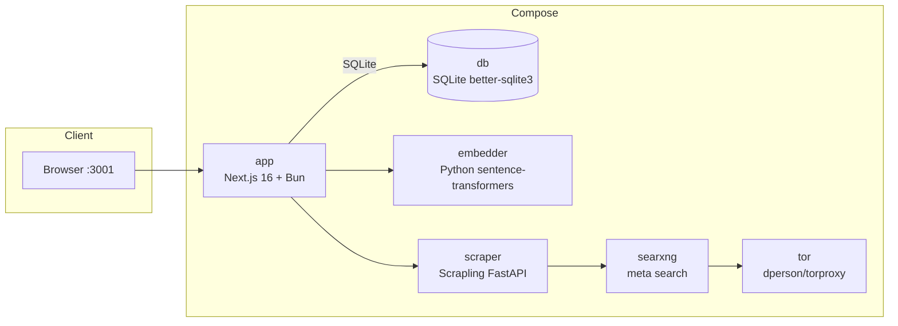
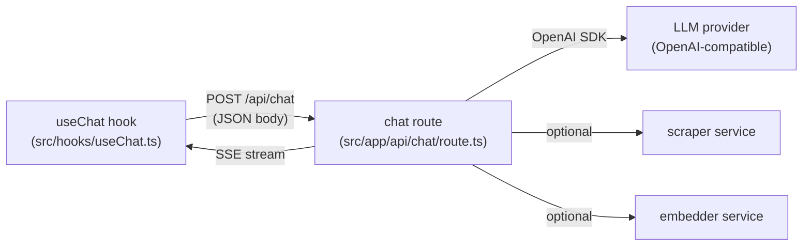
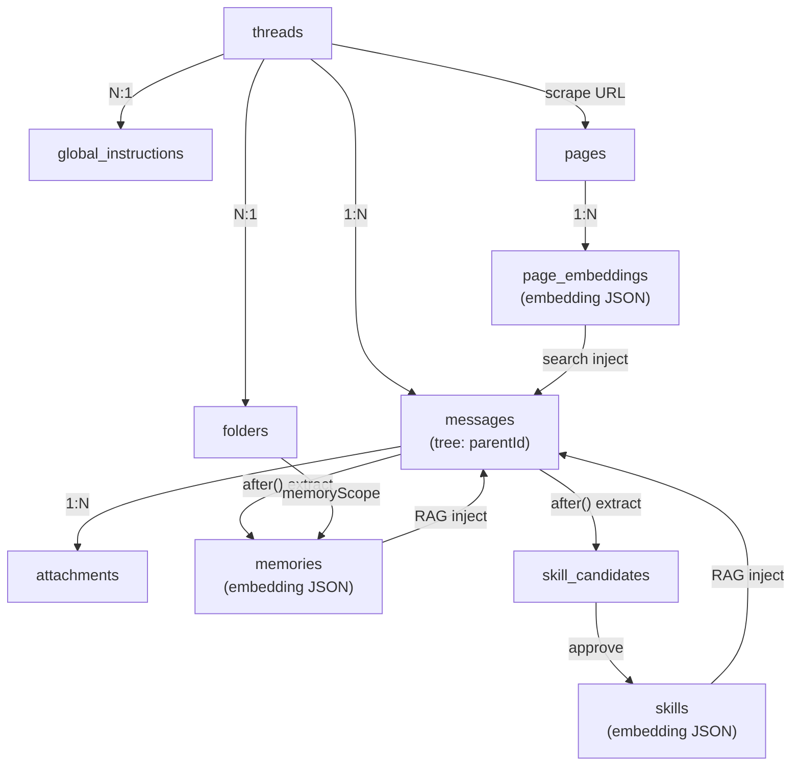

# Architecture Overview

High-level system architecture for MinervaAIWorkspace — a self-hosted, open-source AI workspace
built with Next.js 16 + React 19 + SQLite.

## Relevant source files

| Area | Key files |
|------|-----------|
| App shell & routing | `src/app/layout.tsx`, `src/app/page.tsx` |
| Chat API (orchestrator) | `src/app/api/chat/route.ts` |
| LLM client | `src/lib/llm.ts` |
| Database layer | `src/db/index.ts`, `src/db/schema.ts` |
| Embedding pipeline | `src/lib/embed.ts`, `src/lib/vectorSearch.ts` |
| Memory / skill retrieval | `src/lib/memoryStore.ts`, `src/lib/skillStore.ts` |
| Scraper client | `src/lib/scraper.ts` |
| MCP integration | `src/lib/mcpClient.ts` |
| Auth | `src/auth.ts`, `src/lib/auth-guards.ts` |
| Docker topology | `Dockerfile`, `docker-compose.yml` |

---

## System Overview

MinervaAIWorkspace is a single-process Next.js application that runs as a standalone server
(`output: "standalone"`). It bundles the chat UI, the REST/Server-Sent-Events API,
the SQLite database driver, and the LLM orchestration logic into one Node/Bun process.

The core premise: **one process, one database file, one OpenAI-compatible LLM endpoint.**
The app talks to an external LLM provider via the OpenAI SDK, reads/writes a local
SQLite file (`data/minerva.db`) through `better-sqlite3`, and optionally delegates
web scraping, meta-search, and embedding to companion Docker services.

Three optional companion services extend the app at runtime:

- **embedder** — a Python `sentence-transformers` HTTP service, used when `EMBED_PROVIDER=http`.
- **scraper** — a Scrapling FastAPI service that fetches and renders web pages with Chrome impersonation.
- **searxng** — a SearXNG meta-search engine instance that the scraper queries for web results.

A **tor** proxy can sit in front of SearXNG for anonymous scraping. When Docker is not
available (standalone exe, local dev), the app falls back to a local in-process embedding
pipeline (`transformers.js`) and disables web scraping.

### Design tenets

1. **Self-hosted & self-contained** — no managed database, no external vector DB
   service, no external cache layer. The SQLite file *is* the entire persistence layer.
   Vector search uses sqlite-vec, a loadable SQLite extension bundled with the app
   (not an external service).
2. **OpenAI-compatible** — the LLM client (`src/lib/llm.ts`) uses the OpenAI SDK with a
   configurable `baseURL`, so any OpenAI-compatible endpoint works (UmansAI, OpenAI, vLLM, Ollama).
3. **Branching-first** — the message store is a tree, not a flat list. Every edit or
   regenerate creates a sibling node, preserving the full conversation history.
4. **RAG with sqlite-vec** — embeddings are stored as Float32 BLOB; cosine distance
   is computed via sqlite-vec's `vec_distance_cosine()` SQL function in-process.
5. **Streaming-first** — chat responses are delivered via Server-Sent Events, with the
   client driving optimistic UI updates before the server responds.

---

## Service Topology

When deployed via Docker Compose, MinervaAIWorkspace runs as a set of cooperating services:



| Service | Image / Build | Role | Port |
|---------|-------------|------|------|
| `app` | Built from `Dockerfile` | Next.js app (chat UI, API, settings) | `3001 → 3000` |
| `db` | `better-sqlite3` (SQLite) | SQLite database (file-based, embedded) | — |
| `embedder` | Built from `./embedder` | Python `sentence-transformers` HTTP embedder | `8001` (exposed) |
| `scraper` | Built from `./scraper` | Scrapling FastAPI scraper + SearXNG client | `8000` (exposed) |
| `searxng` | `searxng/searxng:latest` | SearXNG meta-search engine | `8081 → 8080` |
| `tor` | `dperson/torproxy:latest` | Tor SOCKS proxy for anonymous scraping | `9050` (exposed) |

**Dependency shape:** only `app` holds a reference to `db` (via `better-sqlite3`, in-process).
The `app` makes outbound HTTP calls to `embedder` and `scraper`; the `scraper` in turn queries
`searxng`, which optionally routes through `tor`. All four companion services are independently
optional — the app runs without any of them in local-dev and exe modes.

The Dockerfile is a 3-stage build (deps → build → runner) on `node:22-slim`. The runner image installs `ca-certificates`, `curl`, and `sqlite3` only — no Docker CLI or socket mount. The Tor proxy is toggled via the scraper's `/config` HTTP endpoint, and cloudflared runs as a child process.

See [Deployment](./deployment.md) for full Docker, exe, and CI/CD details.

---

## Request Flow

A chat turn flows through four layers: the React client hook, the API route handler,
the LLM orchestration logic, and the SSE stream back to the client.



### High-level sequence

1. **Client** — `useChat(threadId)` (`src/hooks/useChat.ts`) builds the request body
   (`{ threadId, content, mode, rapid, ... }`), inserts an optimistic user message
   and assistant placeholder into the in-memory message tree, and `fetch()`-es
   `POST /api/chat` with an `AbortSignal`.

2. **API route** (`src/app/api/chat/route.ts`) — a Node.js route handler
   (`runtime = "nodejs"`, `dynamic = "force-dynamic"`) that:
   - Authenticates the user via `getSessionUser()`.
   - Loads the thread and the *entire* message tree (all branches) from SQLite.
   - Resolves the user message + parent-chain history via `prepareTurn()`.
   - Resolves a system prompt cascade: `thread.systemPrompt` → global instruction → folder instruction.
   - Runs pre-stream context assembly in parallel (`Promise.all`):
     `buildSearchContext`, `buildUrlContext`, `buildMemoryContext`, `buildSkillContext`
     — each isolated with `.catch(() => null)` so one failure doesn't block the others.
     **Rapid mode skips all four.**
   - Loads MCP servers and connections enabled on the thread (`thread.mcpServerIds`, `thread.connectionIds`).

3. **LLM orchestration** — depending on mode:
   - **Normal**: probes tool support; if supported, streams with function-calling tools;
     if not, injects pre-search results as a system message and streams without tools.
   - **Rapid**: pure single-stream LLM round-trip — no search, no memory, no tools.
   - **Dual**: runs a cross-review or debate flow between two models, then streams the synthesis.

4. **SSE stream** — the route returns a `ReadableStream<Uint8Array>` with
   `Content-Type: text/event-stream`. The `send(event, data)` closure enqueues framed
   events (`start`, `status`, `thinking`, `delta`, `sources`, `dual_trace`, `done`, `error`).
   The client parses frames in `streamChat()`, swaps optimistic IDs for real ones on
   `start`/`done`, and updates the message tree live.

5. **Post-stream** (`after()`) — once the response completes, a background callback
   (bridged via a `streamDone` promise + `streamResult` object) runs memory generation
   and skill-candidate extraction against the just-completed turn — without blocking
   the HTTP response.

For the full SSE event protocol, branching semantics, dual-model trace format, and rapid-mode
behavior, see [Chat & Streaming](./chat-streaming.md). For tool calling, MCP, and connections,
see [Tool Calling](./tool-calling.md).

---

## Data Flow

MinervaAIWorkspace's data model centers on five first-class entities, linked by foreign keys and
scattered across SQLite tables. The diagram below shows how a single conversation turn
touches each of them:



### How entities relate

- **`threads`** are the top-level container. Each has a `currentLeafId` pointing at the
  currently-displayed branch leaf, a `userId` (owner), optional `folderId`, and
  JSON-array columns `mcpServerIds` / `connectionIds` that enable tools per-thread.

- **`messages`** form a tree inside a thread. Each row has a nullable `parentId`; roots
  have `parentId = null`. `edit` and `regenerate` create *siblings* (same `parentId`),
  while `send` creates a *child* of the current leaf. The chain from root → leaf is the
  displayed conversation. See [Chat & Streaming](./chat-streaming.md) § Branching Model.

- **`memories`** are extracted *after* each assistant response (in the `after()` callback),
  embedded, and stored with a `kind` (`fact` / `working`) and an `importance` score. On the
  *next* send, `findRelevantMemories()` runs cosine similarity against the query embedding,
  filters by `similarity > 0.3`, and injects the top-5 (ranked by recency-weighted score)
  as a system message. Memories are scoped by `folders.memoryScope` (`global` or `folder`).
  See [Memory System](./memory.md).

- **`skills`** are user-approved reusable instructions (6 kinds: `workflow`, `bugfix`,
  `project_rule`, `tool_usage`, `coding_pattern`, `debugging`). Auto-extracted as
  `skill_candidates` (status: `draft` → `approved`/`rejected`/`merged`), then promoted to
  `skills` with an embedding. Injected via semantic search (`similarity > 0.3`, top-5)
  or manual name match. See [Skills System](./skills.md).

- **`pages`** + **`page_embeddings`** — when a user scrapes a URL (via the Sidebar URL input
  or `POST /api/scrape`), the content is fetched, stored in `pages` (deduplicated by
  `contentHash`), and chunked into `page_embeddings` rows. These feed cross-thread semantic
  search (`POST /api/search`) alongside memories. See [Embeddings & Vector Search](./embeddings.md).

- **`attachments`** — files attached to user messages (images as base64 dataURLs for vision
  models; PDFs/text with server-side extracted text). Linked to both `threadId` and `messageId`.

### Per-user isolation

Every table that holds user data carries a `userId` foreign key (directly on `threads`,
`folders`, `memories` via thread ownership, `skills`, `mcp_servers`, `connections`,
`global_instructions`). All API routes scope queries with `eq(table.userId, user.id)`,
and `DELETE`/`PATCH` always combine the row id *and* the userId in the `WHERE` clause.
See [Authentication & User Isolation](./authentication.md).

---

## Directory Structure

```
src/
├── app/                      # Next.js App Router
│   ├── layout.tsx            #   Root layout (ThemeProvider, I18nProvider, MotionConfig)
│   ├── page.tsx              #   Main page → renders <ChatShell />
│   ├── login/                #   Login page (first-run admin detection)
│   ├── actions/              #   Server actions (auth)
│   └── api/                  #   API route handlers (all runtime=nodejs, force-dynamic)
│       ├── chat/             #     POST /api/chat — SSE streaming (the orchestrator)
│       ├── threads/          #     Thread CRUD (+ [id]/ for get/delete)
│       ├── folders/          #     Folder CRUD
│       ├── memories/         #     Memory list/create + edit/soft-delete
│       ├── skills/           #     Skill CRUD
│       ├── skill-candidates/ #     Candidate extraction + approval pipeline
│       ├── settings/         #     GET/POST settings (.env write + cache reset)
│       ├── search/           #     Semantic search (memories + page_embeddings)
│       ├── scrape/           #     URL → knowledge (scraper service)
│       ├── upload/           #     File upload (max 10 MB)
│       ├── models/           #     Available LLM models
│       ├── mcp-servers/      #     MCP server config CRUD
│       ├── connections/      #     Notion OAuth (authorize/callback)
│       ├── tunnel/           #     Cloudflare Tunnel control
│       ├── tor/              #     Tor proxy status/toggle
│       ├── global-instructions/
│       └── auth/[...nextauth]/ #   NextAuth v5 route handler
│
├── components/                # React components
│   ├── ChatShell.tsx         #   Top-level shell (sidebar + chat window + modals)
│   ├── ChatWindow.tsx        #   Main conversation view (messages, input, branch nav)
│   ├── Sidebar.tsx           #   Thread/folder list, search, URL input
│   ├── SettingsModal.tsx     #   5-tab settings (AI, search, system, connections, personalization)
│   ├── MemoryViewerModal.tsx #   Memory viewer/editor
│   ├── SkillManagerModal.tsx #   Skill manager (active/draft/archived)
│   ├── ThreadSettings.tsx    #   Per-thread config (model, mode, MCP, connections)
│   ├── Markdown.tsx          #   react-markdown with remark-gfm + rehype + katex
│   └── ui/                   #   UI primitives (MotionButton, AnimateModal, Accordion)
│
├── hooks/                    # React hooks (client-side state)
│   ├── useChat.ts            #   Chat state machine: messages tree, SSE, optimistic UI
│   ├── useThreads.ts         #   Thread list CRUD
│   └── useFolders.ts         #   Folder list CRUD
│
├── lib/                      # Business logic (framework-agnostic)
│   ├── llm.ts                #   OpenAI SDK client + model/reasoning config
│   ├── embed.ts              #   Embedding pipeline (local transformers.js or HTTP)
│   ├── vectorSearch.ts       #   cosineSimilarity() — pure JS, in-process
│   ├── memory.ts             #   Memory generation (extraction, classify, store)
│   ├── memoryStore.ts        #   Memory retrieval (RAG search, recency scoring)
│   ├── skillStore.ts         #   Skill retrieval + injection
│   ├── skillCandidate.ts     #   Auto skill-candidate extraction
│   ├── skillGenerator.ts     #   Explicit "save as skill" generation
│   ├── searchDecision.ts     #   Heuristic + LLM router for search necessity
│   ├── scraper.ts            #   Scraper service HTTP client
│   ├── mcpClient.ts          #   MCP server connection manager
│   ├── toolProbe.ts          #   Tool-support probe (cached, warmup at module load)
│   ├── toolCallSanitizer.ts  #   Strips tool-call syntax from non-tool models
│   ├── personalization.ts    #   Style preset + trait slider → system message
│   ├── contextCompaction.ts  #   History summarizer (dormant — not wired in)
│   ├── auth-guards.ts        #   getSessionUser() — universal API guard
│   ├── password.ts           #   bcrypt wrapper
│   ├── envUtils.ts           #   .env read/write helpers
│   ├── tunnel.ts             #   Cloudflare Tunnel binary management
│   ├── urlExtract.ts         #   URL extraction from message text
│   ├── wikipedia.ts          #   Wikipedia API client
│   ├── clientFetch.ts        #   Client-side fetch wrapper
│   ├── utils.ts              #   Misc helpers (cn, etc.)
│   ├── i18n/                  #   Internationalization (ja source, en mirrored)
│   └── connections/           #   External service integrations (Notion)
│
├── db/                       # Database layer
│   ├── index.ts              #   better-sqlite3 singleton + integrity recovery
│   └── schema.ts             #   Drizzle ORM schema (all tables, indexes, relations)
│
├── auth.ts                   # Auth.js v5 config (providers, session, callbacks)
├── auth.config.ts            #   Auth.js base config (edge-safe)
└── proxy.ts                  #   Reverse proxy helper
```

**Convention:** `src/app/` holds Next.js routing primitives (layouts, pages, route handlers);
`src/components/` holds React components (client-side unless marked Server Component);
`src/hooks/` holds client-side stateful hooks; `src/lib/` holds pure business logic with no
React or Next.js imports; `src/db/` holds the database driver and schema. Tests are co-located
as `*.test.ts` / `*.test.tsx` next to their source files.

---

## Key Design Decisions

### 1. SQLite over PostgreSQL

MinervaAIWorkspace uses SQLite via `better-sqlite3` rather than PostgreSQL.

- **Rationale**: MinervaAIWorkspace targets self-hosting on a single machine (Docker or standalone exe).
  SQLite eliminates a separate database process, simplifies deployment to a single binary +
  one `.db` file, and makes backups trivial (copy the file).
- **Trade-off**: no concurrent multi-writer scaling. This is acceptable — the workload is
  single-user or small-team, and reads dominate. Write contention is low because each chat
  turn produces at most a few INSERTs.
- **WAL caveat**: the DB connection uses `journal_mode = DELETE`, *not* WAL. Docker Desktop's
  bind mounts corrupt WAL's shared-memory (`-shm`) files on some platforms, so DELETE journaling
  is the safe default. This is configured in `src/db/index.ts` alongside an integrity check
  and a `sqlite3 .recover` fallback on corruption.
- **Migrations**: managed by `drizzle-kit migrate`. In Docker, `docker-entrypoint.sh` runs it
  automatically; the standalone exe runs a programmatic migrator in the launcher.

### 2. Embeddings stored as Float32 BLOB via sqlite-vec

Embedding vectors are stored as Float32 BLOB using the `embeddingColumn` customType in
`src/db/schema.ts`. The column DDL is `text`, but BLOB values persist as BLOB (SQLite
storage class rule — no ALTER TABLE needed). sqlite-vec (v0.1.9) is loaded at startup
via `sqliteVec.load(db)` in `initDatabase()`.

```typescript
// src/db/schema.ts — embeddingColumn customType
// toDriver: number[] → Buffer(Float32Array)
// fromDriver: Buffer → number[] (with legacy JSON text fallback)
```

- **Rationale**: ~20x faster than the previous JS loop (C+SIMD brute-force scan via
  `vec_distance_cosine()` SQL function), 44% storage reduction vs JSON text, and no
  external service (prebuilt binaries bundled via npm).
- **Trade-off**: stable sqlite-vec (v0.1.9) is flat/exact KNN (no ANN index).
  Performance is O(N×dim) but with a much lower constant factor than JS. The top-30-then-top-5
  two-stage filter in `memoryStore.ts` keeps the per-request cost bounded.
- A one-time data migration converts legacy JSON text embeddings to Float32 BLOB on startup.

### 3. In-process vector search via sqlite-vec

`vec_distance_cosine(embedding, ?)` SQL function computes cosine distance (1 - similarity)
in C via sqlite-vec. The query vector is passed as a Float32Array Buffer via `toVecBuffer()`
from `src/lib/vectorSearch.ts`. Candidate sets are pre-filtered by `user_id` / `folder_id` /
`kind` via standard SQL indexes before the distance computation.

```sql
SELECT id, content, vec_distance_cosine(embedding, ?) AS distance
FROM memories
WHERE user_id = ?
  AND vec_distance_cosine(embedding, ?) < 0.7  -- similarity > 0.3
ORDER BY distance
LIMIT 30
```

- **Rationale**: computing distance in SQLite avoids loading all candidate embeddings into
  JS memory (156MB at 20K rows → 0MB — only result rows cross the JS boundary).
- `cosineSimilarity()` JS function is kept in `vectorSearch.ts` as a fallback for tests.
- **Embedding dimension** is configurable via `EMBED_DIM` (default `1024`). When it changes,
  the settings endpoint clears `memories` and `page_embeddings` and re-embeds `skills`
  (user-created, persistent) — see [Settings & Environment](./settings-env.md).

### 4. Branching tree message model

Messages are stored as a tree, not a flat list. Every row in `messages` has a nullable
`parentId`; `threads.currentLeafId` points at the currently-displayed leaf.

- **`send`** creates a *child* of the current leaf (extends the branch).
- **`edit`** and **`regenerate`** create *siblings* (same `parentId` as the original) — the
  old branch is preserved, never overwritten.
- **Navigation**: the client's `getSiblingInfo(messageId)` finds all messages sharing a
  `parentId` and renders a `< 2/3 >` branch navigator. Switching branches updates
  `thread.currentLeafId` (optimistically + PATCH to server) and rebuilds the display chain.

This is the ChatGPT-style branching UX. The full tree is loaded on thread open
(`GET /api/threads/[id]` returns all messages), and the linear conversation is derived
client-side and server-side by the same `buildChain(leafId)` algorithm (walk `parentId`
to root, unshift into an array). See [Chat & Streaming](./chat-streaming.md) § Branching Model.

### 5. Streaming via Server-Sent Events (not WebSockets)

Chat responses use SSE (`text/event-stream`) rather than WebSockets:

- **Rationale**: SSE is unidirectional server→client, which matches the chat response shape.
  It works over plain HTTP (no upgrade handshake), passes through proxies, and — critically —
  `next.config.ts` sets `compress: false` so intermediaries don't buffer the stream.
- The route returns a `ReadableStream<Uint8Array>`; a `send(event, data)` closure enqueues
  framed SSE events. The client reads `response.body` as a stream, buffers, splits on `\n\n`,
  and dispatches per-event.

### 6. `after()` for post-stream work

Memory generation and skill extraction run *after* the HTTP response completes, via Next.js's
`after()` primitive. Because `after()` must be called within the request context (the POST
body, not inside `ReadableStream.start()`), the route uses a `streamDone` promise +
`streamResult` mutable-object bridge to pass the final assistant content out of the stream
closure into the `after()` callback. This keeps memory/skill work off the response path entirely.

---

## Technology Stack

| Layer | Technology | Version | Notes |
|-------|-----------|---------|-------|
| **Framework** | Next.js | `^16.2.9` | App Router, `output: "standalone"`, `compress: false` (SSE) |
| **UI runtime** | React | `19.2.4` | Server + Client Components |
| **Language** | TypeScript | `^5` | `strict`, `moduleResolution: "bundler"`, `@/*` → `./src/*` |
| **Package manager / runtime** | Bun | (latest) | Primary runtime; `bun build --compile` for exe |
| **Database** | SQLite | (via `better-sqlite3`) | File-based, `journal_mode = DELETE` |
| **DB driver** | better-sqlite3 | `^12.11.1` | Synchronous, in-process; `serverExternalPackages` |
| **ORM / migrations** | Drizzle ORM + drizzle-kit | `^0.45.2` / `0.31.10` | Schema-first, `drizzle-kit migrate` |
| **LLM client** | OpenAI SDK | `^6.43.0` | `baseURL` configurable → any OpenAI-compatible API |
| **Auth** | Auth.js v5 (NextAuth) | `5.0.0-beta.31` | JWT session, Credentials + Google OAuth |
| **Auth adapter** | @auth/drizzle-adapter | `^1.11.2` | Persists sessions/accounts to SQLite |
| **Embeddings (local)** | transformers.js | (via Xenova) | `feature-extraction` pipeline, mean pooling |
| **Embeddings (HTTP)** | sentence-transformers | (Python service) | `LiquidAI/LFM2.5-Embedding-350M` default |
| **Web scraping** | Scrapling | (Python service) | FastAPI, Chrome impersonation |
| **Meta-search** | SearXNG | `searxng/searxng:latest` | Self-hosted meta-search engine |
| **Anonymous proxy** | Tor | `dperson/torproxy:latest` | SOCKS proxy on `:9050` |
| **Tunnel** | Cloudflare Tunnel | pinned `2024.12.2` | Downloaded binary, SHA-256 verified |
| **Styling** | Tailwind CSS | `^4` | CSS variables, light/dark via `next-themes` |
| **Animation** | Framer Motion | (latest) | `MotionConfig`, `AnimatePresence` |
| **Markdown** | react-markdown | `^10.1.0` | + remark-gfm, rehype-highlight, rehype-katex |
| **Math rendering** | KaTeX | `^0.17.0` | Via rehype-katex |
| **Syntax highlighting** | highlight.js | `^11.11.1` | Via rehype-highlight |
| **i18n** | Custom (client-side) | — | `ja` source of truth, `en` type-checked, 16 namespaces |
| **Testing** | Vitest | `^4.1.9` | `jsdom` default, `threads` pool, real SQLite (temp file) |
| **Test utils** | @testing-library/react | `^16.3.2` | Component testing |
| **CI** | GitHub Actions | — | Typecheck on PR; manual release workflow |
| **Container base** | node:22-slim | — | 3-stage Docker build |

---

## See also

- [Database & Schema](./database.md) — full table reference, indexes, migrations, integrity recovery
- [Authentication & User Isolation](./authentication.md) — Auth.js v5, providers, per-user scoping
- [Chat & Streaming](./chat-streaming.md) — SSE protocol, branching model, dual-model, rapid mode
- [Tool Calling](./tool-calling.md) — built-in tools, MCP, connections, tool probe
- [Memory System](./memory.md) — extraction, RAG retrieval, recency scoring
- [Skills System](./skills.md) — skill kinds, RAG matching, approval pipeline
- [Embeddings & Vector Search](./embeddings.md) — local vs HTTP embedder, cosine similarity
- [Frontend Components](./frontend.md) — component catalog, server/client boundaries
- [Hooks & State](./hooks.md) — useChat, useThreads, useFolders
- [Settings & Environment](./settings-env.md) — .env config, runtime settings GUI, cache invalidation
- [Deployment](./deployment.md) — Docker, standalone exe, CI/CD, Cloudflare Tunnel
