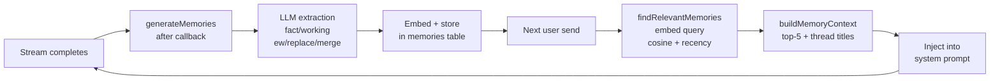
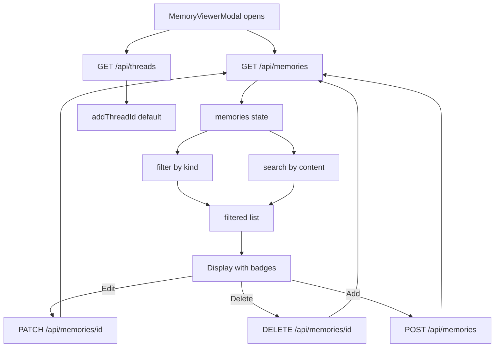

# Memory System

Fact/working memory extraction, RAG retrieval, and recency scoring for MinervaAIWorkspace conversations.

## Relevant source files

- `src/lib/memory.ts` — memory generation: LLM extraction, classification, new/replace/merge actions
- `src/lib/memoryStore.ts` — memory retrieval: RAG search, recency scoring, context building
- `src/app/api/memories/route.ts` — REST API: list (GET), manual create (POST)
- `src/app/api/memories/[id]/route.ts` — REST API: edit (PATCH), soft-delete (DELETE)
- `src/components/MemoryViewerModal.tsx` — viewer/editor UI modal
- `src/db/schema.ts` — `memories` table definition (line 325) and `folders.memoryScope` (line 266)
- `src/lib/embed.ts` — `embedText()`, `hashContent()` used by generation and retrieval
- `src/lib/vectorSearch.ts` — `cosineSimilarity()` pure-JS implementation

## Overview

The memory system extracts durable memories from conversations after each assistant response, stores them with embeddings, and retrieves them via RAG for injection into subsequent chat context. There are two phases:

1. **Generation** (`generateMemories`): After the SSE stream completes, the `after()` callback (Next.js `waitUntil`) runs LLM extraction in the background. The LLM classifies each extracted memory as `fact` or `working` and determines an action — `new`, `replace`, or `merge`. The memory is embedded and stored.

2. **Retrieval** (`findRelevantMemories`): On the next user send, the query is embedded and compared via cosine similarity against all active memories. Results are filtered, ranked by a combined similarity + recency score, and the top-5 are injected into the system context.



## Memory Generation

### Trigger Point — `after()` callback

Memory generation runs in the background via Next.js `after()` (which uses `waitUntil`), so the process persists after the HTTP response closes. This is called from the chat route after the SSE stream completes:

```typescript
// src/app/api/chat/route.ts:498-516
after(async () => {
  await streamDone;              // wait for stream to complete
  if (!streamResult.assistantContent) return;
  if (body.rapid) return;       // rapid mode skips memory generation
  try {
    await generateMemories(
      body.threadId,
      [
        { role: "user", content: prepared.content },
        { role: "assistant", content: streamResult.assistantContent },
      ],
      llm,
      finalModel,
      user.id,
    );
  } catch (err) {
    console.error("[memory] generation failed:", err);
  }
});
```

The `after()` call must be made within the request context (the POST handler body), not inside the `ReadableStream`'s `start()` callback — calling it inside `start()` loses the request context and `waitUntil` silently never executes.

### `generateMemories()` — `memory.ts:194-345`

```typescript
export async function generateMemories(
  threadId: string,
  recentTurns: { role: string; content: string }[],
  llm: OpenAI,
  model: string,
  userId?: string,
): Promise<void>
```

**Step 0 — Guard (line 202-204):** Early return if `recentTurns` lacks either a `user` or `assistant` message, or is empty.

**Step 1 — Resolve folderId and userId (lines 207-212):** Queries the `threads` table for `folderId` and `userId`. The `userId` parameter overrides the thread's owner.

**Step 2 — Fetch existing active memories (lines 216-259):** The scope of existing memories presented to the LLM depends on the folder's `memoryScope`:
- If `folder.memoryScope === "folder"`: fetch memories within the same `folderId` (top 20 by `updatedAt` desc).
- If `folder.memoryScope === "global"` (or a folder exists with global scope): fetch memories across all threads owned by the same user (top 20 by `updatedAt` desc).
- If no `folderId`: fetch memories from the same thread only (ordered by `createdAt` asc).

All queries filter `suppressedAt IS NULL` (only active, non-soft-deleted memories).

**Step 3 — LLM extraction (lines 262-272):** Calls `buildExtractionMessages()` to construct the system + user messages, sends to the LLM, and parses with `parseExtraction()`. On LLM failure, logs and returns.

**Step 4 — Process each extracted memory (lines 278-344):** For each `ExtractedMemory`:

- **`action: "replace"` (lines 280-287):** Finds target via `findExistingMemory()`. If found, sets `suppressedAt` on the old memory (soft-delete). Falls back to creating a new memory if target not found.

- **`action: "merge"` (lines 289-310):** Finds target. If found, calls `mergeContents()` which makes a separate LLM call to merge existing and incoming content into one concise sentence. Re-embeds the merged text, updates the existing memory's `content`, `embedding`, `contentHash`, `importance`, and `updatedAt`. Skips new INSERT (`continue`).

- **`action: "new"` or fallback (lines 312-340):** Embeds via `embedText(content, "document")`. Computes `contentHash` (SHA-256). Checks for duplicate via `contentHash` within the same thread (skips if exists). Inserts new row.

### LLM Extraction Prompt

The system prompt instructs the LLM to extract durable memories and classify each one:

```text
You are a memory extractor. Analyze the conversation and extract durable memories.

Classify each memory as:
- "fact": user info, environment, preferences, identity, goals, topics discussed, subjects explored, decisions made
- "working": current task, temporary context, recent decisions, ongoing discussion topic

For each memory, decide an action:
- "new": no similar existing memory exists
- "replace": supersedes an existing memory that is now outdated or wrong
- "merge": combines with an existing memory to form a richer one

When action is "replace" or "merge", set targetId to the ID of the existing memory you are replacing or merging with. The existing memories are listed with their IDs below. If you cannot identify the exact memory by ID, set targetContent to the EXACT content string instead.

Write each memory's content as a concise, search-friendly sentence. Capture the topic and key facts, not just the user's identity.

Skip pure greetings and acknowledgments (e.g. 'hello', 'thanks', 'got it'), BUT always save what was discussed or decided. If the conversation only contains greetings with no substance, return an empty array. Otherwise, extract at least one memory about what was discussed.

Return ONLY valid JSON (no markdown fences):
[{"kind": "fact"|"working", "content": "...", "importance": 0.0-1.0, "action": "new"|"replace"|"merge", "targetId": "... (existing memory ID, for replace/merge)", "targetContent": "... (fallback: exact content string, for replace/merge)"}]
```

The user message presents the recent conversation and the existing active memories (with IDs), so the LLM can reference them by `targetId` for replace/merge:

```typescript
// buildExtractionMessages() — memory.ts:55-77
const conversation = recentTurns.map((t) => `${t.role}: ${t.content}`).join("\n");
const existingList = existingMemories.length > 0
  ? existingMemories.map((m) => `ID: ${m.id} | ${m.content}`).join("\n")
  : "(none)";

return [
  { role: "system", content: SYSTEM_PROMPT },
  { role: "user", content: `Recent conversation:\n${conversation}\n\nExisting active memories:\n${existingList}\n\nExtract memories as JSON array.` },
];
```

### Classification: fact vs. working

| Kind | Description |
|------|-------------|
| `fact` | Immutable user info, environment, preferences, identity, goals, topics discussed, subjects explored, decisions made |
| `working` | Current task, temporary context, recent decisions, ongoing discussion topic |

### Action Determination: new / replace / merge

The LLM decides the action for each extracted memory based on the existing active memories list:

| Action | Behavior |
|--------|----------|
| `new` | No similar existing memory. Embed content, compute `contentHash`, check for duplicate within the same thread, insert new row. |
| `replace` | Supersedes an existing memory that is now outdated or wrong. Soft-deletes the old memory (`suppressedAt = now`), then creates a new one. |
| `merge` | Combines with an existing memory to form a richer one. Calls `mergeContents()` (separate LLM call) to produce a single concise merged sentence. Re-embeds and updates the existing memory in-place. No new INSERT. |

For `replace` and `merge`, the LLM provides either `targetId` (preferred) or `targetContent` (exact content string fallback). The `findExistingMemory()` function tries `targetId` first, then falls back to exact content match within the same thread. If multiple matches exist, the oldest one is targeted (via `orderBy(asc(createdAt))`).

### Merge — `mergeContents()` — `memory.ts:157-179`

```typescript
async function mergeContents(
  existing: string,
  incoming: string,
  llm: OpenAI,
  model: string,
): Promise<string>
```

Makes a separate LLM call with system prompt: *"Merge two memories into one concise, search-friendly sentence. Preserve all key facts. Return only the merged sentence, no explanation."* Falls back to the incoming content if the LLM returns empty.

### Edge Cases

- **LLM returns non-JSON** → `parseExtraction()` returns `null`, generation skips (console.error only).
- **Existing memory not found by `targetContent`** → falls back to `new` (creates a new memory).
- **Embed returns empty array** (model loading, HTTP embedder unavailable) → skips memory storage for that item (`continue`).
- **`replace`/`merge` with multiple hits** → targets the oldest one (via `orderBy(asc(createdAt))` in `findExistingMemory`).
- **Duplicate content within the same thread** → detected via `contentHash` (SHA-256); the duplicate is skipped (`continue`).
- **Rapid mode** (`body.rapid = true`) → memory generation is skipped entirely at the chat route level.
- **Empty LLM response** → `parseExtraction()` returns `null` (raw is null/empty after trim).

## Memory Retrieval

### `findRelevantMemories()` — `memoryStore.ts:39-116`

```typescript
export async function findRelevantMemories(
  query: string,
  folderId: string | null,
  userId: string,
): Promise<ScoredMemory[]>
```

On the next user send, this function searches for relevant memories using RAG:

1. **Embed the query** via `embedText(query, "query")` (line 44). Returns `[]` immediately if embedding fails (model loading).

2. **Resolve scope (lines 47-59):** If `folderId` is set and the folder's `memoryScope === "folder"`, set `scopeFolder = true` and `targetFolderId = folderId`. Otherwise, search globally across all threads owned by the user.

3. **Fetch candidate rows (lines 61-80):** `innerJoin(memories, threads)` with conditions:
   - `suppressedAt IS NULL` (active only)
   - `threads.userId = userId` (prevents cross-user leakage — memories have no `userId` column; scope is enforced via thread ownership)
   - If folder-scoped: `memories.folderId = targetFolderId`

4. **Score each row (lines 85-100):**
   - `similarity = cosineSimilarity(queryVector, row.embedding)`
   - `recency = exp(-ageDays / 14)` — exponential decay, reaching $e^{-1} \approx 0.37$ after 14 days
   - `recencyScore = importance * 0.6 + recency * 0.4`

5. **Filter by similarity > 0.3** (line 101).

6. **Two-stage ranking (lines 106-115):**
   - Top-30 by `similarity` descending
   - Then top-5 by `recencyScore` descending
   - Both scores rounded to 3 decimal places.

### Recency Formula

The recency score blends the memory's LLM-assigned importance with an exponential time decay:

$$\text{recencyScore} = \text{importance} \times 0.6 + e^{-\text{ageDays} / 14} \times 0.4$$

Where:
- `importance` is the 0.0–1.0 score assigned by the LLM during extraction (default 0.5).
- `ageDays = (now - updatedAt) / 86_400_000` — days since the memory was last updated.
- The exponential term $e^{-\text{ageDays}/14}$ decays smoothly: it is ~1.0 when fresh, ~0.37 after 14 days, and ~0.14 after 28 days.

The 60/40 weighting gives more influence to importance (the memory's intrinsic value) than to recency (how recently it was touched), but ensures that stale memories gradually lose relevance even if their importance is high.

> **Note on "LLM rerank":** The schema docstring at `src/db/schema.ts:316` mentions "client-side cosine search → LLM rerank → sorted by recency score → top-5 injected into system context (RAG)". However, **the LLM rerank step is NOT implemented**. The actual retrieval pipeline is pure cosine similarity filtering (`> 0.3`) followed by a two-stage sort (top-30 by similarity, then top-5 by recency score). No LLM is involved in the retrieval/ranking stage. The docstring is aspirational/outdated.

## Folder Memory Scope

The `folders.memoryScope` column (`schema.ts:266`) controls whether memory search and generation are scoped to a single folder or span all of the user's threads:

| Value | Default | Behavior |
|-------|---------|----------|
| `"global"` | Yes | Memory search and generation span all threads owned by the same user. |
| `"folder"` | No | Memory search and existing-memory lookup during generation are limited to the same `folderId`. |

### How scope affects generation

When `generateMemories()` fetches existing active memories to present to the LLM (Step 2 above), the scope determines which memories are listed:

- **`"folder"` scope:** Only memories with the same `folderId` are fetched (top 20 by `updatedAt` desc). This means the LLM only sees memories within the folder when deciding `replace`/`merge` targets.
- **`"global"` scope:** Memories across all of the user's threads are fetched (top 20 by `updatedAt` desc), allowing cross-thread memory consolidation.
- **No folder (`folderId = null`):** Memories from the same thread only (conventional behavior, ordered by `createdAt` asc).

Newly created memories inherit the thread's `folderId`, so they are automatically scoped correctly.

### How scope affects retrieval

When `findRelevantMemories()` fetches candidate rows (Step 2 above), the scope filters the search space:

- **`"folder"` scope:** Only memories with `memories.folderId = targetFolderId` are candidates.
- **`"global"` scope:** All memories owned by the user (via `threads.userId`) are candidates.

### Scope resolution code (retrieval)

```typescript
// memoryStore.ts:47-59
let scopeFolder = false;
let targetFolderId: string | null = null;
if (folderId) {
  const [folder] = await db
    .select({ memoryScope: folders.memoryScope })
    .from(folders)
    .where(eq(folders.id, folderId));
  if (folder?.memoryScope === "folder") {
    scopeFolder = true;
    targetFolderId = folderId;
  }
}
```

## Memory Context Injection

### `buildMemoryContext()` — `memoryStore.ts:154-184`

```typescript
export async function buildMemoryContext({
  content,
  thread,
  userId,
  currentThreadId,
}: {
  content: string;
  thread: { folderId: string | null };
  userId: string;
  currentThreadId: string;
}): Promise<{ role: "system"; content: string } | null>
```

`buildMemoryContext()` runs three retrieval operations in parallel via `Promise.all`:

1. `findRelevantMemories(content, thread.folderId, userId)` — RAG search for past memories.
2. `fetchRecentThreadTitles(userId, currentThreadId)` — fetches up to 15 recent thread titles (excluding the current thread and threads titled "New chat"), ordered by `updatedAt` desc.
3. `findProfileTraits(userId)` — fetches up to 30 active user traits (always injected, not similarity-filtered). See [User Traits](#user-traits-profile).

It assembles these into a single system message with three sections:

- **User traits:** Always-injected stable user attributes (e.g. age, interests, speech patterns). Placed first so the LLM sees user identity context before anything else.
- **Recent conversation topics:** A list of recent thread titles, so the LLM can infer which past conversations may be relevant.
- **Past memories:** The top-5 retrieved memories, formatted as `- [fact] content` or `- [working] content`.

If all sections are empty, returns `null` (no system message injected). The chat route injects this into the system context before the user's message.

### Injection format

```text
User traits — stable attributes about the user. Apply these in every conversation:
- [demographic] 20歳らしい
- [interest] ラテン語が好き

Recent conversation topics (most recent first). Use these to infer which past conversations may be relevant to the user's current question:
- Thread title 1
- Thread title 2

Past memories from previous conversations. Use these to provide context for the user's question. If the user asks what you discussed before, summarize the relevant memories.
- [fact] The user is building a Next.js app with SQLite.
- [working] Currently debugging an SSE streaming issue.
```

For details on how this system message fits into the full chat pipeline, see [Chat & Streaming](./chat-streaming.md).

## Memory Fields

The `memories` table is defined at `src/db/schema.ts:325-350`:

| Field | Type | Description |
|-------|------|-------------|
| `id` | `text` PK | UUID, auto-generated via `randomUUID()` |
| `threadId` | `text` NOT NULL FK | Thread this memory originated from. `ON DELETE CASCADE` — if the thread is deleted, all its memories are deleted too. |
| `folderId` | `text` FK | Folder for scope filtering. `ON DELETE SET NULL`. Set from the thread's `folderId` during generation. `null` for threads without a folder. |
| `kind` | `text` enum | `"fact"` or `"working"` |
| `content` | `text` NOT NULL | The memory text — a concise, search-friendly sentence capturing the topic and key facts. |
| `sourceMessageIds` | `text` json | Array of message IDs that contributed to this memory. (Schema field; not populated in current generation flow.) |
| `embedding` | `text` json | JSON array of floats (`number[]`). Drizzle auto-parses on read. Used for cosine similarity. |
| `contentHash` | `text` NOT NULL | SHA-256 hex hash of `content`, used for deduplication within the same thread. |
| `model` | `text` NOT NULL | Embedding model ID (e.g. `LiquidAI/LFM2.5-Embedding-350M`), or `"manual"` for API-created memories. |
| `importance` | `real` NOT NULL default 0.5 | 0.0–1.0, assigned by the LLM during extraction. Used in recency scoring: `importance * 0.6`. |
| `suppressedAt` | `timestamp_ms` | Soft-delete timestamp. `NULL` = active. Set when a memory is replaced or manually deleted. |
| `createdAt` | `timestamp_ms` now() | Creation time. |
| `updatedAt` | `timestamp_ms` now() | Last modification time. Updated on merge, edit, and soft-delete. Used for recency calculation. |

### Indexes

| Index | Column | Purpose |
|-------|--------|---------|
| `memories_thread_idx` | `threadId` | Fast lookup of memories by thread |
| `memories_folder_idx` | `folderId` | Fast folder-scoped search |
| `memories_kind_idx` | `kind` | Filter by fact/working |
| `memories_suppressed_idx` | `suppressedAt` | Fast active/deleted filtering |

For the full schema definition, see [Database & Schema](./database.md).

## Memory REST API

### GET `/api/memories` — List all memories

Returns all active (non-soft-deleted) memories for the logged-in user, newest first by `updatedAt`.

- **Auth:** Requires session (`getSessionUser()`). Returns 401 if not authenticated.
- **Response:** JSON array of objects with `id`, `threadId`, `threadTitle`, `folderId`, `kind`, `content`, `importance`, `createdAt`, `updatedAt`.
- **Scope:** `innerJoin(threads)` on `memories.threadId = threads.id` filtered by `threads.userId = user.id`. Only `suppressedAt IS NULL` rows are returned.
- **Embedding excluded:** The `embedding` field is not included in the response (metadata + `threadTitle` only).

### POST `/api/memories` — Manual memory creation

Creates a new memory with user-provided content. Generates embedding + `contentHash` and saves.

- **Auth:** Requires session. Returns 401 if not authenticated.
- **Body:**
  ```json
  {
    "content": "The user prefers TypeScript over JavaScript.",
    "kind": "fact",
    "importance": 0.8,
    "threadId": "uuid-of-target-thread"
  }
  ```
- **Validation:**
  - `content` is required (non-empty after trim) → 400 if missing.
  - `threadId` is required → 400 if missing.
  - `kind` defaults to `"fact"` if not `"working"`.
  - `importance` is clamped to [0, 1], defaults to 0.5.
- **Thread ownership:** Verifies the `threadId` belongs to the authenticated user. Returns 400 if thread not found.
- **Embedding:** Calls `embedText(content, "document")`. Returns 503 if embedding fails.
- **Duplicate check:** None — manual additions allow identical content in different contexts.
- **Response:** 201 with the created memory object (`id`, `threadId`, `kind`, `content`, `importance`).

### PATCH `/api/memories/[id]` — Partial update

Updates one or more fields of an existing memory. Regenerates embedding + `contentHash` only when `content` changes.

- **Auth:** Requires session. Returns 401 if not authenticated.
- **Ownership:** `assertOwned()` — `innerJoin(threads)` to verify the memory belongs to a thread owned by the user. Returns 404 if not found.
- **Body:**
  ```json
  {
    "content": "Updated memory text.",
    "kind": "working",
    "importance": 0.7
  }
  ```
  All fields are optional (partial update). Only provided fields are updated.
- **Content change:** If `content` is provided:
  - Must be non-empty after trim → 400 if empty.
  - Re-embeds via `embedText(content, "document")` → 503 if embedding fails.
  - Recomputes `contentHash` via `hashContent(content)`.
- **Kind/importance-only changes:** No re-embedding. `importance` is clamped to [0, 1].
- **Response:** 200 with the updated memory object (`id`, `threadId`, `kind`, `content`, `importance`). 404 if the row was not found after update.

### DELETE `/api/memories/[id]` — Soft delete

Soft-deletes a memory by setting `suppressedAt = now()`. This is the same treatment as the `replace` action in `generateMemories`.

- **Auth:** Requires session. Returns 401 if not authenticated.
- **Ownership:** Same `assertOwned()` check as PATCH. Returns 404 if not found.
- **Behavior:** Sets `suppressedAt` and `updatedAt` to the current time. Does NOT physically delete the row. RAG search already filters by `suppressedAt IS NULL`, so the memory immediately stops appearing in retrieval results.
- **Response:** 204 No Content on success.

> **Why soft delete?** Soft deletion preserves consistency with past conversation history. If a memory is physically deleted, there's no audit trail. Soft-deleted memories are excluded from RAG search but remain in the database for reference.

## MemoryViewerModal UI

`src/components/MemoryViewerModal.tsx` — a modal component for viewing, searching, filtering, editing, deleting, and manually adding memories. It targets only the `memories` table (page embeddings are excluded).

### Features

| Feature | Behavior |
|---------|----------|
| **List** | Fetches all memories via `GET /api/memories` when the modal opens. Displays each memory with a kind badge (blue for `fact`, purple for `working`), content (truncated to 2 lines, expandable on click), thread title, importance percentage, and `updatedAt` timestamp. |
| **Search** | Client-side text search on memory `content` (case-insensitive `includes`). Filters the displayed list in real-time. |
| **Filter** | Dropdown filter: All / Fact / Working. Filters by `kind`. |
| **Edit** | Inline edit mode — click the pencil icon on a memory to edit its `content`, `kind`, and `importance` (range slider 0–1, step 0.1). Saves via `PATCH /api/memories/[id]`. Cancel button discards changes. |
| **Delete (soft)** | Two-step delete — click the trash icon, then confirm with "Yes" or cancel. Calls `DELETE /api/memories/[id]` (soft-delete). Refreshes the list after deletion. |
| **Add** | "Add" button toggles an add form — textarea for content, kind selector, importance slider, and thread selector (defaults to the most recent thread from `GET /api/threads`). Submits via `POST /api/memories`. |
| **Expand** | Click memory content to toggle between 2-line truncation (`line-clamp-2`) and full display. |

### Data flow



### MemoryEntry type

```typescript
type MemoryEntry = {
  id: string;
  threadId: string;
  threadTitle: string;
  kind: "fact" | "working";
  content: string;
  importance: number;
  createdAt: string;
  updatedAt: string;
};
```

## User Traits (Profile)

User traits are **persistent user attributes** (age, interests, speech patterns, preferences) that are **always injected** into every conversation — unlike memories, which are similarity-filtered via RAG. They solve the problem where "20歳らしい" or "ラテン語が好き" would lose the cosine similarity race when the user asks an unrelated question.

### Extraction — shared LLM call

Profile traits are extracted in the **same LLM call** as memories. The extraction prompt (`memory.ts:SYSTEM_PROMPT`) classifies items as `"fact"`, `"working"`, or `"profile"`. Profile items additionally include a `category` field (`"demographic" | "interest" | "speech_pattern" | "preference"`).

After `parseExtraction()`, profile items are routed to `processProfileTraits()` (memory.ts) while fact/working items follow the existing memory pipeline unchanged.

### `processProfileTraits()` — `memory.ts`

For each extracted profile trait:

1. **Dedup** — `contentHash` (exact) + `cosineSimilarity > 0.85` (semantic duplicate like "ラテン語が好き" vs "ラテン語を好む"). If matched: `evidenceCount += 1`, `confidence = min(1.0, confidence + 0.15)`.
2. **Contradiction** — `cosineSimilarity > 0.75 but ≤ 0.85` selects candidates for `checkContradiction()` (same pattern as memories). If contradiction: soft-delete old trait, insert new.
3. **Insert** — New trait with `confidence = 0.5`, `evidenceCount = 1`.

### Retrieval — always inject

`findProfileTraits(userId)` (`traitStore.ts`) queries active traits (`suppressedAt IS NULL`), ordered by `confidence DESC, updatedAt DESC`, limited to 30 rows. Called in parallel within `buildMemoryContext()` alongside `findRelevantMemories` and `fetchRecentThreadTitles`.

Traits are injected as a dedicated section **before** the RAG memory section:

```
User traits — stable attributes about the user. Apply these in every conversation:
- [demographic] 20歳らしい
- [interest] ラテン語が好き
- [speech_pattern] よく「〜だろ」という表現を使う
```

### Key differences from memories

| Aspect | Memories | User Traits |
|--------|----------|-------------|
| Table | `memories` | `user_traits` |
| Scope | Thread/folder (via `threadId`) | User-global (direct `userId` FK) |
| Retrieval | RAG (cosine > 0.3, top-5) | Always injected (up to 30) |
| Thread deletion | Cascade delete | `sourceThreadId` ON DELETE SET NULL (survives) |
| Lifecycle | fact (permanent) / working (7-day TTL) | No expiry; soft-delete via `suppressedAt` |
| Embeddings | Used for RAG retrieval | Used for dedup + contradiction candidate selection only |

### Relevant source files

- `src/db/schema.ts` — `userTraits` table definition
- `src/lib/memory.ts` — `processProfileTraits()`, `TraitCategory` type, extraction prompt
- `src/lib/traitStore.ts` — `findProfileTraits()` retrieval
- `src/lib/memoryStore.ts` — `buildMemoryContext()` injection point
- `src/app/api/user-traits/route.ts` — GET + POST
- `src/app/api/user-traits/[id]/route.ts` — PATCH + DELETE
- `src/components/MemoryViewerModal.tsx` — Profile filter + CRUD UI

## See also

- [Chat & Streaming](./chat-streaming.md) — How memory generation is triggered via `after()` after SSE stream completion, and how the memory context is injected into the system prompt
- [Embeddings & Vector Search](./embeddings.md) — `embedText()`, `cosineSimilarity()`, local ONNX vs HTTP embedder providers, the `kind` parameter
- [Database & Schema](./database.md) — Full `memories` table definition, `folders.memoryScope`, indexes, and Drizzle ORM conventions
- [Skills System](./skills.md) — Similar RAG pattern for skill retrieval and injection
