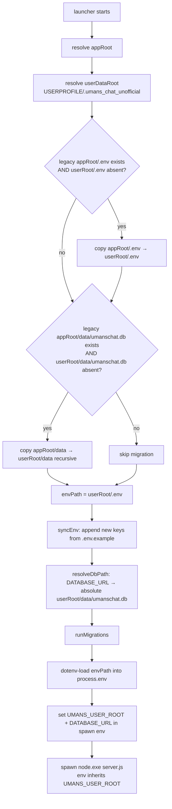

# User Data Folder Relocation

## Problem

The standalone exe stores `.env`, `data/` (SQLite DB, cloudflared binary, update staging), and the auto-update marker in `appRoot` (the exe's directory). Rebuilding (`pack:exe`), deleting, or replacing the exe folder risks losing user config (registration lock, API keys) and the database. The in-app updater and `pack-exe.ts` stash/restore mitigate this, but the root cause is that mutable user data lives beside replaceable application binaries.

## Solution

Move `.env` and `data/` to `%USERPROFILE%\.umans_chat_unofficial\` (the "user data root"). The exe folder becomes purely application binaries — safe to delete, rebuild, or replace without data loss. A one-time automatic migration copies legacy `appRoot/.env` and `appRoot/data` to the user data root on first launch of the new exe.

**Scope:** exe distribution only. Dev (`bun run dev`) and Docker are unchanged.

## Architecture

### Data layout

```
%USERPROFILE%\.umans_chat_unofficial\        ← UMANS_USER_ROOT
├── .env                                      ← GUI settings, secrets
└── data\
    ├── umanschat.db                          ← SQLite database
    ├── cloudflared\                          ← tunnel binary + cache
    ├── updates\                              ← downloaded release zips + staging
    └── .update-pending                       ← auto-update marker
```

### Control flow



### Environment variable: `UMANS_USER_ROOT`

The launcher sets `UMANS_USER_ROOT` to the user data root path before spawning `server.js`. The server reads it to locate `.env`, `data/`, cloudflared, and update staging. When unset (dev/Docker), all paths fall back to the current behavior.

### New helper: `src/lib/user-data.ts`

```ts
export function getUserDataRoot(): string | null {
  return process.env.UMANS_USER_ROOT || null;
}

export function getDataDir(): string {
  const root = getUserDataRoot();
  if (root) return join(root, "data");
  // Fallback (dev/no launcher): exe-aware, matches tunnel.ts's prior detection
  const isCompiled =
    process.execPath.endsWith("umanschat.exe") ||
    process.execPath.endsWith("umanschat");
  const base = isCompiled ? dirname(process.execPath) : process.cwd();
  return join(base, "data");
}
```

### New helper: `launcher/user-data.cjs`

Side-effect-free CommonJS module so tests can `require` it without triggering launcher startup:

```js
function resolveUserDataRoot() {
  const home = process.env.USERPROFILE || process.env.HOME;
  if (!home) throw new Error("Cannot determine user home directory");
  return join(home, ".umans_chat_unofficial");
}

function migrateLegacyData(appRoot, userDataRoot) {
  // .env: copy only if target absent
  const legacyEnv = join(appRoot, ".env");
  const targetEnv = join(userDataRoot, ".env");
  if (existsSync(legacyEnv) && !existsSync(targetEnv)) {
    cpSync(legacyEnv, targetEnv, { force: true });
  }
  // data/: copy only if legacy DB exists and target DB absent
  const legacyDb = join(appRoot, "data", "umanschat.db");
  const targetDb = join(userDataRoot, "data", "umanschat.db");
  if (existsSync(legacyDb) && !existsSync(targetDb)) {
    cpSync(join(appRoot, "data"), join(userDataRoot, "data"),
      { recursive: true, force: true });
  }
}

function resolveDataPaths(userDataRoot) {
  return {
    envPath: join(userDataRoot, ".env"),
    dataDir: join(userDataRoot, "data"),
    dbPath: join(userDataRoot, "data", "umanschat.db"),
    cloudflaredDir: join(userDataRoot, "data", "cloudflared"),
    updatesDir: join(userDataRoot, "data", "updates"),
    markerPath: join(userDataRoot, "data", ".update-pending"),
  };
}

module.exports = { resolveUserDataRoot, migrateLegacyData, resolveDataPaths };
```

## File changes

### `launcher/umanschat-launcher.cjs`

- `require("./user-data.cjs")` for `resolveUserDataRoot`, `migrateLegacyData`, `resolveDataPaths`
- Replace all `join(appRoot, ".env")` with the single `envPath` variable (used by `syncEnv`, `resolveDbPath`, and the dotenv-load block)
- Replace `dataDir` with `resolveDataPaths(userDataRoot).dataDir`
- Before sync/migrations: create `userDataRoot` (root only), run `migrateLegacyData(appRoot, userDataRoot)`
- After dotenv-load: set `process.env.UMANS_USER_ROOT = userDataRoot`
- Server spawn: pass `UMANS_USER_ROOT` in `env`
- `markerPath`: use `resolveDataPaths(userDataRoot).markerPath`
- `applyUpdate`: marker read from `markerPath` (user data root); staging → appRoot copy unchanged (still skips `data/` and `.env`)

### `src/lib/user-data.ts` (new)

- `getUserDataRoot()` and `getDataDir()` as above

### `src/lib/envUtils.ts`

- `resolveEnvPath()`: if `UMANS_USER_ROOT` is set, return `join(root, ".env")`; else fall back to current upward search

### `src/lib/tunnel.ts`

- `getCloudflaredDir()`: replace local exe detection with `join(getDataDir(), "cloudflared")` from `user-data.ts`; delete the inline `isCompiled`/`appRoot` logic

### `src/lib/updater.ts`

- `updatesDir`: `join(getDataDir(), "updates")`
- `markerPath`: `join(getDataDir(), ".update-pending")`
- Replace `join(process.cwd(), "data", ...)` with `getDataDir()` calls

### `src/db/index.ts`

- No change. Reads `process.env.DATABASE_URL` (launcher sets absolute path to `userDataRoot/data/umanschat.db`)

### `scripts/pack-exe.ts`

- Keep stash/restore as a **migration bridge**: preserves `appRoot/.env` and `appRoot/data` during rebuild so the launcher can migrate them on first launch. After migration, stash/restore is effectively a no-op (user data root persists independently)
- No new changes to pack-exe beyond the stash/restore already implemented

### Documentation

- `docs/deployment.md`: update Standalone exe section — `.env`/`data/` live in `%USERPROFILE%\.umans_chat_unofficial\`; exe folder is replaceable; auto-migration from legacy appRoot on first launch
- `README.md` / `README.ja.md`: update Quick Start (exe) and Auto-Update sections to note data lives in user folder

## Migration logic

**Trigger:** legacy `appRoot/data/umanschat.db` exists AND target `userDataRoot/data/umanschat.db` does NOT exist. This prevents partial-launch strand (cloudflared/updates created without DB).

**Behavior:**
- `appRoot/.env` → `userDataRoot/.env` (only if target absent)
- `appRoot/data` → `userDataRoot/data` (recursive, only if target DB absent; `cpSync` merge is fine — overwrites stale, brings the DB)
- `appRoot` side is left intact as a backup

## Edge cases

1. **Fresh install (new user):** no legacy `appRoot/.env`/`data` → skip migration; launcher creates `.env` from `.env.example` in user folder; `data/` created fresh; first run unlocked
2. **Existing install upgrade:** legacy data migrated to user folder; appRoot retained as backup
3. **`USERPROFILE` undefined:** fall back to `HOME`; both undefined → error exit (exe is Windows-only, so effectively unreachable)
4. **Corrupt DB in user folder:** `recoverDatabase()` handles `*.corrupt-*` as today; legacy appRoot DB remains as manual recovery source
5. **Post auto-update:** staging → appRoot copy skips `data/`/`.env` (unchanged); new exe's launcher re-resolves `UMANS_USER_ROOT` from `USERPROFILE`; user folder data is untouched
6. **Direct exe run without launcher (diagnostic):** `getDataDir()` fallback uses `dirname(process.execPath)/data` (exe-aware), matching prior `tunnel.ts` behavior

## Testing

| File | Tests |
|------|-------|
| `src/lib/user-data.test.ts` (new) | `getDataDir()`: `UMANS_USER_ROOT` set → `join(root,"data")`; unset+compiled → `dirname(execPath)/data`; unset+non-compiled → `cwd/data` |
| `src/lib/envUtils.test.ts` (extend) | `resolveEnvPath()`: `UMANS_USER_ROOT` set → returns `join(root,".env")`; unset → upward search |
| `launcher/user-data.test.cjs` (new) | `migrateLegacyData`: legacy `.env`+`data` present → copied; target DB absent → migration runs; target DB present → skip; no legacy → skip; legacy DB + existing `cloudflared/` (no DB) → migration still runs |
| `src/lib/updater.test.ts` (extend) | marker/staging paths use `getDataDir()` when `UMANS_USER_ROOT` set |

## Out of scope

- Docker data relocation (already volume-mounted)
- Dev mode changes (`UMANS_USER_ROOT` unset → current behavior)
- Moving registration gate to SQLite
- Auto-locking registration after first admin
- `.env.example` default changes
