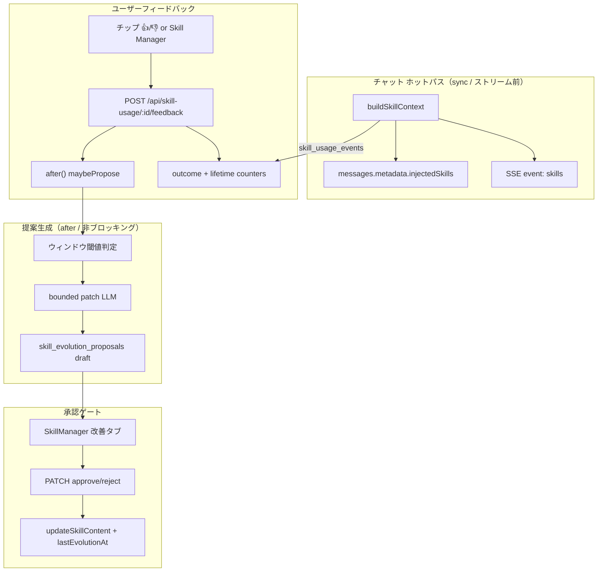
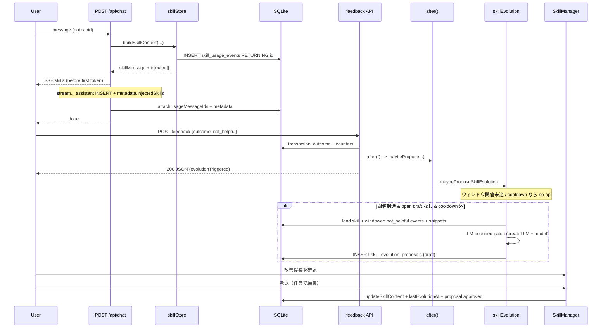
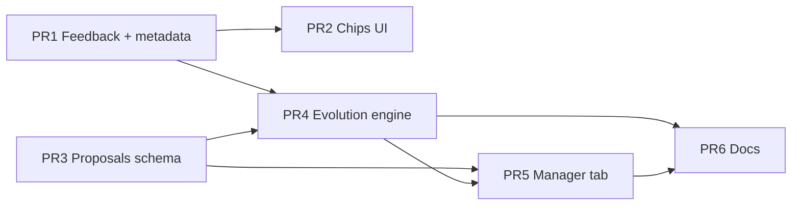

# Skill Evolution System（スキル進化システム）設計書

| 項目 | 値 |
|------|-----|
| **Document** | Skill Evolution System Design |
| **Author** | (TBD) |
| **Date** | 2026-07-24 |
| **Status** | Approved（design review consensus, revision 2） |
| **Related** | `docs/skills.md`, `docs/architecture.md`, `docs/patterns/db-migration.md` |
| **Stack** | Next.js 16 App Router / TypeScript / SQLite+Drizzle / Bun / Vitest |

---

## Overview

UmansChat には既に **runtime skills**（SQLite `skills` テーブル）の完全なライフサイクルが存在する。注入時に `skill_usage_events` を記録し、`successCount` / `failureCount` / `outcome` はスキーマ上予約済みだが **未配線** である。

本設計は Microsoft [SkillOpt](https://github.com/microsoft/SkillOpt) の **考え方**（rollout → フィードバック → 有界な編集提案 → 検証/承認ゲート → 更新）を、UmansChat の TypeScript スタック上に **ネイティブ実装** する。Python SkillOpt を依存関係として入れない。チャットのホットパスをブロックしない。

**Skill Evolution（スキル進化）** のコア:

1. 注入されたスキルへの **helpful / not_helpful** フィードバック
2. 十分な負のシグナルで **有界（bounded）な content 編集提案** を LLM で生成
3. **人間の承認** 後のみ live skill を更新（version bump + re-embed）
4. 既存の `skill_candidates` 抽出と **ノイズ二重生成を分離**
5. `successCount` / `failureCount` / `outcome` を正しく配線
6. チップは **assistant `messages.metadata.injectedSkills`** に永続化し、リロード後もフィードバック可能

---

## Background & Motivation

### 現状

| コンポーネント | パス | 役割 |
|----------------|------|------|
| スキーマ | `src/db/schema.ts` | `skills`, `skill_candidates`, `skill_usage_events`, `messages.metadata` |
| 検索・注入 | `src/lib/skillStore.ts` | `findRelevantSkills`, `buildSkillContext` |
| 明示保存 | `src/lib/skillGenerator.ts` | `generateSkillFromConversation` |
| 自動候補 | `src/lib/skillCandidate.ts` | `extractSkillCandidates` |
| CRUD API | `src/app/api/skills/`, `skill-candidates/` | 一覧・作成・編集・承認 |
| UI | `src/components/SkillManagerModal.tsx` | Active / Drafts / Archived（3 タブ） |
| チャット | `src/app/api/chat/route.ts` | 並列 context 組立 + `after()` で memory/candidates |
| クライアント | `src/hooks/useChat.ts` | SSE → optimistic id → `done` で実 id スワップ; metadata に dual/hyper/council |

**既に動いていること:**

- セマンティック検索は SQL `vec_distance_cosine`（類似度 > 0.3 ⇔ distance < 0.7、top-5）+ 名前指定（「Xスキルを使って」/ `use X skill`）
  - **注:** `docs/skills.md` の一部は古い「全件 fetch + クライアント cosine」記述のまま。PR6 で SQL 実装に合わせて修正する（Issue 17）
- 注入時に `skill_usage_events` INSERT + `lastUsedAt` 更新（現状 fire-and-forget）
- content 変更時の version++ / contentHash / re-embed（`PATCH /api/skills/[id]`）
- rapid モードではスキル注入・memory・候補抽出をすべてスキップ
- 全クエリで `userId` スコープ
- `messages.metadata` に dual/hyper/council trace を永続化（チップも同パターンで載せる）

**未使用・ギャップ:**

```text
skills.successCount / failureCount     → 常に 0
skill_usage_events.outcome             → 常に "unknown"
skill_usage_events.messageId           → 未設定
クライアントへの注入スキル通知          → SSE に skills イベントなし
messages.metadata に injectedSkills なし
フィードバック UI                       → なし
失敗時のスキル改善ループ               → なし
```

### なぜ SkillOpt を直接入れないか

SkillOpt は Python 研究用ハーネス（epochs、learning rate、held-out validation、rollout 集約）である。UmansChat は local-first の Next.js アプリであり:

- ホットパスでの multi-epoch 学習はレイテンシ・コスト的に不適
- Python 依存は exe / Docker 配布の複雑性を増やす
- 既存の **承認ゲート（skill_candidates）** と思想が一致するため、アイデアのみ移植すれば足りる

### ペインポイント

1. 悪いスキルが注入され続けても修正されない（ユーザーは手動編集しかできない）
2. usage log が監査ログ止まりで学習に使われない
3. 自動候補抽出は「新規スキル」のみで、「既存スキルの改善」は対象外

---

## Goals & Non-Goals

### Goals

1. **Outcome フィードバック** — 注入イベント単位で `helpful` / `not_helpful` を記録し、lifetime `successCount` / `failureCount` を更新する
2. **有界編集提案** — **進化ウィンドウ内**の負シグナルが閾値を超えたスキルに対し、LLM が制限付きパッチを提案する
3. **人間承認ゲート** — 提案は draft。承認時のみ content 更新・version++・re-embed
4. **チャット非ブロッキング** — 提案生成は feedback ルートの `after()`。sync ホットパスと chat の `after()` に LLM 最適化を置かない
5. **既存システムとの共存** — rapid skip、userId 隔離、contentHash 重複排除、候補抽出との分離
6. **永続チップ UI** — SSE 即時表示 + `messages.metadata.injectedSkills` 永続化（リロード / resync 対応）
7. **実装準備完了** — モジュール境界、シグネチャ、スキーマ差分、PR 分割、テスト方針まで具体化

### Non-Goals

| 項目 | 理由 |
|------|------|
| Microsoft SkillOpt の pip インストール / 同梱 | 依存・配布コスト |
| ホットパスでの multi-epoch 学習・held-out validation | レイテンシ・コスト |
| 自動適用（人間なしで content 書き換え） | プロンプトインジェクション / 暴走リスク |
| メモリ（memories）や global_instructions の進化 | スコープ外 |
| 完全自動の nightly 集約（Sleep-like）Phase 1 実装 | Phase 2 候補として設計のみ |
| クロスユーザーのスキル共有・グローバルランキング | multi-user isolation を壊す |
| Playwright E2E | プロジェクトは Vitest のみ |
| 暗黙フィードバック（次ターン挙動からの推定） | Phase 1 は明示 UI のみ |

---

## Proposed Design

### 名称と責務

**システム名:** Skill Evolution（スキル進化）  
**ロガー category:** `"skill-evolution"` / `"skill-feedback"`



### シーケンス: フィードバック → スコア → 提案 → 承認 → デプロイ



### タイミング: sync / after() / offline

| 処理 | 実行場所 | レイテンシ影響 |
|------|----------|----------------|
| スキル検索・注入 | ストリーム前 `Promise.all`（既存） | 既存どおり（embed + SQL） |
| usage multi-row INSERT + RETURNING | 同上（await） | 最大 6 行。`lastUsedAt` は 1 回の `UPDATE ... WHERE id IN (...)` または fire-and-forget |
| SSE `skills` | context 組立直後・**first token より前** | 無視できる程度 |
| `metadata.injectedSkills` + `messageId` 後付け | assistant INSERT 時（成功 **および** partial error save） | 極小 |
| ユーザーフィードバック API | リクエスト同期（transaction） | 目標 < 50ms |
| 進化提案 LLM | feedback / evolve ルートの **`after()`**（chat の after には載せない） | レスポンス非ブロック。Next.js waitUntil で耐久 |
| 候補抽出・memory | 既存 chat `after()`（変更なし） | 既存どおり |
| Sleep-like 集約 | Phase 2 | オフライン |

**重要（プロジェクト標準）:**

- 提案 LLM を **bare `void fn()` で kick しない**。Next.js ではレスポンス後の fire-and-forget がキャンセルされうる（AGENTS.md / umanschat-debug と同根）。feedback ルートの **request scope で `after(() => ...)`** を使う。
- 提案 LLM を **`chat/route.ts` の `after()` に常時ぶら下げない**。候補抽出とコスト二重化を避ける。提案は **負フィードバックが閾値を超えたときだけ**。

rapid モード:

- 既存どおり `buildSkillContext` を呼ばない → usage なし → metadata なし → 進化なし
- 過去イベントへのフィードバック API は利用可能

---

## Data Model Changes

### 既存テーブルの活用

- `skill_usage_events.outcome`: `"unknown" | "helpful" | "not_helpful"` — **配線**
- `skills.successCount` / `failureCount` — **lifetime 表示用に配線**（閾値はウィンドウ集計、後述）
- `skills.version` / `contentHash` / `embedding` — 承認時は共有ヘルパー経由
- `messages.metadata` — **`injectedSkills` を追加**（チップ永続化の主経路）

### `messages.metadata` 型拡張

`src/db/schema.ts` の `messages.metadata` JSON 型に追加（dualTrace と同列）:

```typescript
metadata: text("metadata", { mode: "json" }).$type<{
  dualTrace?: { /* 既存 */ };
  hyperTrace?: { /* 既存 */ };
  councilTrace?: { /* 既存 */ };
  model?: string;
  elapsedMs?: number;
  /** Skill Evolution: この assistant 応答に注入されたスキル */
  injectedSkills?: Array<{
    skillId: string;
    name: string;
    usageEventId: string;
    similarity: number;
    activationType: "semantic" | "manual";
  }>;
}>()
```

**永続化契約（チップ persistence）:**

1. assistant 行 INSERT/UPDATE 時に `injectedSkills` を **既存 metadata と merge** して保存（下記「metadata 構築」）。**置き換え禁止**
2. `GET /api/threads/[id]` は既に message metadata を返す → `useChat` の load / resync でチップが復元される
3. **追加 round-trip API は不要**。hydrate-by-usage はフォールバックとして不要
4. regenerate / edit: 新しい assistant 行 + 新しい usage events + 新しい metadata（旧行のチップは旧 event のまま）

#### metadata 構築（必須 merge — dual/hyper/council を落とさない）

現行 `chat/route.ts` は mutually exclusive ternary で `dualTrace` / `hyperTrace` / `councilTrace` のいずれかを載せている。`injectedSkills` を足すときは **単一オブジェクトに spread merge** する。naive な `{ injectedSkills, model, elapsedMs }` のみの書き込みは dual/hyper/council を消し、スキルは rapid 以外の dual/hyper/council でも注入されるため実害がある。

**成功パス・partial error save の両方**で同じ構築関数を使う:

```typescript
// chat/route.ts — assistant INSERT 用（概念実装）
function buildAssistantMetadata(args: {
  finalModel: string;
  elapsedMs: number;
  dualTrace?: DualTrace;
  hyperTrace?: HyperTrace;
  councilTrace?: CouncilTrace;
  injectedSkills: InjectedSkillInfo[];
}) {
  return {
    model: args.finalModel,
    elapsedMs: args.elapsedMs,
    ...(args.dualTrace ? { dualTrace: args.dualTrace } : {}),
    ...(args.hyperTrace ? { hyperTrace: args.hyperTrace } : {}),
    ...(args.councilTrace ? { councilTrace: args.councilTrace } : {}),
    ...(args.injectedSkills.length > 0
      ? { injectedSkills: args.injectedSkills }
      : {}),
  };
}
```

**テスト（PR1）:** dual（または hyper/council）モード + スキル注入 → 保存 metadata に **trace と `injectedSkills` の両方が存在**すること。

### `skill_usage_events.messageId`

assistant message id を設定（evidence スニペット用）。`attachUsageMessageIds` を **成功パスと partial error save の両方**で呼ぶ。

### `buildSkillContext` の INSERT シーケンス（Issue 12）

```typescript
// 1) multi-row insert + returning（await）— usageEventId に必須
const rows = await db.insert(skillUsageEvents).values(usageEntries).returning({
  id: skillUsageEvents.id,
  skillId: skillUsageEvents.skillId,
});
// 2) lastUsedAt: 1 回の IN 句 UPDATE（await 可）または fire-and-forget
await db.update(skills)
  .set({ lastUsedAt: new Date() })
  .where(and(eq(skills.userId, userId), inArray(skills.id, skillIds)));
// 空 merged のときは insert 自体を呼ばない（既存 skillStore.test.ts ガード維持）
```

per-skill の N 回 update ループはしない。

### 新規テーブル: `skill_evolution_proposals`

**なぜ `skill_candidates` を拡張しないか**

- candidates は「会話から **新規** スキルを生む」用途
- evolution は「**既存** スキルの有界パッチ + baseVersion + evidence」
- タブ UI: Drafts = 「新規候補」、Evolution = 「既存スキル改善」
- 抽出 dedup（0.88）に evolution を混ぜるとノイズ増

```typescript
// src/db/schema.ts に追加
export const skillEvolutionProposals = sqliteTable("skill_evolution_proposals", {
  id: text("id").primaryKey().$defaultFn(() => randomUUID()),
  userId: text("user_id").notNull().references(() => users.id, { onDelete: "cascade" }),
  skillId: text("skill_id").notNull().references(() => skills.id, { onDelete: "cascade" }),
  baseVersion: integer("base_version").notNull(),
  previousContent: text("previous_content").notNull(),
  proposedContent: text("proposed_content").notNull(),
  proposedName: text("proposed_name"),
  proposedTrigger: text("proposed_trigger"),
  proposedTags: text("proposed_tags", { mode: "json" }).$type<string[]>(),
  patchSummary: text("patch_summary").notNull(),
  reason: text("reason"),
  evidenceEventIds: text("evidence_event_ids", { mode: "json" })
    .$type<string[]>()
    .notNull()
    .default(sql`'[]'`),
  contentHash: text("content_hash").notNull(),
  status: text("status", {
    enum: ["draft", "approved", "rejected", "superseded", "conflict"],
  }).notNull().default("draft"),
  appliedVersion: integer("applied_version"),
  createdAt: tsNow("created_at"),
  updatedAt: tsNow("updated_at"),
}, (t) => ({
  userSkillStatusIdx: index("skill_evo_user_skill_status_idx").on(
    t.userId, t.skillId, t.status,
  ),
}));
```

### `skills` に Phase 1 から追加するカラム

lifetime 閾値スパム（Issue 6）と cooldown 定義（Issue 7）のため、**Phase 1 で**次を追加する:

| カラム | 型 | 用途 |
|--------|-----|------|
| `lastEvolutionAt` | timestamp nullable | 最後に evolution を **承認適用**した時刻。閾値ウィンドウ下限 & 観測 |

```typescript
// skills テーブルに ADD
lastEvolutionAt: ts("last_evolution_at"), // nullable
```

**cooldown（提案生成）の計算 — DB のみ、in-memory 禁止:**

```sql
-- cooldownActive: 直近 cooldownMs 以内に「何らかの提案行」が作られたか
SELECT 1 FROM skill_evolution_proposals
WHERE user_id = ? AND skill_id = ?
  AND created_at > ?
LIMIT 1;
-- ? = now - EVOLUTION_DEFAULTS.cooldownMs
-- status は問わない（draft/approved/rejected/conflict いずれも「最近試した」扱い）
```

**force rate limit（手動 evolve、5 分）:**

```sql
-- 同一 skill で created_at > now - 5min の proposal があれば 429
SELECT 1 FROM skill_evolution_proposals
WHERE user_id = ? AND skill_id = ? AND created_at > ?
LIMIT 1;
```

open draft（読み取り; 書き込みは transaction 内で再チェック — 後述）:

```sql
SELECT 1 FROM skill_evolution_proposals
WHERE user_id = ? AND skill_id = ? AND status = 'draft' LIMIT 1;
```

#### 同時 draft 1 件の保証（concurrent `after(propose)`）

アプリ層の「先に SELECT、後で INSERT」だけでは、2 本の `after(maybePropose)` がどちらも「draft なし」を見て **二重 draft** を作れる。次を **両方** 実装する:

1. **Transaction 内 re-check + insert**（必須）

```typescript
// maybeProposeSkillEvolution の INSERT 直前（LLM 成功後）
db.transaction((tx) => {
  const [open] = tx.select({ id: skillEvolutionProposals.id })
    .from(skillEvolutionProposals)
    .where(and(
      eq(skillEvolutionProposals.userId, userId),
      eq(skillEvolutionProposals.skillId, skillId),
      eq(skillEvolutionProposals.status, "draft"),
    ))
    .limit(1);
  if (open) {
    return { proposed: false, reason: "open_draft_exists", proposalId: open.id };
  }
  // cooldown / force interval もこの tx 内で再評価してよい
  const [row] = tx.insert(skillEvolutionProposals).values({ ... }).returning({ id: ... });
  return { proposed: true, proposalId: row.id };
});
```

LLM 呼び出しは transaction **外**（長時間ロック回避）。race は「LLM 2 回走るが INSERT は 1 件」まで許容（コスト上稀; force 連打は 429 で抑制）。

2. **Partial unique index（推奨・PR3 schema）** — DB 二重防衛

```sql
-- SQLite 3.8+ partial unique index
CREATE UNIQUE INDEX skill_evo_one_draft_per_skill
  ON skill_evolution_proposals (user_id, skill_id)
  WHERE status = 'draft';
```

INSERT が unique 違反した場合: catch → `{ proposed: false, reason: "open_draft_exists" }`（エラーにしない）。Drizzle schema では raw SQL migration で index を追加してよい。

3. **force evolve + 既存 draft → 409**

`POST /api/skills/[id]/evolve`（`force: true` 含む）は、open draft があるとき **新しい draft を作らず 409** を返す。ボディ例: `{ error: "open_draft_exists", proposalId }`。クライアントは既存 draft を Manager で処理するよう誘導。

### マイグレーション手順

`docs/patterns/db-migration.md` に従う:

1. `src/db/schema.ts` を編集（**既存 migration ファイルは編集しない**）
2. `bunx drizzle-kit generate` → 新 SQL（proposals テーブル + `skills.last_evolution_at`）
3. `bunx drizzle-kit migrate` / `predev`
4. 実 SQLite でテスト（DB mock 禁止を基本; skillStore 単体は returning mock 更新可）

---

## API / Interface Changes

### 1. `buildSkillContext` 戻り値拡張

```typescript
// src/lib/skillStore.ts
export type InjectedSkillInfo = {
  skillId: string;
  name: string;
  usageEventId: string;
  similarity: number;
  activationType: "semantic" | "manual";
};

export type SkillContextResult = {
  message: { role: "system"; content: string };
  injected: InjectedSkillInfo[];
};

export async function buildSkillContext(args: {
  content: string;
  userId: string;
  threadId?: string;
}): Promise<SkillContextResult | null>
```

### 2. messageId 後付け + metadata 保存

```typescript
export async function attachUsageMessageIds(
  usageEventIds: string[],
  messageId: string,
  userId: string,
): Promise<void>
```

`chat/route.ts`:

- assistant INSERT 時: `buildAssistantMetadata({ finalModel, elapsedMs, dualTrace, hyperTrace, councilTrace, injectedSkills })` で **merge**（trace を置き換えない）
- **成功パスと partial error save の両方**で同じ merge と `attachUsageMessageIds` を呼ぶ（`streamResult.assistantMessageId` が立っているとき常に）

### 3. SSE イベント `skills` + クライアント契約（Issue 4）

**サーバ順序（必須）:**

1. context 組立（`buildSkillContext`）
2. `send("skills", { skills: injected })` — **first token / first delta より前**
3. ストリーム開始
4. assistant 保存時に metadata 永続化
5. `send("done", { assistantMessageId })`

**ペイロード:**

```json
{
  "event": "skills",
  "data": {
    "skills": [
      {
        "skillId": "uuid",
        "name": "Docker rebuild",
        "usageEventId": "uuid",
        "activationType": "semantic",
        "similarity": 0.72
      }
    ]
  }
}
```

**`useChat` クライアント契約:**

| タイミング | 動作 |
|------------|------|
| `event === "skills"` | 現在の **optimistic** `assistantId` に `metadata.injectedSkills = data.skills` を merge（`dual_trace` と同型の spread） |
| `event === "done"` | id スワップ時 `{ ...oldMsg, id: realId }` — **metadata を落とさない**（既存 spread を維持） |
| 初期 load / resync | サーバ `msg.metadata.injectedSkills` をそのまま `ChatMessage.metadata` に載せる |
| `skills` 欠落 / reconnect で未受信 | metadata が空ならチップ非表示。永続化済みなら load で復元 |
| 旧クライアント | 未知イベント無視（既存 if/else-if）。安全 |

**型拡張:**

```typescript
// useChat.ts
type SseData = {
  // ...既存
  skills?: InjectedSkillInfo[];
};

// ChatMessage / RawMessage metadata
metadata?: {
  dualTrace?: ...;
  hyperTrace?: ...;
  councilTrace?: ...;
  injectedSkills?: InjectedSkillInfo[];
  model?: string;
  elapsedMs?: number;
};
```

**回帰テスト:** 未知イベントで `setError` しない; `skills` → `done` id スワップ後も `injectedSkills` が残る。

### 4. Feedback API

```
POST /api/skill-usage/[id]/feedback
Authorization: session (cookie; same-origin clientFetch — CSRF は既存パターン)
Body: { "outcome": "helpful" | "not_helpful" }
```

**挙動:**

1. `getSessionUser()` → 401
2. event を `id` + `userId` で取得 → 不一致/不存在は **404**（403 にしない）
3. **単一 transaction** で outcome + counters（後述 pseudocode）
4. アーカイブ済み skill でも **feedback は許可**（lifetime カウンタ更新）。evolution kick は archive なら no-op
5. `outcome === "not_helpful"` かつ `isSkillEvolutionEnabled()` かつ auto-propose なら:
   ```typescript
   after(async () => {
     try {
       await maybeProposeSkillEvolution({ skillId, userId });
     } catch (err) {
       logger.error("skill-evolution", "after() propose failed", { ... });
     }
   });
   ```
6. レスポンス:

```typescript
{
  id: string;
  outcome: "helpful" | "not_helpful";
  skill: { id: string; successCount: number; failureCount: number };
  evolutionTriggered: boolean; // after() をスケジュールしたか
}
```

**ファイル:** `src/app/api/skill-usage/[id]/feedback/route.ts`

#### Transactional feedback（Issue 9）

```typescript
// skillFeedback.applySkillFeedback — pseudocode
return db.transaction((tx) => {
  const [event] = tx.select().from(skillUsageEvents)
    .where(and(eq(skillUsageEvents.id, usageEventId), eq(skillUsageEvents.userId, userId)))
    .limit(1);
  if (!event) return notFound;

  if (event.outcome === outcome) {
    // 冪等: skill の現在カウントを返す
    return current;
  }

  // 差分計算（unknown → X, helpful ↔ not_helpful）
  let ds = 0, df = 0;
  if (event.outcome === "unknown") {
    if (outcome === "helpful") ds = 1; else df = 1;
  } else if (event.outcome === "helpful" && outcome === "not_helpful") {
    ds = -1; df = 1;
  } else if (event.outcome === "not_helpful" && outcome === "helpful") {
    ds = 1; df = -1;
  }

  tx.update(skillUsageEvents)
    .set({ outcome })
    .where(and(eq(skillUsageEvents.id, usageEventId), eq(skillUsageEvents.userId, userId)));

  const [skill] = tx.update(skills)
    .set({
      successCount: sql`MAX(0, ${skills.successCount} + ${ds})`,
      failureCount: sql`MAX(0, ${skills.failureCount} + ${df})`,
    })
    .where(and(eq(skills.id, event.skillId), eq(skills.userId, userId)))
    .returning({
      id: skills.id,
      successCount: skills.successCount,
      failureCount: skills.failureCount,
      status: skills.status,
    });

  return { event, skill, deltas: { ds, df } };
});
// transaction 成功後、not_helpful かつ skill.status === 'active' なら after(propose)
```

better-sqlite3 / Drizzle の同期 transaction API に合わせて実装（プロジェクト既存の transaction 用法に従う）。

### 5. Evolution Proposals API

| Method | Path | 説明 |
|--------|------|------|
| GET | `/api/skill-evolution-proposals?status=draft` | 一覧（user スコープ、limit 100）。`status` は draft/approved/rejected/superseded/conflict。省略時 draft |
| PATCH | `/api/skill-evolution-proposals/[id]` | approve / reject / edit fields |
| DELETE | `/api/skill-evolution-proposals/[id]` | **draft のみ**物理削除（再提案の手動クリア） |

**PATCH body:**

```typescript
type PatchBody = {
  status: "approved" | "rejected";
  proposedContent?: string;
  proposedName?: string;
  proposedTrigger?: string;
  proposedTags?: string[];
};
```

**approve フロー:**

1. proposal + skill を userId で取得
2. skill が `archived` → **409**（feedback は可、apply は不可）
3. `skill.version !== proposal.baseVersion` → proposal status=`conflict`、**409**
4. オーバーライド適用後、**`isBoundedEdit` サーバ再検証**
5. contentHash 重複（他 active skill）→ 409
6. **`updateSkillContent(skillId, userId, { content, name?, trigger?, tags? })`**（共有ヘルパー）
7. `skills.lastEvolutionAt = now()`
8. proposal → `approved`, `appliedVersion = new version`
9. 同一 skill の他 draft → `superseded`
10. lifetime success/failure **はリセットしない**（UI 用）。閾値は `lastEvolutionAt` 以降のイベントのみ（後述）

### 6. 手動トリガ

```
POST /api/skills/[id]/evolve
Body: { "force"?: boolean }
```

- 通常: ウィンドウ閾値 + cooldown + open draft チェック
- **既存 draft あり（force の有無を問わず）→ 409** `{ error: "open_draft_exists", proposalId }`。第二 draft は作らない
- `force: true`: 閾値スキップ。ただし **5 分 rate limit**（proposals.createdAt クエリ）。超過は 429。open draft がある場合は force でも 409（上書きしない）
- 実行本体は `after(() => maybeProposeSkillEvolution(...))` でも、手動経路はユーザー待機でもよいが **推奨は after + 202/200 + triggered flag**（長時間 LLM を HTTP で待たない）。409/429 は after をスケジュールする **前** に同期返却
- Skill Manager「改善を提案」ボタン

### 7. 共有ヘルパー `updateSkillContent`（Issue 10）

```typescript
// src/lib/skillStore.ts（または skillMutations.ts）
export async function updateSkillContent(
  skillId: string,
  userId: string,
  patch: {
    content?: string;
    name?: string;
    trigger?: string;
    tags?: string[];
    status?: "active" | "archived";
  },
): Promise<{ id: string; version: number; content: string; /* ... */ } | null>
```

- embed ソースは既存 PATCH と **完全同一**:  
  `[name, trigger, tags.join(", "), content].filter(Boolean).join("\n")` + `embedText(..., "document")`
- content 変更時のみ `contentHash = hashContent(content)` と `version + 1`
- **使用箇所:** `PATCH /api/skills/[id]`、`applyEvolutionProposal`、（任意）candidate merge 経路

---

## Core Modules（実装単位）

### `src/lib/skillFeedback.ts`（新規）

```typescript
export type FeedbackOutcome = "helpful" | "not_helpful";

export async function applySkillFeedback(args: {
  usageEventId: string;
  userId: string;
  outcome: FeedbackOutcome;
}): Promise<{
  eventId: string;
  outcome: FeedbackOutcome;
  skillId: string;
  successCount: number;
  failureCount: number;
  skillStatus: "active" | "archived";
  /** transaction 成功後、呼び出し側が after() を貼るか判断 */
  shouldAttemptEvolution: boolean;
}>;
```

### `src/lib/skillEvolution.ts`（新規）

```typescript
export const EVOLUTION_DEFAULTS = {
  minNetFailures: 3,
  minSamples: 5,
  maxFailureRate: 0.5,
  maxAbsCharsChanged: 500,
  maxFracChanged: 0.35,
  maxOpenDraftsPerSkill: 1,
  /** 提案生成クールダウン（proposals.createdAt 基準） */
  cooldownMs: 60 * 60 * 1000,
  /** force evolve 最短間隔 */
  forceMinIntervalMs: 5 * 60 * 1000,
  maxEvidenceEvents: 8,
  /** 1 evidence の user+assistant 合計上限のベース */
  maxSnippetChars: 2000,
  /** プロンプト全体の evidence セクション上限 */
  maxEvidencePromptChars: 6000,
} as const;

/** env ヘルパー */
export function isSkillEvolutionEnabled(): boolean {
  // 未設定 or 空 → true。明示 "false" / "0" のみオフ
  const v = process.env.SKILL_EVOLUTION_ENABLED?.trim().toLowerCase();
  return v !== "false" && v !== "0";
}
export function isSkillEvolutionAutoPropose(): boolean {
  // 既定 false（dogfood 後に true）。明示 "true" / "1" のみオン
  const v = process.env.SKILL_EVOLUTION_AUTO_PROPOSE?.trim().toLowerCase();
  return v === "true" || v === "1";
}
export function skillEvolutionModel(): string {
  return process.env.SKILL_EVOLUTION_MODEL?.trim() || defaultModel();
}

/**
 * 閾値は lifetime counters ではなく「進化ウィンドウ」内の event 集計。
 * windowStart = skill.lastEvolutionAt ?? skill.createdAt
 */
export function shouldProposeEvolution(stats: {
  windowSuccess: number;
  windowFailure: number;
  hasOpenDraft: boolean;
  cooldownActive: boolean;
}): boolean {
  if (stats.hasOpenDraft || stats.cooldownActive) return false;
  const s = stats.windowSuccess;
  const f = stats.windowFailure;
  const samples = s + f;
  const net = f - s;
  if (net >= EVOLUTION_DEFAULTS.minNetFailures) return true;
  if (samples >= EVOLUTION_DEFAULTS.minSamples && f / samples >= EVOLUTION_DEFAULTS.maxFailureRate) {
    return true;
  }
  return false;
}

/**
 * 唯一の差分メトリクス（Issue 11）:
 *   lcp = longest common prefix length (code units)
 *   lcs = longest common suffix length (code units), not overlapping lcp
 *   absChanged = |len(next)-len(prev)| + (len(prev) - lcp - lcs)
 *   fracChanged = absChanged / max(len(prev), 1)
 * cap: absChanged <= max(maxAbsCharsChanged, floor(len(prev) * maxFracChanged))
 */
export function measureContentDelta(previous: string, next: string): {
  absChanged: number;
  fracChanged: number;
  lcp: number;
  lcs: number;
};

export function isBoundedEdit(
  previous: string,
  next: string,
  opts = EVOLUTION_DEFAULTS,
): boolean;

export async function loadEvidenceSnippets(
  events: Array<{ id: string; messageId: string | null; similarity: number | null; activationType: string; outcome: string }>,
  userId: string,
): Promise<EvidenceItem[]>;

/**
 * force=true でも open draft があれば proposed:false, reason:"open_draft_exists"
 * INSERT は transaction 内 re-check。unique 違反は no-op 成功扱い。
 */
export async function maybeProposeSkillEvolution(args: {
  skillId: string;
  userId: string;
  force?: boolean;
}): Promise<{ proposed: boolean; proposalId?: string; reason?: string }>;

export async function generateBoundedPatch(args: {
  skill: { id: string; name: string; content: string; kind: string; trigger: string | null; tags: string[]; version: number };
  evidence: EvidenceItem[];
  llm: OpenAI;
  model: string;
}): Promise<{
  proposedContent: string;
  proposedName?: string;
  proposedTrigger?: string;
  proposedTags?: string[];
  patchSummary: string;
} | null>;

export async function applyEvolutionProposal(args: {
  proposalId: string;
  userId: string;
  overrides?: { proposedContent?: string; proposedName?: string; proposedTrigger?: string; proposedTags?: string[] };
}): Promise<{ skillId: string; version: number } | { error: string; status: number }>;
```

### ウィンドウ閾値（Issue 6）— 採用案 (2)

```typescript
// maybeProposeSkillEvolution 内
const windowStart = skill.lastEvolutionAt ?? skill.createdAt;

const windowEvents = await db.select({ outcome: skillUsageEvents.outcome })
  .from(skillUsageEvents)
  .where(and(
    eq(skillUsageEvents.skillId, skillId),
    eq(skillUsageEvents.userId, userId),
    gt(skillUsageEvents.createdAt, windowStart),
    // unknown はサンプルに含めない
    inArray(skillUsageEvents.outcome, ["helpful", "not_helpful"]),
  ));

const windowSuccess = windowEvents.filter((e) => e.outcome === "helpful").length;
const windowFailure = windowEvents.filter((e) => e.outcome === "not_helpful").length;
```

- UI の success/failure は **lifetime**（既存カラム）
- 提案トリガは **window のみ** → 承認後 `lastEvolutionAt` 更新でウィンドウがリセットされ、再スパムしない
- 却下のみの場合は `lastEvolutionAt` を進めない（問題が残っている可能性がある）。cooldown は proposal.createdAt で抑止

### measureContentDelta — 単一アルゴリズム + golden fixtures（Issue 11）

```typescript
export function measureContentDelta(previous: string, next: string) {
  const prev = previous;
  const nxt = next;
  let lcp = 0;
  const minLen = Math.min(prev.length, nxt.length);
  while (lcp < minLen && prev[lcp] === nxt[lcp]) lcp++;
  let lcs = 0;
  while (
    lcs < prev.length - lcp &&
    lcs < nxt.length - lcp &&
    prev[prev.length - 1 - lcs] === nxt[nxt.length - 1 - lcs]
  ) {
    lcs++;
  }
  const absChanged =
    Math.abs(nxt.length - prev.length) + (prev.length - lcp - lcs);
  const fracChanged = absChanged / Math.max(prev.length, 1);
  return { absChanged, fracChanged, lcp, lcs };
}

export function isBoundedEdit(previous: string, next: string, opts = EVOLUTION_DEFAULTS) {
  if (!next.trim()) return false;
  const { absChanged } = measureContentDelta(previous, next);
  const cap = Math.max(
    opts.maxAbsCharsChanged,
    Math.floor(previous.length * opts.maxFracChanged),
  );
  return absChanged <= cap;
}
```

**Golden fixtures（テスト必須）:**

| ケース | previous | next | 期待 |
|--------|----------|------|------|
| identity | `"abc"` | `"abc"` | absChanged=0, bounded true |
| small bullet tweak | `"1. Do A\n2. Do B\n3. Do C"` | `"1. Do A\n2. Do B carefully\n3. Do C"` | 小さな absChanged、bounded true |
| full rewrite | 短文 skill | 全く別の長文 | absChanged 大、bounded false |
| empty | `"hello"` | `""` / `"   "` | bounded false |
| unicode | `"日本語スキル手順"` | `"日本語スキル手順を明確化"` | lcp ベースで計算、サロゲートは code unit で可（文書化） |

### Evidence snippet アルゴリズム（Issue 8）

```typescript
type EvidenceItem = {
  usageEventId: string;
  outcome: string;
  similarity: number | null;
  activationType: string;
  /** 無ければ meta-only */
  userSnippet?: string;
  assistantSnippet?: string;
};

async function loadEvidenceSnippets(events, userId): Promise<EvidenceItem[]> {
  // 1. not_helpful を優先、最大 maxEvidenceEvents
  // 2. 各 event:
  //    if messageId:
  //      SELECT assistant WHERE id=messageId（thread 経由で所有者検証: threads.userId = userId）
  //      SELECT user WHERE id = assistant.parentId
  //      各 content を floor(maxSnippetChars / 2) で truncate（末尾優先 or 先頭 — 先頭を採用）
  //    else:
  //      meta only: outcome, similarity, activationType
  // 3. 合計文字が maxEvidencePromptChars を超えたら後ろの event から落とす
  // 4. message 欠落 / 他ユーザー → meta only（throw しない）
  // 5. logger.info にスニペット全文を出さない（ids + lengths のみ）
}
```

### LLM クライアント / モデル（Issue 5）

| 項目 | 仕様 |
|------|------|
| Client | `createLLM()` from `src/lib/llm.ts`（timeout 120s, maxRetries 1） |
| Model | `skillEvolutionModel()` = `SKILL_EVOLUTION_MODEL` \|\| `defaultModel()` |
| API key 欠落 | `createLLM` は key なしでも client 生成するが、呼び出し失敗 → catch → `logger.error` + skip proposal（throw しない） |
| temperature | 省略（provider デフォルト）。指定するなら `0.3` 固定をコメントで |
| max_tokens | 任意: 2048 程度（skill content 上限を意識） |
| JSON parse | fence 除去 → `JSON.parse` → フィールド validate（`skillCandidate.parseCandidates` と同型の手書きガード）。zod 必須ではない |
| テスト | `generateBoundedPatch({ llm: mock, model: "test" })` に注入（`searchDecision` パターン） |

### Bounded edit ルール

1. **kind 不変**
2. **content 必須**（trim 後非空）
3. **差分上限** = `isBoundedEdit`。失敗時 1 回 "shorten the edit" で再試行、それでもダメなら破棄
4. 構造保持をプロンプトで指示
5. name ≤ 80 / trigger ≤ 200 / tags ≤ 10
6. 他 skill と contentHash 衝突 → 提案しない
7. 自己同一 hash → 提案しない
8. 元 content の主言語を維持

### 候補抽出との関係

| 経路 | トリガ | 出力先 | 目的 |
|------|--------|--------|------|
| `extractSkillCandidates` | chat after() | `skill_candidates` | **新規** スキル（UI: 新規候補） |
| `maybeProposeSkillEvolution` | feedback after() | `skill_evolution_proposals` | **既存** 改善（UI: 既存スキル改善） |

- evolution 時に候補抽出は動かさない
- 候補 dedup 0.88 は active skills のみ
- archive skill は提案しない

### `chat/route.ts` 変更点

```typescript
const skillResult = body.rapid ? null : await buildSkillContext(...).catch(...);
const skillMessage = skillResult?.message ?? null;
const injectedSkills = skillResult?.injected ?? [];

// REQUIRED: before first token
if (injectedSkills.length > 0) {
  send("skills", { skills: injectedSkills });
}

// assistant INSERT（success と partial error の両方）:
// 現行の mutually exclusive ternary を置き換え — 必ず merge:
// metadata: buildAssistantMetadata({
//   finalModel, elapsedMs, dualTrace, hyperTrace, councilTrace, injectedSkills,
// })
// attachUsageMessageIds(...)

// chat after(): memory + candidates のみ。evolution は入れない
```

**禁止:** `metadata: { injectedSkills, model, elapsedMs }` のみの代入（dual/hyper/council を落とす）。

---

## UI Surfaces

### A. チャット: スキルチップ + 👍/👎（主経路）

場所: `ChatWindow.tsx` アシスタント footer（regenerate 付近）

- データソース: `message.metadata.injectedSkills`（SSE 即時 + DB 永続）
- 各チップ: スキル名 + 👍 / 👎 → `POST /api/skill-usage/${usageEventId}/feedback`
- 送信後 disabled + 選択状態（outcome はクライアント楽観更新; リロード後は event を再取得しない場合はローカルのみ — **Phase 1.5 任意:** usage outcome を metadata に書き戻す必要はなし。再表示時は未投票 UI で可、または GET 不要のシンプルさ優先で **再表示時は再投票可（サーバ冪等/toggle）**）
- a11y: i18n `aria-label`

Phase 1 は **明示 UI のみ**。

### B. Skill Manager: 「改善提案」タブ

| Tab key | ラベル（ja） | データ |
|---------|--------------|--------|
| active | アクティブ | skills active |
| drafts | 新規候補 | skill_candidates draft |
| evolution | 既存スキル改善 | skill_evolution_proposals |
| archived | アーカイブ | skills archived |

evolution タブ:

- デフォルト filter: draft
- filter: draft / conflict / rejected（PR5）
- skill 名、baseVersion、patchSummary、reason
- previous vs proposed の **plain 2 カラム**（diff ライブラリ追加なし）
- 承認 / 編集して承認 / 却下
- conflict: 「スキルが更新済み」+ 却下 or 削除して再提案
- 操作ヒント: draft 削除 → cooldown 経過後に再提案可

Active カード: lifetime `success {n} / failure {m}` + 「改善を提案」ボタン

### C. メッセージ単位 API

Phase 1 必須ではない（metadata で足りる）。

---

## Feature Flags / Settings

| フラグ | 既定 | 解釈 | 効果 |
|--------|------|------|------|
| `SKILL_EVOLUTION_ENABLED` | **true**（未設定時） | `"false"`/`"0"` のみ off | off 時は提案 LLM を走らせない。**feedback 記録は常に有効** |
| `SKILL_EVOLUTION_AUTO_PROPOSE` | **false**（未設定時） | `"true"`/`"1"` のみ on | off 時は閾値でも自動 `after(propose)` しない。手動 evolve のみ |
| `SKILL_EVOLUTION_MODEL` | 未設定 → `defaultModel()` | 文字列 | 提案用モデル上書き |

パースは `isSkillEvolutionEnabled` / `isSkillEvolutionAutoPropose` / `skillEvolutionModel` に集約（散在 `process.env` 禁止）。

UI トグル: Phase 1 は env のみ。PR6 で optional Settings 露出可。

rapid は最優先でスキル系すべてオフ。

---

## Security & Privacy Considerations

| 脅威 | 深刻度 | 緩和 |
|------|--------|------|
| スキル content 経由のプロンプトインジェクション | High | 承認ゲート; 禁止事項; 有界編集; サーバ再検証 |
| フィードバック連打で LLM コスト | Medium | cooldown（DB）、open draft 1、ウィンドウ閾値、AUTO_PROPOSE 既定 false |
| 他ユーザー event 操作 | High | userId 一致; 404 |
| 無制限 content 適用 | High | `isBoundedEdit` + kind 固定 + `updateSkillContent` |
| evidence 機微情報 | Medium | truncate; 所有者検証; info ログに全文なし |
| 自動適用暴走 | High | 自動 apply なし |
| bare void のジョブ消失 | Medium | **`after()` 必須** |

### Auth マトリクス（Issue 14）

| 状況 | ステータス |
|------|------------|
| 未ログイン | 401 |
| 他ユーザー / 存在しない id | 404 |
| body 不正 | 400 |
| version conflict / skill archived on approve | 409 |
| force rate limit | 429 |
| open draft が既にある evolve（force 含む） | 409 (`open_draft_exists`) |
| embedding 失敗 | 503 |
| CSRF | cookie session + same-origin `clientFetch`（既存）。追加トークンなし |

**Feedback on archived skill:** 許可（counters）。**Propose / approve on archived:** no-op / 409。

---

## Observability

既存 `logger`:

```typescript
logger.info("skill-feedback", "outcome recorded", {
  usageEventId, skillId, outcome, successCount, failureCount,
});
logger.info("skill-evolution", "proposal created", {
  proposalId, skillId, baseVersion, absChanged, fracChanged,
});
logger.warn("skill-evolution", "patch rejected unbounded", { skillId, absChanged });
logger.error("skill-evolution", "LLM patch failed", { skillId, error });
logger.info("skill-evolution", "proposal approved", {
  proposalId, skillId, appliedVersion,
});
logger.info("skill-evolution", "propose skipped", { skillId, reason });
```

メトリクス（ログ集計）: feedback 内訳、proposal 状態遷移、unbounded discard、LLM エラー、after() 失敗。

外部 APM 不要。

---

## Testing

### Vitest（必須）

| ファイル | env | 内容 |
|----------|-----|------|
| `src/lib/skillFeedback.test.ts` | node | transaction outcome、toggle、MAX(0)、user 隔離、冪等 |
| `src/lib/skillEvolution.test.ts` | node | window 閾値、cooldown SQL 前提、tx 内二重 draft 抑止 / unique 違反 no-op、`measureContentDelta` golden、`isBoundedEdit`、evidence loader |
| `src/lib/skillStore.test.ts` | node | empty guard + **returning mock 形に更新**; 可能なら実 DB で insert+ids |
| `src/app/api/skill-usage/[id]/feedback/route.test.ts` | node | 401/404/200、after mock |
| `src/app/api/skill-evolution-proposals/*.test.ts` | node | list / approve conflict / archived 409 |
| `src/hooks/useChat.test.ts` | jsdom | skills イベント、id スワップで metadata 保持、未知イベントで setError しない |
| `src/components/SkillManagerModal.test.tsx` | jsdom | evolution タブ・conflict filter |

DB: 実 SQLite + `afterAll` cleanup。LLM: `vi.mock` / 引数注入。

### skillStore テスト注意（Issue 19）

現行 mock は `insert().values().catch`。PR1 で:

```typescript
values: vi.fn(() => ({ returning: vi.fn(async () => []) })),
// または実 DB テストを追加し empty 時 insert 非呼び出しを検証
```

### 手動確認

1. 注入 → チップ → リロード後もチップ
2. 👍/👎 → カウント
3. 閾値 → draft（AUTO_PROPOSE=true）
4. 承認 → version++ / lastEvolutionAt → すぐ再提案されない
5. rapid でチップなし
6. 他 user 404

---

## Alternatives Considered

### A. skill_candidates に evolution を載せる

- **判定:** 不採用（責務・status・UI ノイズ）

### B. 毎ターン LLM 自己評価

- **判定:** 不採用

### C. SkillOpt Python sidecar

- **判定:** 不採用

### D. 失敗時自動 archive

- **判定:** Phase 1 不採用（将来の補助提案は可）

### E. message 単位 1 ビット feedback

- **判定:** 不採用（usage-event 単位）

### F. memory_injections 型の暗黙フィードバック

- コードベースには memory 注入ジャンクションがあり、次ターン挙動から暗黙スコアを付ける案も考えられる
- **Pros:** UI 不要
- **Cons:** 帰属曖昧、誤検知、Phase 1 コスト
- **判定:** Phase 1 不採用（B と同系）。明示チップを主経路とする

---

## i18n

`src/lib/i18n/dictionaries.ts` — **ja 先、en 同キー**。

```typescript
// skills.* 追加キー
feedbackHelpful: "役立った",
feedbackNotHelpful: "役立たなかった",
feedbackThanks: "フィードバックありがとうございます",
evolutionTab: "既存スキル改善",
draftsTabClarify: "新規候補", // 既存 drafts ラベルの明確化（任意）
evolutionEmpty: "改善提案はありません",
evolutionApprove: "適用する",
evolutionReject: "却下",
evolutionEditApprove: "編集して適用",
evolutionConflict: "スキルが更新済みのため競合しています",
evolutionSummary: "変更概要",
evolutionPrevious: "変更前",
evolutionProposed: "変更後",
evolutionDeleteDraft: "下書きを削除",
evolutionFilterConflict: "競合",
successFailCounts: "成功 {success} / 失敗 {failure}",
proposeEvolve: "改善を提案",
skillsInjected: "適用中のスキル",
```

---

## Rollout Plan

1. **PR1+PR2:** feedback + 永続チップ（進化 LLM は AUTO_PROPOSE=false で安全）
2. **PR3+PR4:** schema + engine。dogfood で AUTO_PROPOSE=true
3. **PR5:** Manager タブ
4. **PR6:** docs / README。任意 settings
5. **ロールバック:** `SKILL_EVOLUTION_ENABLED=false`（提案停止）。feedback は残してよい。破壊的 migration なし

### 後方互換

- 旧クライアント: SSE `skills` 無視
- 新 metadata フィールド: 旧コードは無視
- outcome default `unknown`

---

## Phase 2（Sleep-like）— メモのみ

- 明示 consolidate API / 将来 schedule
- 複数 not_helpful 集約
- chat after() に載せない

---

## Risks

| リスク | 深刻度 | 緩和 |
|--------|--------|------|
| 有界編集でも意味破壊 | Medium | 人間承認 + plain diff |
| 閾値感度 | Medium | EVOLUTION_DEFAULTS + window 閾値 |
| bare void ジョブ消失 | High（修正済） | feedback の `after()` |
| lifetime 再トリガスパム | High（修正済） | lastEvolutionAt ウィンドウ |
| embed 503 | Low | 既存 PATCH と同 |
| usage await レイテンシ | Low | multi-row + 単一 lastUsedAt UPDATE |
| プロンプトインジェクション | High | 承認 + 有界 + 禁止事項 |
| タブ混乱 | Low | 「新規候補」vs「既存スキル改善」 |
| stuck draft | Low | DELETE draft + cooldown ドキュメント |
| concurrent after(propose) 二重 draft | Medium（緩和済） | tx 内 re-check + partial unique index; force+draft→409 |
| metadata が dualTrace 等を上書き | Medium（緩和済） | `buildAssistantMetadata` spread merge（PR1 テスト） |

---

## Open Questions

1. **トグル feedback** を初回のみに制限するか？ → **本設計: toggle 可**（transaction で安全）
2. ~~承認後カウンタリセット~~ → **解決:** lifetime 保持 + window 閾値 + `lastEvolutionAt`
3. Settings GUI を Phase 1 に含めるか？ → **PR6 optional、既定は env**
4. diff UI → **plain 2 カラム（依存追加なし）**
5. evidence 本文 → **messageId あるとき user+assistant スニペット、なければ meta-only**

---

## References

- `docs/skills.md`（PR6 で SQL 検索記述を修正）
- `docs/architecture.md`, `docs/patterns/db-migration.md`, `docs/patterns/api-route.md`
- AGENTS.md / `skill://umanschat-debug` — `after()` 配置
- https://github.com/microsoft/SkillOpt（非依存・概念のみ）
- `src/lib/skillStore.ts`, `skillCandidate.ts`, `skillGenerator.ts`
- `src/db/schema.ts`, `src/app/api/chat/route.ts`, `src/hooks/useChat.ts`
- `src/lib/llm.ts` — `createLLM`, `defaultModel`
- `src/app/api/skills/[id]/route.ts` — embed/version 参照実装

---

## Key Decisions

1. **SkillOpt は依存にしない** — アイデアのみ移植。  
   *Rationale:* 配布・レイテンシ・スタック整合。

2. **専用テーブル `skill_evolution_proposals`** — candidates と分離。  
   *Rationale:* baseVersion/evidence/status・UI ラベル（新規 vs 既存改善）。

3. **主フィードバックは usage-event 単位の明示 UI**  
   *Rationale:* 多スキル帰属、誤検知回避。

4. **提案 LLM は閾値トリガのみ。kick は feedback/evolve の `after()`。chat after() には載せない**  
   *Rationale:* Next.js 耐久ジョブ標準 + 候補抽出との二重課金回避。

5. **有界編集 + サーバ再検証 + 人間承認** — 自動 apply なし。kind 不変。単一 `measureContentDelta` メトリクス。  
   *Rationale:* セキュリティと実装一貫性。

6. **lifetime counters は UI 用に保持。提案閾値は `lastEvolutionAt`（なければ `createdAt`）以降のイベントウィンドウで評価。承認時に `lastEvolutionAt` を更新**  
   *Rationale:* 履歴表示と再トリガスパム防止の両立。

7. **チップ永続化は `messages.metadata.injectedSkills`。書き込みは dual/hyper/council と **spread merge**（置き換え禁止）。SSE は即時表示用**  
   *Rationale:* リロード/resync ゼロ追加 API。multi-mode で trace を消さない。

8. **`buildSkillContext` は multi-row await RETURNING + 単一 lastUsedAt UPDATE。SSE `skills` は first token 前**  
   *Rationale:* usageEventId と早期チップ表示。

9. **rapid スキップ維持 / 全操作 userId スコープ / 404 not 403**  
   *Rationale:* 既存契約と enumeration 回避。

10. **content 更新は `updateSkillContent` 共有。LLM は `createLLM()` + `SKILL_EVOLUTION_MODEL || defaultModel()`**  
    *Rationale:* drift 防止と既存 LLM 経路の再利用。

11. **cooldown / force rate limit は `skill_evolution_proposals.createdAt` の DB クエリ。in-memory 禁止**  
    *Rationale:* exe 再起動・将来 multi-instance 耐性。

12. **フラグ既定: ENABLED 未設定=true、AUTO_PROPOSE 未設定=false**  
    *Rationale:* feedback は安全に常時、LLM コストは opt-in。

13. **Phase 2 に Sleep-like 集約を先送り**

14. **open draft は skill あたり 1 件** — INSERT は transaction 内 re-check; partial unique index `(user_id, skill_id) WHERE status='draft'`; force でも既存 draft なら 409  
    *Rationale:* 並列 `after(propose)` の二重 draft と Manager ノイズを防ぐ。

---

## PR Plan

各 PR は独立レビュー・マージ可能。

### PR1 — Feedback wiring + skillStore returning + chat metadata/messageId

- **Title:** `feat(skills): wire skill usage feedback and persist injected skill ids`
- **Files:**
  - `src/lib/skillFeedback.ts` + `.test.ts`
  - `src/app/api/skill-usage/[id]/feedback/route.ts` + `.test.ts`
  - `src/lib/skillStore.ts` — `SkillContextResult`, multi-row insert returning, `attachUsageMessageIds`, 単一 lastUsedAt UPDATE
  - `src/lib/skillStore.test.ts` — empty guard + returning mock / 実 DB
  - `src/db/schema.ts` — `messages.metadata` 型に `injectedSkills`（JSON 型のみ・migration 不要の場合あり）
  - `src/app/api/chat/route.ts` — skillResult 型、**`buildAssistantMetadata` merge**（dual/hyper/council + injectedSkills）、success+partial で attach、**evolution after はまだ呼ばない**
  - chat route テスト: dual（等）+ skills → metadata に両方
  - 短い `docs/skills.md` 注記（outcome 配線）
- **Dependencies:** なし
- **Description:**  
  Transactional feedback。usageEventId と messageId。metadata に injectedSkills を **merge 保存**（リロード基盤; trace を落とさない）。進化 LLM なし。

### PR2 — Client SSE `skills` + chips + i18n

- **Title:** `feat(skills): chat skill chips with helpful/not_helpful feedback`
- **Files:**
  - `src/app/api/chat/route.ts` — `send("skills")` **before first token**
  - `src/hooks/useChat.ts` + `.test.ts` — SseData、optimistic metadata、done id-swap 保持、未知イベント回帰
  - `src/components/ChatWindow.tsx` — チップ UI
  - `src/lib/i18n/dictionaries.ts` — ja/en feedback キー
- **Dependencies:** PR1
- **Description:**  
  ライブセッション + **PR1 の metadata 永続によりリロード後もチップ表示**。永続は PR1 に含めるため「ライブのみ」負債を作らない。

### PR3 — Schema: proposals + `lastEvolutionAt` + list API

- **Title:** `feat(skills): skill_evolution_proposals table and list API`
- **Files:**
  - `src/db/schema.ts` — `skillEvolutionProposals`, `skills.lastEvolutionAt`
  - `drizzle/00xx_*.sql` + meta — テーブル + **`UNIQUE INDEX … WHERE status = 'draft'`**（partial）
  - `src/app/api/skill-evolution-proposals/route.ts` + test（GET list）
  - `docs/skills.md` / database メモ
- **Dependencies:** なし（PR1 と並列可）
- **Description:**  
  マイグレーションと draft 一覧。one-draft-per-skill partial unique index。approve は PR4。

### PR4 — Bounded evolution engine + approve + flags + shared updateSkillContent

- **Title:** `feat(skills): bounded skill evolution with after() propose and approval gate`
- **Files:**
  - `src/lib/skillEvolution.ts` + `.test.ts` — ウィンドウ閾値、cooldown SQL、**tx 内 draft re-check + unique 違反 no-op**、delta golden、evidence、LLM
  - `src/lib/skillStore.ts` または `skillMutations.ts` — **`updateSkillContent`**
  - `src/app/api/skills/[id]/route.ts` — PATCH を共有ヘルパーへ
  - `src/app/api/skill-evolution-proposals/[id]/route.ts` — PATCH approve/reject/DELETE draft
  - `src/app/api/skills/[id]/evolve/route.ts` — 手動 + force rate limit + **open draft 409**
  - `src/app/api/skill-usage/[id]/feedback/route.ts` — `after(() => maybePropose...)` + flags
  - env ドキュメント断片
- **Dependencies:** PR1, PR3
- **Description:**  
  `createLLM` + `skillEvolutionModel()`。AUTO_PROPOSE 既定 false。承認で `updateSkillContent` + `lastEvolutionAt`。並列 propose は draft 1 件に収束。

### PR5 — Skill Manager evolution tab + polish

- **Title:** `feat(skills): evolution proposals tab in SkillManagerModal`
- **Files:**
  - `src/components/SkillManagerModal.tsx` + `.test.tsx`
  - `src/lib/i18n/dictionaries.ts` — evolution タブ、filter、conflict、delete draft
  - Active カード: lifetime counts + 「改善を提案」
  - drafts ラベルを「新規候補」に明確化（任意キー）
- **Dependencies:** PR3（list）、PR4（approve/evolve）
- **Description:**  
  4 タブ目「既存スキル改善」。draft/conflict/rejected filter。plain 2 カラム diff。stuck draft 削除 UX。

### PR6 — Docs + README parity + optional Settings

- **Title:** `docs(skills): skill evolution loop, flags, and retrieval doc fix`
- **Files:**
  - `docs/skills.md` — Evolution 節、**retrieval を SQL `vec_distance_cosine` に修正**（旧 client-side 記述削除）
  - `docs/architecture.md`, `docs/api-routes.md`, `docs/glossary.md`
  - README / README.ja（dual-file parity）
  - env 一覧: `SKILL_EVOLUTION_*`
  - 任意: SettingsModal + settings API で flag 露出
- **Dependencies:** PR4（挙動確定）、PR5 推奨
- **Description:**  
  work-completion doc sync。実装と乖離した skills.md 検索節を必ず直す。

### 依存関係図



**並列:** PR1 ∥ PR3。PR2 は PR1 後。PR4 は PR1+PR3。

---

*End of design document（revision 2 — metadata merge + concurrent draft uniqueness）.*

