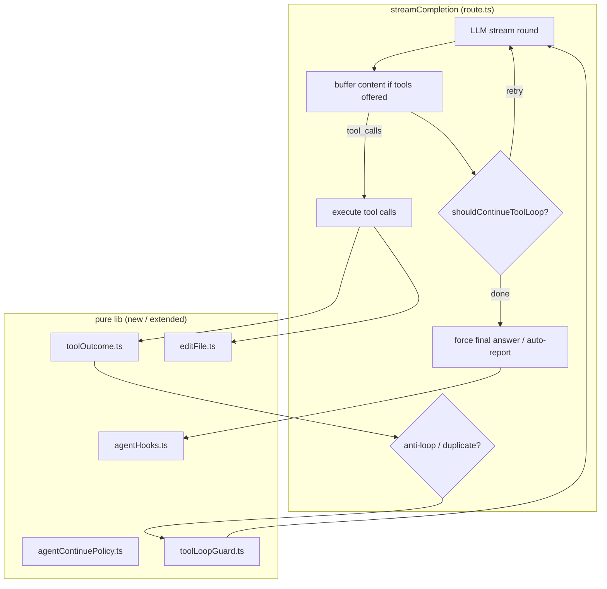

# Agent Harness Quality（自前エージェント・ハーネス強化）設計書

| 項目 | 値 |
|------|-----|
| **Document** | Agent Harness Quality Design |
| **Author** | (design) |
| **Date** | 2026-07-29 |
| **Status** | Draft（implementation by separate agent） |
| **Related** | `docs/tool-calling.md`, `docs/chat-streaming.md`, `docs/architecture.md`, `src/lib/agentContinuePolicy.ts`, `src/lib/agentHooks.ts`, `src/lib/toolStreamPolicy.ts`, `src/app/api/chat/route.ts` |
| **Stack** | Next.js 16 App Router / TypeScript / OpenAI-compatible streaming / Vitest |
| **Decision** | **自前ハーネス強化**（oh-my-pi / `@oh-my-pi/*` を依存に入れない） |

---

## Overview

UmansChat の会話エンジンは自前の multi-round tool loop（`streamCompletion` in `route.ts`）で動いている。  
oh-my-pi（OMP）のような「途中で止まらず、ツール結果に接地し、タスクを完了まで進める」体感は、**モデル差し替えや OMP 埋め込みではなく、ハーネス品質**で大半が決まる。

本設計は OMP の **設計原則のみ** を自前ループに移植し、次を達成する:

1. **途中停止の抑制** — thinking のみ / 極短い「やります」でツールループを抜けない
2. **ツール結果のモデル親和性** — 空結果・エラーに次アクションが付き、同じ探索を繰り返さない
3. **編集の信頼性** — 全文 `write_file` 一択をやめ、部分編集で失敗・トークン浪費を減らす
4. **完了保証** — ツール実行後は必ずユーザー可視本文（既存 hooks の強化）
5. **テスト可能な境界** — ポリシーを pure 関数に寄せ、`route.ts` の巨大 if 分岐を薄くする

**埋め込まないもの:** `@oh-my-pi/pi-coding-agent`、`omp` バイナリ、RPC サイドカー、LSP/DAP、hashline フル実装（Phase 2 候補）。

---

## Background & Motivation

### 現状（既にあるもの）

| コンポーネント | パス | 役割 |
|----------------|------|------|
| Tool loop | `src/app/api/chat/route.ts` (`streamCompletion`) | 最大 `MAX_TOOL_ROUNDS = 12` の tool ラウンド |
| Continue | `src/lib/agentContinuePolicy.ts` | ツール無し停止時の再突入（OMP 風） |
| Post-tool hooks | `src/lib/agentHooks.ts` | 強制最終レポート / 自動報告フォールバック |
| Stream policy | `src/lib/toolStreamPolicy.ts` | tool ラウンド中の中間ナレーション破棄 + grounding reminder |
| Loop detect | `route.ts` 内 `seenToolCalls` | 同一 tool+args を 3 回目で遮断 |
| Built-in tools | `STREAM_TOOLS` | search / workspace / sandbox / kb / todo 等 |
| Extensibility | MCP + connections | 外部ツール |

**既に効いていること:**

- tools 提供ラウンドで content をバッファし、tool_calls 付きなら破棄
- continue 再突入 + forced report + auto-report で「thinking のみ終了」を緩和
- 重複 tool 呼び出しの簡易検出

### ギャップ（知性不足の主因）

```text
1. Continue 条件が粗い
   - 短い「完了しました」風の嘘・中途半端レポートを検知しにくい
   - ユーザー依頼が多段タスクでも、ある程度の本文があればループを抜けうる

2. ツール結果がプレーン文字列
   - 失敗: "Failed to read file: ..." のみ → モデルが同じ path を再試行
   - 空: "No results found." / 素の empty → 次の戦略が示されない
   - 成功時も「次に何をすべきか」ヒントなし

3. 編集ツールが write_file のみ
   - 部分修正でも全文再生成 → 失敗・巨大 diff・トークン浪費
   - OMP の hashline ほどではなくても、str_replace 系が無い

4. 探索ポリシーが system prompt 文言頼み
   - list_directory 連打 / 同一 glob 再検索が MAX_TOOL_ROUNDS を消費
   - signature 完全一致以外の「意味的ループ」を止められない

5. route.ts にロジックが集中
   - tool dispatch が巨大 switch（テストしづらい）
   - ポリシー変更の blast radius が 🔴
```

### なぜ OMP を依存にしないか

| 理由 | 詳細 |
|------|------|
| 製品境界 | UmansChat は multi-user Web チャット + branching + memory/skills。OMP は terminal coding agent |
| 配布 | Docker + Windows exe 両方。Rust natives / 別プロセスは重い |
| 永続 | message tree + SSE と OMP session の二重管理が必要 |
| 方針 | 公開コアは schema-agnostic。外部 harness に会話の真実を預けない |
| 効果 | 体感の差は continue / tool UX / edit で大半を回収できる |

サイドカー（`agent` モード + `omp --mode rpc`）は **本設計の Non-Goal**。別エピックスとして将来検討可。

---

## Goals & Non-Goals

### Goals（Phase 1）

1. **Structured tool outcomes** — 全 built-in tool 結果を統一 envelope で返す（status / summary / next_hint / raw）
2. **Stronger continue policy** — タスク未完了シグナルに基づく再突入（transcript + ヒューリスティック）
3. **Partial edit tool** — `edit_file`（exact / optional fuzzy `str_replace`）。`write_file` は新規・全面置換用として残す
4. **Exploration anti-loop** — 同系ツール連打・空探索連続を検知し、次アクション付きで遮断
5. **Tool result formatter の単体テスト** — pure モジュール。`route.ts` は dispatch のみ
6. **観測性** — logger に `agent-continue` / `tool-outcome` / `edit-miss` 等の構造化イベント
7. **ドキュメント同期** — `docs/tool-calling.md` を `MAX_TOOL_ROUNDS=12` と新ツールに合わせる

### Non-Goals

| 項目 | 理由 |
|------|------|
| `@oh-my-pi/*` / `omp` バイナリ依存 | 配布・境界・コスト |
| hashline 編集フォーマット（content-hash anchors） | Phase 2 候補。まず str_replace で十分 |
| LSP / DAP / browser tool / subagents | スコープ爆発 |
| Advisor 第二モデル常時監視 | dual モードと重複。Phase 2 |
| time-traveling stream rules（ストリーム中断注入） | 実装複雑。Phase 2 |
| agent loop の完全抽出（別プロセス runtime） | 段階的リファクタのみ |
| Playwright E2E | プロジェクトは Vitest のみ |
| rapid モードへの tools 導入 | rapid は pure stream のまま |
| ツール非対応モデル（Path A）の agent 化 | 本設計は Path B（function calling）中心 |

### Success criteria（実装完了の定義）

| # | 基準 |
|---|------|
| S1 | 同一 tool+args 以外でも「空探索 3 連続」等が検知され、ループを割る |
| S2 | tool 失敗時、モデルへ `next_hint` が必ず付く（単体テストで全 outcome 種別） |
| S3 | `edit_file` が old 未一致時に拒否し、read 推奨ヒントを返す（ファイル破壊なし） |
| S4 | continue が「tools 実行後 + 極短本文」で再突入し、最終的にユーザー可視本文が残る |
| S5 | `bun run test` + `bun run typecheck` green。新モジュールに co-located tests |
| S6 | README に OMP 埋め込みを謳わない。tool-calling.md が実装と一致 |

---

## Proposed Design

### 名称と責務

**システム名:** Agent Harness Quality  
**ロガー category:** `"agent"` / 既存 `"chat"` を継続してよいが、イベント名をプレフィックス統一



### アーキテクチャ原則

1. **Policy is pure** — continue / outcome format / edit apply / loop guard は I/O なし
2. **route.ts is orchestration** — auth・SSE・LLM client・workspace I/O のみ
3. **OMP は参照実装** — プロンプト文言や UX を真似てよいが、コードコピーは最小限（ライセンスは MIT だがメンテ境界を分ける）
4. **破壊的変更を避ける** — 既存 SSE イベント種は維持。status ラベル追加は可
5. **後方互換** — `write_file` / `read_file` 等の既存ツール名は残す。`edit_file` は追加

---

## Detailed Design

### D1 — Tool outcome envelope

**File (new):** `src/lib/toolOutcome.ts`

すべての built-in tool 実行結果を、LLM に渡す **文字列** にシリアライズする前に構造化する。

```ts
export type ToolOutcomeStatus =
  | "ok"
  | "empty"
  | "error"
  | "blocked"   // policy / loop / whitelist
  | "partial";  // truncated success

export type ToolOutcome = {
  tool: string;
  status: ToolOutcomeStatus;
  /** One-line human summary for logs and compact transcript */
  summary: string;
  /** Body the model should ground on (file content, search hits, …) */
  body: string;
  /** Concrete next step when status !== ok (or ok-with-caveat) */
  nextHint?: string;
  /** Optional machine codes for tests / metrics */
  code?: string;
};

export function formatToolOutcomeForModel(o: ToolOutcome): string {
  // Deterministic multi-line format, e.g.:
  // [tool=read_file status=error code=ENOENT]
  // summary: ...
  // next: Call search_files with pattern ...
  // ---
  // body...
}
```

**ルール:**

| status | 必須 | モデル向け意図 |
|--------|------|----------------|
| `ok` | body または summary | 事実として使ってよい |
| `empty` | nextHint 必須 | 別クエリ・別パスを試せ / ユーザーに聞け |
| `error` | nextHint 必須 | 同じ引数を繰り返すな |
| `blocked` | nextHint 必須 | 方針違反・ループ。答えをまとめよ |
| `partial` | body + 注意 | 切れている。必要なら offset/limit |

**route.ts 変更方針:**

- 各 tool 分岐の末尾で `ToolOutcome` を組み立て → `formatToolOutcomeForModel` → `tool` role content
- 既存の `recordToolResult(transcript, …)` には **format 後文字列** または summary 優先で保存（transcript 肥大防止は現状どおり truncate）

**互換:** モデルは今までプレーン文を見ている。新しいヘッダ形式は追加情報であり、body は従来相当の中身を維持する。

---

### D2 — Continue policy 強化

**File:** `src/lib/agentContinuePolicy.ts`（拡張）

#### 現行

- thinking / 空本文 → continue
- tools 実行後 + `emittedContentChars < 80` → continue
- 予算: `AGENT_CONTINUE_RETRIES`（default 3, max 8）

#### 追加ヒューリスティック（Phase 1）

`shouldContinueToolLoop` に入力を足す（破壊を避けるため **オプション引数 + デフォルト**）:

```ts
export function shouldContinueToolLoop(args: {
  // existing…
  /** User message text (last user turn) — optional for smarter incomplete detection */
  userMessage?: string;
  /** Last assistant content buffer this round (if any) */
  lastAssistantText?: string;
  /** Whether transcript suggests unfinished multi-step work */
  unfinishedToolWork?: boolean;
}): boolean
```

**新しい continue トリガ（いずれか）:**

| ID | 条件 | 意図 |
|----|------|------|
| C1 | 既存: 可視本文なし | thinking-only |
| C2 | 既存: tools 後 + 本文 < 80 | 極短 |
| C3 | tools 後 + 本文が「やります/確認します/次に…」系の予告のみ（locale 対応 regex） | 宣言だけで未実行 |
| C4 | `unfinishedToolWork===true`（例: write/edit/kb 失敗 outcome が直近にある、または todo 未完了が transcript にある）かつ本文 < 400 | 失敗放置 |

**continue しない:**

- continue 予算尽きた
- MAX_TOOL_ROUNDS 到達
- ユーザーが明確に短答を求めるケースは **ユーザーメッセージ長・疑問詞のみ** では無理に続けない（false positive 回避）。C3/C4 は tools 実行後に限定

**プロンプト:** `buildContinueAgentPrompt` に直近 outcome の `status/summary/nextHint` を載せる（transcript から再パースしてもよいが、Phase 1 は transcript 文字列で十分）。

**Env（既存維持 + ドキュメント化）:**

| Variable | Default | Meaning |
|----------|---------|---------|
| `AGENT_CONTINUE_RETRIES` | `3` | 再突入回数上限 |
| `AGENT_CONTINUE_MIN_CHARS` | `80` | C2 の閾値（現状ハードコードを env 化してもよい） |

---

### D3 — `edit_file` ツール

**File (new):** `src/lib/editFile.ts`  
**登録:** `STREAM_TOOLS` + `route.ts` dispatch

#### Schema

```ts
// tool name: edit_file
{
  path: string;           // workspace-relative
  old_string: string;     // exact match required (Phase 1)
  new_string: string;     // replacement
  replace_all?: boolean;  // default false; if false and multiple matches → error
}
```

#### Semantics

1. Resolve path via existing workspace guards（`write_file` / `read_file` と同じ）
2. Read file as utf-8 text
3. Count occurrences of `old_string`
   - 0 → `status=error` `code=EDIT_NO_MATCH` + nextHint: re-read file, copy exact snippet
   - \>1 and not `replace_all` → `status=error` `code=EDIT_AMBIGUOUS`
   - else apply replace, write atomically if可能（write temp + rename は任意。最低限 writeFileSync 既存パターンに合わせる）
4. Return outcome: lines changed summary, **not** full file dump（トークン節約）

#### 対 `write_file`

| 用途 | ツール |
|------|--------|
| 新規ファイル / 意図的な全面置換 | `write_file` |
| 既存ファイルの部分修正 | **`edit_file`（推奨）** |
| システム prompt | 「既存ファイルは edit_file を優先。write_file は新規 or 全面書き換え時のみ」を agent 指示に 1 行追加 |

#### Fuzzy（Phase 1.5 optional）

- 空白正規化後の一意マッチのみ許可
- 複数候補は出さず error（サイレント破壊禁止）
- Phase 1 では **exact only** で ship してよい

#### Non-goal: hashline

Content-hash 行アンカーは Phase 2。ベンチマーク価値はあるが、read 出力フォーマット変更が横断的。

---

### D4 — Exploration anti-loop（toolLoopGuard）

**File (new):** `src/lib/toolLoopGuard.ts`

既存: 完全一致 `name:arguments` の回数 > 2 → LOOP DETECTED（tools 1 ラウンド off）

**追加:**

| Guard | 条件 | 動作 |
|-------|------|------|
| G1 | 既存 duplicate signature | blocked outcome + 1 round tools off |
| G2 | 連続 N 回（default 3）`empty` の探索系（`list_directory` / `search_files` / `grep_content` / `search_web`） | blocked + nextHint: 戦略変更 or ユーザーに確認 |
| G3 | 同一 `list_directory` path を depth 違いのみで 3 回 | blocked |
| G4 | 同一 path の `read_file` 成功後、未 edit で再 read 3 回 | soft only または soft warn in outcome（Phase 1 は soft: nextHint） |

状態は **1 ターンの streamCompletion 内** のみ（プロセスグローバルにしない）。

```ts
export type LoopGuardState = { /* opaque counters */ };

export function createLoopGuardState(): LoopGuardState;

export function evaluateToolCall(
  state: LoopGuardState,
  call: { name: string; arguments: string },
  /** call after we know outcome status, or pre-exec for pure duplicates */
): { allow: boolean; outcome?: ToolOutcome };
```

統合ポイント: `route.ts` の loop detection ブロックを `toolLoopGuard` に置換（挙動はテストで固定）。

---

### D5 — Forced final answer / auto-report（既存強化）

**File:** `src/lib/agentHooks.ts`

| 変更 | 内容 |
|------|------|
| transcript | `status` を optional で持てるように拡張してもよい（後方互換: 文字列のみでも可） |
| `buildForcedReportPrompt` | empty/error の tool を強調し「成功したと書くな」 |
| `formatAutoUserReport` | outcome ヘッダがあれば status を一覧に出す |

**変更しない:** SSE プロトコル、`after()` memory 生成タイミング（umanschat-debug の制約維持）。

---

### D6 — System / agent instruction の薄い更新

**File:** `route.ts` の agent/tool 指示ブロック（既存の long system strings）

追加・修正する要点のみ（長文化しすぎない）:

1. 既存ファイル編集は `edit_file` 優先
2. empty/error の nextHint に従え。同じ引数を繰り返すな
3. ユーザー向け最終回答は CONTENT。thinking だけでは終了しない
4. 探索は `search_files` / `grep_content` を先に。`list_directory` 連打禁止

**Personalization / global instruction との衝突:** ユーザー systemPrompt が優先される既存 cascade は維持。agent 指示は tool 用 system メッセージとして注入（現行パターン踏襲）。

---

### D7 — モジュール分割（route 肥大化対策）

Phase 1 では **全面 rewrite しない**。次だけ切り出す:

| 新/拡張モジュール | 責務 |
|-------------------|------|
| `toolOutcome.ts` | format + helpers（empty/error factory） |
| `editFile.ts` | pure apply + path I/O wrapper（I/O は薄い関数で injectable にするとテスト容易） |
| `toolLoopGuard.ts` | anti-loop state machine |
| `agentContinuePolicy.ts` | C3/C4 |
| `agentHooks.ts` | prompt 微修正 |
| `route.ts` | STREAM_TOOLS に edit_file、dispatch 接続、guard 接続 |

**任意（Phase 1 後半）:** `dispatchBuiltInTool(name, args, ctx) → ToolOutcome` を `src/lib/builtInTools.ts` に抽出。巨大 PR になるなら **別 Task** に分離し、最初は route 内のまま outcome 化だけでも可。

---

### D8 — 観測性・UX

| 項目 | 内容 |
|------|------|
| logger | `agent-continue-loop`（既存）に reason: `C1`…`C4` を追加 |
| logger | `tool-outcome` { tool, status, code }（debug/info、本文は載せない） |
| logger | `edit-file` { status, code } |
| SSE status | 既存 `statusAgentContinue` を継続。必要なら `statusToolBlocked` 等を i18n 追加 |
| UI | 必須変更なし。status ラベルだけで十分 |

---

### D9 — 設定・環境変数

| Variable | Default | Notes |
|----------|---------|-------|
| `AGENT_CONTINUE_RETRIES` | `3` | 既存 |
| `AGENT_CONTINUE_MIN_CHARS` | `80` | 新規 optional |
| `AGENT_EMPTY_EXPLORATION_LIMIT` | `3` | G2 |
| `AGENT_EDIT_FUZZY` | `false` | Phase 1.5 |

Settings UI への露出は **任意**。Phase 1 は env のみでよい（sandbox と同様、必要なら後で Settings）。

---

## Interaction with existing modes

| Mode | Behavior |
|------|----------|
| Normal + tools supported | 本設計フル適用 |
| Normal + tools unsupported (Path A) | 変更なし（pre-search のみ） |
| Rapid | 変更なし |
| Dual / debate | 既存 dual フロー維持。各 streamCompletion 内で outcome が効くならラッキー。dual 専用ロジックは触らない |
| MCP / connections | 結果は現状の文字列のままでも可。Phase 1 で envelope 化するなら optional wrapper のみ（必須にしない） |

---

## Testing strategy

| 対象 | 環境 | 内容 |
|------|------|------|
| `toolOutcome.test.ts` | node | format 全 status、nextHint 必須 |
| `editFile.test.ts` | node | match/no match/ambiguous/replace_all；temp dir |
| `toolLoopGuard.test.ts` | node | G1–G3 遷移 |
| `agentContinuePolicy.test.ts` | node | C1–C4、予算、予告文 regex |
| `agentHooks.test.ts` | node | forced prompt に empty/error 注意 |
| `route.test.ts` | node | 既存 + edit_file 登録・continue reason の結合（重すぎる結合は最小限） |
| `toolStreamPolicy` | 変更なければテスト追加不要 |

**DB:** edit/workspace は temp ディレクトリ。real SQLite は不要なら使わない。

---

## Documentation & README

| ファイル | 更新 |
|----------|------|
| `docs/tool-calling.md` | MAX_TOOL_ROUNDS=12、edit_file、outcome envelope、loop guard、continue |
| `docs/chat-streaming.md` | continue status の一言（必要なら） |
| `docs/glossary.md` | `tool outcome` / `agent continue` 用語（任意） |
| `README.md` / `README.ja.md` | ユーザー向け「エージェントが途中で止まりにくい / 部分編集」程度。OMP 依存を謳わない |
| `AGENTS.md` | 原則変更なし。pitfall があれば umanschat-debug skill に追記 |

---

## Rollout / Phases

### Phase 1（本 spec + plan の実装対象）

1. toolOutcome + route の主要 tools への適用
2. continue C3/C4 + env
3. edit_file exact
4. toolLoopGuard G1–G3
5. docs + tests

### Phase 2（別 spec 推奨・本計画に含めない）

- hashline または read 行番号付きフォーマット
- fuzzy edit
- advisor 第二モデル
- subagent / task fan-out
- stream mid-abort rules
- OMP RPC サイドカー（製品判断が必要）

---

## Risks & Mitigations

| Risk | Mitigation |
|------|------------|
| continue の false positive（短答を何度も続ける） | tools 後限定 + 予算 + 短答ユーザー向けは C3 のみ緩く |
| outcome ヘッダで context 肥大 | summary 短く、body は既存 slice 上限を踏襲 |
| edit_file の部分一致事故 | exact only、ambiguous 拒否 |
| route.ts さらに肥大 | モジュール分割タスクを plan に明示 |
| モデルが edit_file を無視して write_file | system 1 行 + description で推奨 |
| i18n 漏れ | status キー追加時は ja/en 同時 |

---

## Open questions（実装前に決まっている前提）

実装エージェントは次を **デフォルト採用** してよい（ユーザー確認不要）:

1. Phase 1 の edit は **exact `str_replace` only**
2. MCP/connection tool 結果の envelope 化は **任意**（built-in 優先）
3. Settings UI は作らない（env のみ）
4. OMP パッケージは入れない

---

## Appendix A — 現行コード参照

| 概念 | 場所（目安） |
|------|----------------|
| MAX_TOOL_ROUNDS | `route.ts` ≈ 2262（値 12） |
| STREAM_TOOLS | `route.ts` ≈ 1737+ |
| continue 分岐 | `route.ts` ≈ 2468–2510 |
| loop detect | `route.ts` ≈ 2521–2565 |
| tool dispatch | `route.ts` ≈ 2583+ |
| forced report | `route.ts` ≈ 3221+ |
| Continue policy | `src/lib/agentContinuePolicy.ts` |
| Hooks | `src/lib/agentHooks.ts` |
| Stream policy | `src/lib/toolStreamPolicy.ts` |

## Appendix B — 関連決定ログ

- 2026-07-29: OMP 埋め込み vs 自前強化 → **自前強化を採用**。サイドカーは将来オプション。
- 設計目的: 「知性を感じる」= 完了まで進む + 接地 + 編集成功率。モデル固定でもハーネスで改善可能（OMP "harness problem" と同型の問題設定）。
